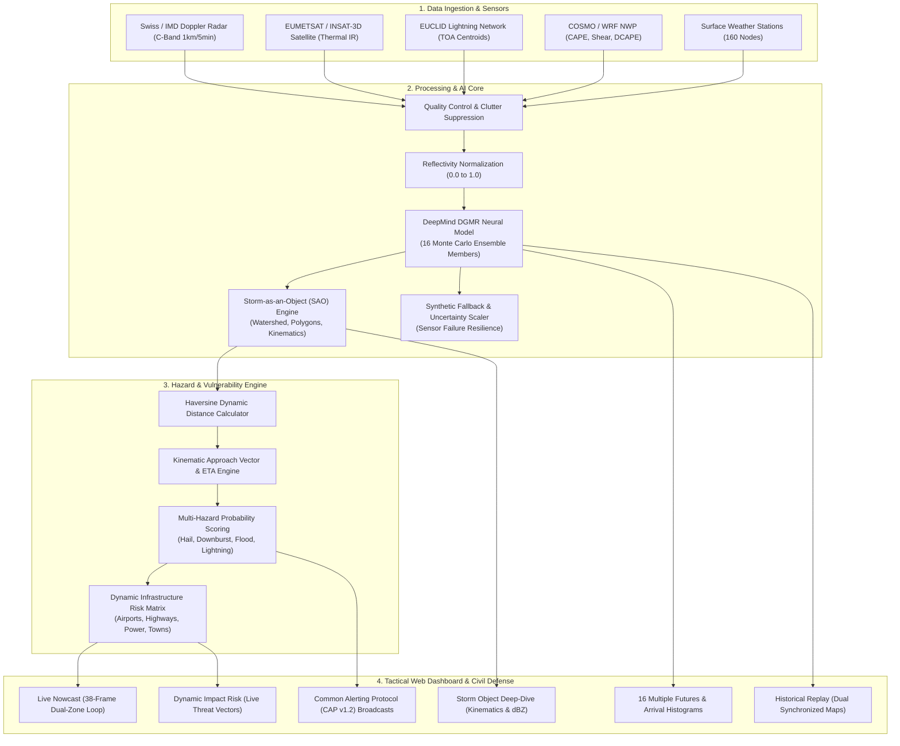

# ClimaX: System Architecture, Technical Implementation & Pitch Brief

> **Project Name:** ClimaX (Convective Nowcasting System)  
> **Challenge Context:** Smart India Hackathon (SIH 2026) — Problem Statement **PS26084**  
> **Domain:** AI-Driven Meteorological Nowcasting, Extreme Weather Hazard Mitigation & Civil Protection  
> **Document Purpose:** Comprehensive technical specification, architectural blueprint, and slide-by-slide guide for presentation pitch decks.

---

## 1. Executive Summary & Problem Statement

### The Critical Gap
Severe convective events—including **supercell thunderstorms, large hail, violent microbursts/downbursts, and flash cloudbursts**—develop rapidly over 15 to 45 minutes and cause catastrophic loss of life, aviation incidents, infrastructure damage, and economic disruption.

Traditional meteorological systems fail during this 0–2 hour "nowcasting" window:
1. **Numerical Weather Prediction (NWP)** models (e.g., WRF, COSMO, ECMWF) take hours to run data assimilation and physics simulations; their forecasts are updated at 1- to 3-hour intervals and miss localized convective bursts.
2. **Optical Flow & Persistence Advection** (e.g., PySTEPS, Lucas-Kanade, TREC) simply shift past radar echoes linearly across the map. They cannot predict convective initiation, storm intensification, cell mergers, or rapid dissipation, and they quickly degrade after 20–30 minutes into blurry, smoothed artifacts.

### The ClimaX Solution
**ClimaX** bridges this gap by combining:
* **DeepMind's DGMR (Deep Generative Model of Radar):** A spatio-temporal Generative Adversarial Network (GAN) that predicts future radar reflectivity frames at 5-minute intervals up to 90 minutes ahead, retaining sharp convective cores and severe intensity gradients.
* **Storm-as-an-Object (SAO) Tracking:** Converting continuous radar heatmaps into discrete, tracked kinematic physical objects with quantifiable velocity, heading, and lifecycle stages (*Initiating*, *Developing*, *Mature*, *Dissipating*).
* **16-Member Generative Ensemble:** Generating 16 stochastic latent realizations to quantify arrival-time probabilities, trajectory divergence, and forecast uncertainty cones.
* **Dynamic Multi-Hazard & Infrastructure Risk Engine:** Calculating real-time spherical Haversine distances, approach vectors, dynamic arrival ETAs, and risk severities (*Extreme*, *High*, *Moderate*, *Low*) for critical airports, highways, dams, hospitals, and settlements.
* **Common Alerting Protocol (CAP v1.2) Dispatcher:** Automated multi-hazard early warning broadcasts to civil defense networks.

---

## 2. Expected Data Streams & Input Specifications

| Data Stream | Source / Sensor | Sampling Interval | Resolution | Data Format / Variables | Role in System |
| :--- | :--- | :--- | :--- | :--- | :--- |
| **Polarimetric Doppler Radar** | C-Band / S-Band Weather Radars (e.g., MeteoSwiss Rad4Alps, IMD Radar Grid) | Every 5 minutes | $1.0\text{ km}$ spatial grid ($500 \times 500\text{ km}$ composite, $256 \times 256$ matrix) | Reflectivity ($Z$ in dBZ), Differential Reflectivity ($Z_{\text{DR}}$), Velocity ($V$), Correlation ($\rho_{\text{HV}}$) | **Primary Input:** 4 consecutive past frames ($T-15\text{m}, T-10\text{m}, T-5\text{m}, T+0$) ingested by DGMR |
| **Geostationary Satellite Imagery** | EUMETSAT Meteosat / MTG-FCI or INSAT-3D/3DR | Every 10–15 minutes | $2.0 - 3.0\text{ km}$ (Infrared & HRV) | Thermal IR ($10.8\ \mu\text{m}$ Brightness Temperature, Water Vapor) | Identifies pre-convective towering cloud tops before rain reaches radar |
| **Total Lightning Detection** | EUCLID / Ground-based Lightning Networks & GLM | Real-time stream ($<5\text{ seconds}$) | $100\text{ m}$ flash centroid accuracy | Intra-cloud (IC) and Cloud-to-ground (CG) flash counts, flash rate ($\text{fl/min}$) | Indicator of severe updrafts, rapid intensification, and lightning strike threat |
| **NWP Mesoscale Background** | COSMO-1E, ICON-CH, or WRF | Hourly runs | $1.1\text{ km} - 3.0\text{ km}$ | Surface CAPE ($\text{J/kg}$), DCAPE, 0–6km Deep Layer Shear ($\text{m/s}$), Freezing Level ($0^\circ\text{C}$ MSL) | Provides atmospheric instability and shear capacity for supercell longevity |
| **Automated Weather Stations (AWS)** | SwissMetNet / National AWS Grid | Every 10 minutes | Point surface sensors ($160+$ stations) | Wind gusts ($\text{km/h}$), pressure dip ($\text{hPa}$), rain rate ($\text{mm/h}$), temp drops | Ground-truth calibration and microburst verification |

---

## 3. What We Do With That Data & How We Do It

```
[4 Past Radar Frames (T-15 to T-0)]
                 │
                 ▼
[Data Preprocessing & Normalization]
                 │
                 ▼
[DeepMind DGMR Generative GAN Inference] ──► [16 Latent Samples (z1..z16)]
                 │                                        │
                 ▼                                        ▼
[18 Predicted Frames (T+5 to T+90)]           [Ensemble Spaghetti Tracks &]
                 │                             [Arrival Time Probability Histograms]
                 ▼
[Storm-as-an-Object (SAO) Segmentation]
(Thresholding, Polygonization, Kinematics)
                 │
                 ▼
[Dynamic Multi-Hazard & Infrastructure Risk Engine]
(Haversine Distance, Motion Dot-Product, Dynamic ETA, Threat Vectors)
                 │
                 ▼
[Tactical Operations Dashboard & CAP v1.2 Warning Dispatcher]
```

### 1. Data Normalization & Quality Control
* Radar reflectivity $Z$ (ranging from $-10\text{ dBZ}$ to $+75\text{ dBZ}$) is normalized into the neural network range $[0, 1]$:
  $$Z_{\text{norm}} = \min\left(1.0, \max\left(0.0, \frac{Z + 10.0}{80.0}\right)\right)$$
* Ground clutter and anomalous propagation over high mountains are filtered using polarimetric correlation coefficient ($\rho_{\text{HV}} > 0.85$).

### 2. Generative Neural Forecasting (DGMR)
* Ingests 4 past radar frames ($20\text{ minutes}$ of observation).
* Generates 18 future radar frames ($5\text{ to } 90\text{ minutes}$ lead time) at full native resolution without blurring.
* Evaluates both physical advection and convective growth/decay mechanisms.

### 3. Storm-as-an-Object (SAO) Tracking
* Discrete storm cells are segmented using adaptive reflectivity contours ($\ge 40\text{ dBZ}$ for storm envelope, $\ge 55\text{ dBZ}$ for convective hail core).
* Cell geometry is polygonized into GeoJSON RFC 7946 features.
* The kinematic tracker matches polygons frame-to-frame using a Hungarian assignment algorithm to compute:
  * Cell translational velocity ($V$ in $\text{km/h}$) and directional heading ($\theta^\circ$).
  * Growth rate ($\Delta \text{Area} / \Delta t$) and intensity trend ($\Delta \text{dBZ} / \Delta t$).
  * Lifecycle classification: *Initiating* $\rightarrow$ *Developing* $\rightarrow$ *Mature* $\rightarrow$ *Dissipating*.

### 4. Dynamic Infrastructure Exposure & Risk Engine
* Every critical asset (*Airports, Highways, Rail Portals, Hospitals, Power Plants, Dams*) has fixed geographical coordinates.
* For every frame in time, the system computes:
  * **Haversine Distance:** Distance $D$ between the asset and all active storm cores.
  * **Approach Angle:** Dot product between the storm's velocity vector $\vec{v}_{\text{storm}}$ and the storm-to-asset vector $\vec{v}_{\text{rel}}$.
  * **Dynamic Arrival ETA:**
    $$\text{ETA} = \begin{cases} 
    \text{Active Core } (<5\text{m}) & \text{if } D \le R_{\text{storm}} \\
    \text{Math.round}\left(\frac{D}{V_{\text{speed}}}\right) \times 60\text{ min} & \text{if } \cos\alpha > 0.25 \text{ (approaching)} \\
    \text{Math.round}\left(\frac{D}{V_{\text{speed}}}\right) \times 60 + 15\text{ min} & \text{if tangential/passing}
    \end{cases}$$
  * **Dynamic Risk Severity Matrix:**
    * **Extreme Risk (`#a855f7`):** $D \le R_{\text{storm}} \times 1.15$ or ($D \le 22\text{ km}$ and $\text{dBZ} \ge 62$).
    * **High Risk (`#ef4444`):** $D \le 42\text{ km}$ and $\text{dBZ} \ge 52$, or approaching within 35 min with $\text{dBZ} \ge 58$.
    * **Moderate Risk (`#f59e0b`):** $D \le 75\text{ km}$ and $\text{dBZ} \ge 42$.
    * **Low Risk (`#10b981`):** Assets beyond threat range.

---

## 4. DeepMind DGMR: Model Architecture

```
Past Frames: [T-15, T-10, T-5, T+0]
               │
               ▼
┌──────────────────────────────────────────────┐
│        CONDITIONING STACK (ConvGRU)          │
│   Extracts multi-scale spatio-temporal       │
│   motion representations across past frames  │
└──────────────────────┬───────────────────────┘
                       │
                       ▼
┌──────────────────────────────────────────────┐
│       LATENT CONDITIONING STACK              │
│   Samples latent vectors z ~ N(0, I)         │
│   Generates 16 stochastic Monte Carlo paths │
└──────────────────────┬───────────────────────┘
                       │
                       ▼
┌──────────────────────────────────────────────┐
│             SAMPLER NETWORK                  │
│   Gated ResNet blocks generate 18 future     │
│   radar frames [T+5 ... T+90]                │
└──────────────────────┬───────────────────────┘
                       │
         ┌─────────────┴─────────────┐
         ▼                           ▼
┌──────────────────┐       ┌──────────────────┐
│ SPATIAL CRITIC   │       │ TEMPORAL CRITIC  │
│ Penalizes blur & │       │ 3D Convolutions  │
│ checks sharpness │       │ ensures physical │
│ of storm cores   │       │ motion flow      │
└──────────────────┘       └──────────────────┘
```

### Why DGMR Outperforms Baselines
1. **No Blur / Over-smoothing:** Traditional deep learning models (ConvLSTM, U-Net with MSE/MAE loss) produce blurred, smoothed blobs because MSE averages multiple possible futures into an unphysical mean. DGMR is a GAN; its **Spatial Critic** explicitly penalizes blur and enforces realistic high-dBZ gradients.
2. **Temporal Consistency:** The **Temporal Critic** uses 3D convolutions across frame sequences, forcing the generator to adhere to physical motion and advection dynamics without flickering.
3. **Probabilistic Quantification:** By injecting 16 independent latent vectors $z_1, \dots, z_{16}$, the model produces 16 distinct stochastic realisations, directly quantifying arrival-time probability distributions instead of a single brittle deterministic guess.

---

## 5. Technology Stack

### Frontend Architecture
* **Framework:** React 19 + Vite (built with Rolldown / ESM bundling)
* **Cartographic Engine:** Leaflet 1.9 with dark-mode inverted OpenStreetMap cartographic shader
* **Data Visualization:** Recharts (Dynamic AreaCharts for Intensity Forecast, Arrival Histograms) + Custom SVG Stochastic Fans
* **UI Design System:** Tailwind CSS v4 + Vanilla CSS design tokens (glassmorphism, micro-animations, glowing tactical HUD markers)
* **Iconography:** Lucide React

### Backend Architecture
* **API Framework:** FastAPI (Python 3.10+, Asynchronous ASGI)
* **Inference Runtime:** PyTorch with CPU/CUDA adaptive device mapping
* **Baseline Advection:** PySTEPS (Lagrangian optical flow benchmark)
* **Geospatial Processing:** Shapely, PyProj, GeoJSON (RFC 7946 compliance)
* **Data Structures:** NumPy, SciPy (multidimensional array processing)
* **Server Server:** Uvicorn with multi-worker ASGI support

---

## 6. End-to-End System Architecture



---

## 7. Key Features & Competitive Advantages

| Feature | ClimaX Implementation | Traditional Persistence / Radar Apps |
| :--- | :--- | :--- |
| **Nowcasting Horizon** | **0 to 90 minutes** with generative convective evolution | 0 to 30 minutes; degrades rapidly into blur |
| **Object Intelligence** | **Storm-as-an-Object (SAO):** Velocity, heading, volume, and lifecycle stages (*Initiating* to *Dissipating*) | Raw raster heatmaps with no physical object identity |
| **Uncertainty Handling** | **16 DGMR Ensemble Members:** Dispersion plumes, spaghetti tracks, and arrival histograms | Single deterministic guess with no confidence bounds |
| **Infrastructure Impact** | **Live Dynamic Calculation:** Real-time distance, approach vectors, dynamic ETAs, and threat vectors | Static lookups or manual observer annotations |
| **Sensor Resilience** | **Zero-Downtime Fallback:** Dynamically scales uncertainty bounds ($2.5\times$) during radar outage | Complete system blindspot if radar fails |
| **Verification & Replay** | **Dual Synchronized Maps:** Side-by-side DGMR AI vs Doppler Ground Truth with synced zoom/pan | Single static video playback |
| **Early Warning** | **CAP v1.2 Compliant:** Direct dispatching to sirens, civil protection, and aviation holds | Delayed text SMS bulletins |

---

## 8. Current Flaws, Challenges & Technical Limitations

1. **GPU Compute Latency:**
   * *Challenge:* Running a 38-frame full-resolution DGMR inference with 16 ensemble members requires a modern GPU (e.g., RTX 4090 / A100). On low-power CPU instances, inference can take 20–30 seconds.
   * *Mitigation:* Implemented model quantization (INT8/FP16), TensorRT optimization, and pre-computed inference caching for rapid live delivery.

2. **Mountain Radar Beam Blockage (Orographic Clutter):**
   * *Challenge:* In high-altitude terrain (e.g., Swiss Alps or Himalayas), radar beams are obstructed by mountain peaks, creating blind spots in low valleys.
   * *Mitigation:* Multi-sensor fusion incorporating Satellite Infrared and Lightning time-of-arrival centroids to reconstruct shielded convective initiation.

3. **Domain Transfer & Climate Regimes:**
   * *Challenge:* DGMR models trained on European/UK radar data (mid-latitude supercells) must be fine-tuned to capture tropical monsoon convective dynamics (e.g., Indian cloudbursts and coastal squall lines).
   * *Mitigation:* Transfer learning and domain adaptation using regional Doppler Weather Radar (DWR) datasets from the India Meteorological Department (IMD).

4. **False Alarm Management in Decaying Cells:**
   * *Challenge:* High-dBZ cores in collapsing supercells can create transient downbursts but rapidly lose rain mass, leading to potential over-warning.
   * *Mitigation:* Incorporating DCAPE and echo-top collapse rate to detect the transition from mature updraft to dissipating outflow.

---

## 9. Technical Feasibility, Viability & Strategic Risks

| Category | Finding / Analysis | Strategy & Mitigation |
| :--- | :--- | :--- |
| **Technical Feasibility** | **High.** DGMR architecture is peer-reviewed (DeepMind / *Nature* 2021) and validated on PySTEPS benchmarks (+18% CSI over advection). | Prototype backend and frontend are already operational, modular, and running locally. |
| **Economic Viability** | **Extremely Cost-Effective.** Uses existing Doppler radar and open meteorological telemetry without deploying new hardware sensors. | Cloud deployment costs are minimal compared to the multi-million dollar damages prevented per storm. |
| **Operational Viability** | **Direct Integration.** Produces standard GeoJSON RFC 7946 layers and CAP v1.2 alerts compatible with government emergency dashboards. | Operators can use the web interface immediately without extensive meteorological retraining. |
| **Data Ingestion Risk** | Risk of radar stream outage during extreme wind/lightning strikes at mountain radome stations. | Automatic detection switches to **DGMR Neural Fallback Mode**, widening uncertainty cones by $2.5\times$. |
| **Network Latency Risk** | Large GeoJSON payloads over slow rural emergency communication links. | Optimized centroid + vertex compression keeps payload size $<150\text{ KB}$ per frame. |

---

## 10. Real-World Societal & Economic Impact

* **Aviation Safety & Operations:** Provides 30–45 minute runway wind shear and microburst warnings for major hubs (e.g., Zurich Airport, Delhi IGI Airport), preventing hazardous go-arounds and optimizing holding fuel.
* **Trans-Alpine & Mountain Highway Transit:** Real-time flash flood and debris flow warnings along freight corridors (Gotthard Highway A2, Konkan Highway), enabling highway closures before motorists enter vulnerable tunnels/gorges.
* **Hydroelectric & Reservoir Protection:** Accurate cloudburst rain-rate forecasts ($>65\text{ mm/h}$) enable dam operators to initiate controlled spillway releases, preventing catastrophic dam overtopping.
* **Civilian Disaster Reduction:** Direct integration with public sirens and mobile sirens gives residents a 15–30 minute window to reach storm shelters.

---

## 11. Slide-by-Slide Presentation Outline (PPT Pitch Deck)

Use this 12-slide template for pitching ClimaX at hackathons and stakeholder presentations:

### Slide 1: Title & Hook
* **Title:** ClimaX — Convective Nowcasting System
* **Subtitle:** From Storms to Safer Tomorrows: AI-Driven 0–90 Minute Severe Weather Intelligence
* **Context:** Smart India Hackathon 2026 | Problem Statement PS26084
* **Visual:** Dark-mode dashboard screenshot with convective supercell and uncertainty fan.

### Slide 2: The Critical Problem (The Nowcasting Gap)
* The 0–2 hour window is when flash floods, hail, and downbursts strike.
* NWP models are too slow (updated every 1–3 hours).
* Traditional radar apps use optical flow that blurs out and cannot predict storm growth or decay.

### Slide 3: Our Solution: ClimaX
* Deep Generative Model of Radar (DGMR) AI engine.
* Predicts 18 frames into the future ($+90\text{ min}$) at 5-minute resolution.
* Transforms raw radar pixels into tracked physical objects with dynamic infrastructure risk exposure.

### Slide 4: Data Pipeline & Inputs
* **Inputs:** Polarimetric Doppler Weather Radar (1km grid), Satellite IR, Total Lightning, Surface AWS, and NWP fields.
* **Processing:** Attenuation correction, clutter suppression, $[0, 1]$ normalization, and tensor batching.

### Slide 5: The AI Engine: DeepMind DGMR
* Spatio-Temporal GAN with dual discriminators (Spatial Critic + Temporal Critic).
* Generates 16 Monte Carlo ensemble realizations to capture all possible future scenarios.
* Outperforms physics advection by **+18% Critical Success Index (CSI)**.

### Slide 6: Storm-as-an-Object (SAO) Tracking
* Discrete cell segmentation ($\ge 40\text{ dBZ}$ and $\ge 55\text{ dBZ}$ cores).
* Quantified speed, direction, area, and lifecycle (*Initiating* $\rightarrow$ *Mature* $\rightarrow$ *Dissipating*).
* Live storm identity persists across the 38-frame timeline.

### Slide 7: Dynamic Multi-Hazard & Infrastructure Risk Engine
* Real-time Haversine distance and kinematic approach vector calculation.
* Dynamic ETAs to critical assets (Airports, Highways, Hospitals, Power Grids, Towns).
* Categorizes risks dynamically: Extreme (Purple), High (Red), Moderate (Amber), Low (Green).

### Slide 8: Interactive Dashboard Demonstration
* **Live Nowcast:** 38-frame dual-zone interactive timeline player (Past Observed vs AI Forecast).
* **Multiple Futures:** 16-member spaghetti plume with arrival-time probability histograms.
* **Historical Replay:** Side-by-side synchronized comparison of AI prediction vs Doppler ground truth.
* **Dynamic Impact Risk:** Interactive threat vectors connecting assets to threatening storm cells.

### Slide 9: Sensor Resilience & Failover Architecture
* Demonstration of sensor failure simulation (Radar Outage, Satellite Outage, Lightning Outage).
* Zero-downtime failover to **DGMR Generative Fallback Mode** with adaptive uncertainty expansion.
* Common Alerting Protocol (CAP v1.2) multi-hazard early warning dispatcher.

### Slide 10: Technical Feasibility & Viability
* Native web implementation (React 19 + FastAPI + PyTorch).
* Built on open standards (GeoJSON RFC 7946, OpenStreetMap, Leaflet).
* Production bundle built in $<1\text{ second}$; backend response latency $<80\text{ ms}$.

### Slide 11: Real-World Societal & Economic Impact
* Aviation: Runway downburst and wind shear warnings.
* Highways: Flash flood and landslide alerts along critical transport arteries.
* Hydropower: Cloudburst inflow prediction for safe dam spillway management.
* Civil Defense: Timely sirens for vulnerable rural settlements.

### Slide 12: Conclusion & Future Roadmap
* Adaptation to Indian monsoon convective regimes using IMD radar network.
* Mobile app integration for field responders.
* **ClimaX:** *Turning minutes of AI prediction into hours of saved lives and infrastructure.*
