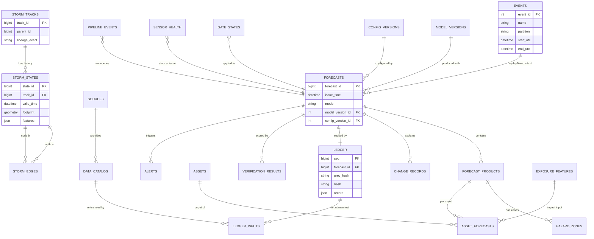
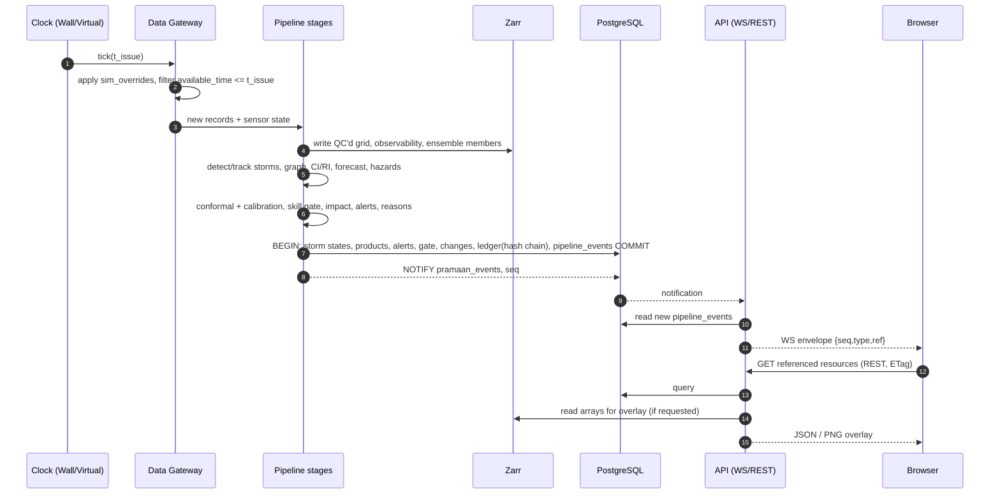
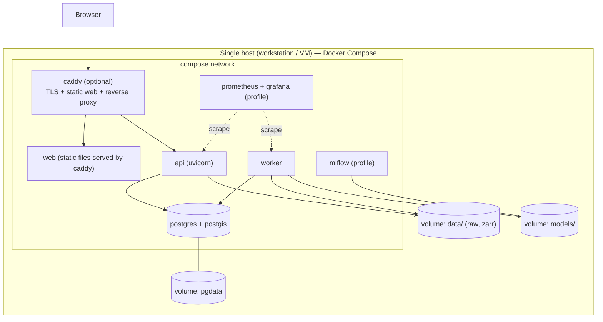

# PRAMAAN-X — TECHSTACK.md

**Product:** PRAMAAN-X — AI-Powered Probabilistic Storm Intelligence, Nowcasting and Impact Prediction Platform
**Document:** Technology stack and architecture decisions
**Version:** 1.0 (Draft for team review) — 04 October 2026
**Companion documents:** `PRD.md` (read in full), `STEPS.md` and `WORKFLOW.md` (see §0.1)
**Scope:** Hackathon MVP first; extensible path to research-grade capability. This document specifies technology only. It does not implement or modify the application.

---

## 0. Reading Notes

### 0.1 Source documents and an important caveat

| Document | Status when this file was written |
|---|---|
| `PRD.md` | Read in full. All tier labels (M / A / R), FR/NFR/AC IDs and feasibility gates (FG-*) are inherited from it. |
| `WORKFLOW.md` | **Not found in the workspace** (no copy was available to read). |
| `STEPS.md` | **Not found in the workspace.** |

Because `WORKFLOW.md` was unavailable, the **workflow baseline used here is the 20-stage "Full Execution / Workflow" from the original PRAMAAN-X notes**, which `PRD.md` already encodes (PRD §4, §10, §16.2). Those stages are named **W1–W20** in §13.3 and every one is mapped to technology. **If `WORKFLOW.md` / `STEPS.md` differ from that baseline, the mapping table in §13.3 must be re-checked against them; no other section should need to change** because the architecture is organised around PRD module boundaries, not around a particular step ordering.

### 0.2 Tier definitions (identical to PRD §0.1)

| Tier | Meaning |
|---|---|
| **M** | Prototype / hackathon MVP. Must work on accessible historical or sample data with limited compute. |
| **M-opt** | MVP-optional: used if time permits or if a profiling/need trigger fires; the MVP is valid without it. |
| **A** | Advanced: credible post-hackathon step. |
| **R** | Research-grade: requires data, compute and validation beyond the MVP. |

### 0.3 Honesty conventions for this document

1. **No version numbers are asserted as "known compatible."** Where a runtime or library version matters, this document states a *selection rule* and a **verification action**. The Phase-0 *compatibility spike* (§11.2) turns those rules into a pinned lockfile.
2. Items needing verification are marked **⚠ VERIFY**.
3. **No library is claimed to deliver a forecasting capability by itself.** Each "purpose" statement separates *what the library provides* from *what PRAMAAN-X code must still build* (see especially §3.1 and ADR-006/007).
4. **No compute, latency or accuracy figures are asserted.** Compute is described qualitatively; measurements are PRD NFR-001..003 outputs.
5. External data and hardware dependencies are consolidated in §11.9.

### 0.4 Guiding constraints (from the task and PRD)

- Small team, limited compute, CPU-first.
- Prefer fewer dependencies and a **modular monolith**.
- No Kubernetes, no distributed streaming, no GPU-specific tooling unless a requirement forces it.
- The **same code path** serves live mode and replay mode (PRD FR-RPL-001).
- Availability-time semantics (`event_time`, `available_time`, `ingestion_time`) are enforced at the data gateway (PRD FR-DATA-001..003).
- Missing data are `null`, never zero-filled (PRD §10.1).

---

## 1. Technology Selection

### 1.1 Master technology table

Legend — **Class:** M / M-opt / A / R. "Alternatives" lists what was seriously considered, with the reason in the relevant ADR (§12).

#### Language, runtime, environment

| Technology | Exact purpose | Why selected | Where used | Alternatives considered | Class |
|---|---|---|---|---|---|
| **Python** | Single implementation language for ingestion, QC, gridding, storm intelligence, forecasting, hazard engines, uncertainty, ledger, API | The meteorological/geospatial ecosystem (Py-ART, wradlib, Satpy, pySTEPS, xarray, rasterio) is Python-native; one language minimises team context-switching | Everything except the web UI | Julia (weaker ecosystem for radar/satellite readers); C++/Rust (high cost for a hackathon); R (weaker serving story) | M |
| **conda-forge + micromamba** (environment manager) | Reproducible install of binary geospatial stack (GDAL, PROJ, GEOS, HDF5/NetCDF) alongside Python packages | GDAL/PROJ/HDF5 binary compatibility is the commonest cause of "works on my machine" failures in this domain; conda-forge ships coherent builds | Dev environment and Docker image build | pip + wheels only (works for many packages but GDAL/system libs are fragile); Poetry/uv alone (excellent for pure-Python, do not manage native libs) | M |
| **conda-lock** (or equivalent lockfile) | Deterministic, platform-specific lock of the conda environment | Reproducibility (PRD NFR-006); locks resolve once in the compatibility spike | Repo root | `pixi` (integrated lock + tasks; good alternative, ⚠ VERIFY team familiarity); plain `environment.yml` (no hard lock) | M |
| **Node.js (Active LTS) + pnpm** | Frontend toolchain and package management | Standard for Next.js; pnpm gives strict, reproducible `node_modules` with lockfile | `web/` | npm (acceptable, simpler), Yarn, Bun (less mainstream for Next.js builds) | M |
| **Typer** | CLI for batch tasks (`ingest`, `build-grid`, `replay`, `train`, `benchmark`, `ledger verify`) | Typed, minimal, integrates with Pydantic types | `src/pramaanx/cli` | argparse (verbose), Click (Typer is built on it) | M |
| **Ruff, mypy (or pyright), pytest, hypothesis, pre-commit** | Lint/format, static typing on core modules, unit/property tests | Property-based tests suit conformal coverage, tracking on synthetic cells, and hash-chain tampering | `tests/`, CI | flake8+black (more tools), unittest | M |

#### Data engineering

| Technology | Exact purpose | Why selected | Where used | Alternatives | Class |
|---|---|---|---|---|---|
| **NumPy / SciPy / pandas** | Array maths, ndimage morphology, Hungarian assignment (`linear_sum_assignment`), statistics (incl. `genpareto`), tabular handling | Foundation of every other library here | Everywhere | Polars (nice for tables; adds a second dataframe API) | M |
| **xarray** | Labelled N-D gridded data model: time × y × x × variable, with CRS/provenance attributes | Natural fit for gridded radar/satellite/NWP/observability tensors; Zarr/NetCDF I/O | `preprocess/`, `forecast/`, `bench/` | Raw NumPy (no coordinates/provenance); iris (less common) | M |
| **Dask** (arrays only; no cluster) | Lazy/chunked operations on large Zarr/NetCDF (e.g., ERA5 subsets); parallelism for batch benchmark | Needed implicitly by xarray for chunked data; avoids loading whole archives | `preprocess/`, `bench/` | joblib/multiprocessing for embarrassingly parallel event loops | M (arrays), A (distributed) |
| **Zarr** (via `zarr` + `numcodecs`, `fsspec`) | Chunked, compressed, versioned store for gridded products (common-grid fields, observability tensor, ensemble members, probability maps) | Append-friendly time axis, cloud-object-store portable via fsspec, good xarray integration | `DATA_ROOT/zarr/…` | NetCDF4/HDF5 (single-file, awkward appends, locking); Parquet (tabular, wrong shape); Cloud Optimized GeoTIFF (2-D layers only) | M |
| **Py-ART** | Radar file readers (format-dependent), radar object model, gridding of polar volumes to Cartesian, QC helpers, dealiasing | Broad format support and gridding; used for proxy-region radar archives too | `ingest/radar`, `preprocess/radar` | wradlib (see next row); LROSE (C++ toolchain, heavy) | M |
| **wradlib** | Radar processing utilities: beam-blockage estimation from DEM, clutter/attenuation helpers, polar↔Cartesian utilities, Z–R conversion | Complements Py-ART where it is stronger (blockage, attenuation) | `preprocess/observability` | In-house DEM line-of-sight (fallback; modest code) | M-opt (conditional) |
| **Satpy** (+ `pyresample`) | Geostationary imager reading, calibration to brightness temperature, resampling to the common grid | Mature multi-sensor readers; pyresample handles swath/area definitions | `ingest/satellite`, `preprocess/grid` | `h5py` + custom reader (fallback if a reader for the chosen INSAT product is absent); GOES/Himawari-specific tools | M |
| **Rasterio** | Raster I/O, windowed reads, reprojection (`rasterio.warp`), vectorisation (`features.shapes`) | Clean Python API over GDAL | `geo/`, `preprocess/` | GDAL Python bindings directly (lower-level, harder to install), `rioxarray` (xarray bridge; optional) | M |
| **GDAL** (system library + CLI, **as a rasterio dependency**) | Format drivers, `gdalwarp` for DEM/WorldPop mosaics and clipping | Required by rasterio; CLI useful for one-off data prep | Data-prep scripts | Using GDAL Python bindings in application code is **not** recommended in MVP | M |
| **pyproj** | CRS definitions and transforms | De-facto standard | `geo/` | — | M |
| **MinIO** (S3-compatible object store) | Object storage for raw/Zarr/model artifacts when more than one machine is involved | Allows production-like S3 semantics | — | Local filesystem + `fsspec` (MVP); managed S3; Garage / SeaweedFS | **A** (not in MVP) |
| **cdsapi, earthaccess/`.netrc`, `s3fs`/`fsspec`, `requests`** | Fetching ERA5 (Copernicus CDS), NASA Earthdata products, open-bucket NWP archives | Required to acquire external data | `ingest/` CLI jobs | Manual download | M |

#### AI / ML

| Technology | Exact purpose | Why selected | Where used | Alternatives | Class |
|---|---|---|---|---|---|
| **OpenCV (`opencv-python-headless`)** | Dense (Farnebäck) and sparse (Lucas–Kanade) optical flow; image morphology | Fast, well-documented; also a dependency of pySTEPS's Lucas–Kanade ⚠ VERIFY | `storms/motion` | scikit-image (`optical_flow_tvl1`, `optical_flow_ilk`; slower, pure Python); pySTEPS motion alone | M |
| **pySTEPS** | Open reference nowcasting: motion fields, extrapolation, S-PROG, STEPS stochastic ensembles, verification metrics | Standard open baseline; gives **ensemble generation machinery** and FSS/CRPS/reliability utilities | `forecast/h1`, `bench/` | Hand-written advection + noise (more code); rainymotion (less maintained ⚠ VERIFY) | M |
| **scikit-image** | Connected-component labelling, `regionprops`, morphology, contour finding | Fits the thresholding-and-objects pipeline | `storms/detect`, `geo/contours` | OpenCV connected components (fewer shape descriptors); tobac / TINT (see ADR-006) | M |
| **scikit-learn** | Logistic models, isotonic calibration, cross-validation utilities, metrics | Calibration and baseline models without extra dependencies | `ml/`, `forecast/uncertainty` | statsmodels (statistical depth, used selectively) | M |
| **LightGBM** | Gradient-boosted trees for CI, lightning, hail, H2/H3 mapping; **native per-feature contributions** (`pred_contrib`) for explanations | Strong on small tabular data, monotone constraints, built-in contribution values avoid a heavy SHAP dependency | `ml/models`, `forecast/hazards` | sklearn `HistGradientBoosting` (no extra dependency; weaker attribution tooling); XGBoost; CatBoost | M |
| **NetworkX** | Storm interaction graph construction and queries | Simple, inspectable; sufficient for tens–hundreds of nodes | `storms/graph` | igraph (faster, extra dependency) | M |
| **Custom conformal module** (NumPy) | Split/Mondrian conformal, Adaptive Conformal Inference | ~dozens of lines of core logic; avoids API churn; fully unit-testable (PRD ML-005) | `forecast/uncertainty` | MAPIE, crepes (use as *cross-check*, optional dev dependency) | M |
| **Calibration methods** (sklearn isotonic; Beta calibration via 3-parameter logistic fit; Platt as baseline) | Post-hoc probability calibration | Standard, low-risk | `forecast/uncertainty` | `betacal` package; temperature scaling (for neural models, A) | M |
| **SciPy `genpareto` (+ custom conditional-scale MLE)** | Peaks-over-threshold GPD fits for extreme rain | Library supplies the distribution and MLE; **covariate conditioning and threshold diagnostics are custom code** | `forecast/hazards/rain` | `pyextremes` (threshold/return-level helpers), `statsmodels` | M |
| **PyTorch** | Training/inference for learned models | Required for all learned deep components | `ml/` (advanced extra) | JAX (smaller ecosystem for graph/operator libs here), TensorFlow | **M-opt** (one small CNN/ConvLSTM baseline if time permits), **A** (core) |
| **PyTorch Geometric (PyG)** | Graph neural networks / graph transformers | The standard PyTorch graph library | `ml/graph` | DGL | **A** (gated by FG-GRF) |
| **Temporal Transformer / Perceiver models** | Sequence models for CI/RI over storm-object histories | Fits irregular, multi-modal sequences | `ml/temporal` | GBM on engineered features (**the MVP choice**) | **A** (gated by FG-TP) |
| **Graph Transformer** | Learned merge/split/intensification prediction | Captures pairwise interaction structure | `ml/graph` | Rule-based graph (**MVP choice**) | **A/R** (gated by FG-GRF) |
| **Conditional Flow Matching** | Learned multi-future generation | Natural generative formulation for trajectories/fields | `ml/generative` | Stochastic ensemble (**MVP choice**); diffusion models | **R** (gated by FG-CFM) |
| **Neural operators (e.g., FNO)** | Learned 1–3 h evolution | Resolution-agnostic operator learning | `ml/operators` | Statistical H2 (**MVP choice**) | **R** (gated by FG-NO) |
| **ONNX Runtime** | Portable CPU inference of exported models | Decouples inference from training stack | `forecast/serving` | In-process sklearn/LightGBM (**MVP choice**) | A |

#### Geospatial

| Technology | Exact purpose | Why selected | Where used | Alternatives | Class |
|---|---|---|---|---|---|
| **Shapely** | Geometry objects/operations (polygons, buffers, intersections) | Standard, GEOS-backed | `storms/`, `geo/`, `impact/` | — | M |
| **GeoPandas** | Vector tables with geometry; bulk loading to/from PostGIS | Ergonomic for exposure preparation | `geo/`, data-prep | Plain Shapely + psycopg (more code) | M |
| **PostGIS** (PostgreSQL extension) | Persistent spatial storage and spatial queries (footprints, tracks, assets, exposure, hazard zones) | One database for both relational and spatial data; GiST indexes; `ST_DWithin`, `ST_Intersects`, KNN | `db` service | SpatiaLite/GeoPackage (single-user only); separate spatial DB | M |
| **GeoAlchemy2 + SQLAlchemy 2.x + Alembic** | ORM/Core mapping of geometry columns; migrations | Standard Python path; migrations are mandatory for team workflows | `api`, `migrations/` | Raw SQL + psycopg (allowed for hot paths); Django ORM | M |
| **OSMnx** | One-time extraction of roads, hospitals, schools, aeroway features for the ROI from OpenStreetMap | Quick, scripted ROI extraction | `geo/exposure` data-prep CLI (**not at runtime**) | Geofabrik extract + `osmium`/`ogr2ogr` (better for large ROI, no API limits); Overpass directly | M |
| **MapLibre GL JS** (via `react-map-gl/maplibre`) | Interactive vector/raster basemap and overlays in the browser | Open-source, no token lock-in, WebGL | `web/` | Leaflet (simpler, weaker for large vector overlays); Mapbox GL (licence/token) | M |
| **deck.gl** (via `@deck.gl/mapbox` overlay) | GPU-rendered ensemble trajectories, probability layers, time-animated paths | Handles many instanced paths/points smoothly; scoped use only | `web/map/layers` | MapLibre native layers only (fallback — see ADR-011) | **M (scoped)** |
| **TiTiler** | Dynamic tiles from Cloud Optimized GeoTIFFs | Useful when many large rasters and many zoom levels must be served | — | Pre-rendered PNG overlays served by the API (**MVP choice**) | **A** |
| **PMTiles / Protomaps basemap** | Single-file, self-hostable basemap tiles for the ROI (offline-capable demos) | Removes dependence on third-party tile servers during a demo | `infra/`, `web/` | Public tile provider subject to its usage policy; MapTiler (key required) | M-opt ⚠ VERIFY tooling |

#### Backend

| Technology | Exact purpose | Why selected | Where used | Alternatives | Class |
|---|---|---|---|---|---|
| **FastAPI** (+ Uvicorn) | Async REST + WebSocket API; auto OpenAPI | Typed, fast to develop, first-class Pydantic integration | `api` service | Flask (no native async/WS typing), Django REST (heavy) | M |
| **Pydantic v2 + pydantic-settings** | Schemas for Storm Object, products, events, config; settings from env | Single source of truth for validation; JSON Schema emission | `src/pramaanx/schemas` | dataclasses + manual validation | M |
| **PostgreSQL** | Primary relational store | See §8 | `db` service | SQLite (no PostGIS/concurrency), MongoDB (weak spatial/relational integrity) | M |
| **psycopg 3** | DB driver with async + LISTEN/NOTIFY support | Needed by the event bridge (§5.4) | `api`, `worker` | asyncpg (fast; separate API for notifications) | M |
| **WebSockets** (FastAPI/Starlette) | Server→browser push of pipeline events | Native in the framework; no extra service | `api` | Server-Sent Events (simpler, one-way; viable alternative) | M |
| **TimescaleDB** | Hypertables/compression for high-volume time series | Not needed at MVP volumes | — | Native PostgreSQL partitioning/BRIN | **A** |
| **Redis / Valkey** | Pub/sub, cache, shared state across multiple API replicas | Not needed with one API process | — | Postgres events table (**MVP choice**) | **A** (Valkey preferred for licensing ⚠ VERIFY) |
| **NATS JetStream** | Durable multi-producer streaming across services/sites | Not justified for one worker, one ROI | — | Postgres events table (**MVP choice**) | **A** |
| **argon2-cffi + PyJWT** | Password hashing and token auth | Minimal secure baseline | `api/auth` | OAuth2 provider (A) | M |

#### Frontend

| Technology | Exact purpose | Why selected | Where used | Alternatives | Class |
|---|---|---|---|---|---|
| **Next.js** (App Router; **static export** when SSR is unnecessary) | App shell, routing, build tooling | Team-familiar standard; static export means no Node runtime in production | `web/` | Vite + React SPA (lighter; legitimate alternative — ADR-011) | M |
| **React + TypeScript** | UI components with typed API contracts | Type safety from OpenAPI-generated types | `web/` | Vue/Svelte (smaller talent pool in many teams) | M |
| **Tailwind CSS** (+ a small set of accessible primitives, e.g., Radix via shadcn/ui — optional) | Styling and layout; colour-blind-safe tokens | Fast iteration, consistent design tokens | `web/` | CSS Modules; Chakra/MUI (heavier) | M |
| **TanStack Query** | Server-state caching/refetch | Clean separation from UI state; works with WS-driven invalidation | `web/state` | SWR; Redux Toolkit Query | M |
| **Zustand** | Small client-state store (selected storm/asset, layer toggles, mode, replay clock) | Minimal boilerplate | `web/state` | Redux Toolkit (heavier), React Context only | M |
| **Apache ECharts** | Time-series, interval bars, reliability diagrams, skill ladder, benchmark charts | Rich chart types needed (reliability, heatmap, error bands) | `web/charts` | Recharts (fewer scientific chart types); uPlot (fast, minimal) | M |
| **openapi-typescript** | Generate TS types from the FastAPI OpenAPI schema | Prevents contract drift | build step | Hand-written types | M |
| **Vitest, Testing Library, Playwright** | Unit/component/E2E tests (E2E for the failure + replay demos) | PRD AC-UI-01 | `web/tests` | Cypress | M |

#### MLOps and infrastructure

| Technology | Exact purpose | Why selected | Where used | Alternatives | Class |
|---|---|---|---|---|---|
| **Docker** | Container images for api/worker/web | Environment reproducibility | `infra/docker` | Podman (equivalent) | M |
| **Docker Compose** | Orchestrate local/single-node deployment (db, api, worker, web, optional profiles) | Right-sized for one host; PRD NFR-004 | `infra/compose` | Kubernetes (rejected — ADR-019), Nomad | M |
| **MLflow** (tracking, SQLite backend + file artifacts) | Experiment tracking, run→model-version linkage | PRD ML-001; lightweight single-user setup | `ml/`, optional compose profile | Weights & Biases (hosted), DVC experiments only | M |
| **DVC** | Version large data/model artifacts and define reproducible pipeline stages (`dvc.yaml`) | Data manifests + reproducible benchmark (PRD DR-004, NFR-006) | repo root | Git LFS (no pipelines), lakeFS (heavy) | M |
| **Caddy** (reverse proxy, automatic TLS when public) | Single entry point; TLS termination; static hosting of web build | Few lines of config | `infra/caddy`, deployment only | Nginx; Traefik | M-opt |
| **Numba** | JIT for CPU hot loops (e.g., ray-based beam blockage, per-cell observability) | Use only after profiling shows a bottleneck | `preprocess/observability` | Vectorised NumPy; Cython | **M-opt** ⚠ VERIFY NumPy compatibility |
| **CUDA toolkit / drivers** | GPU execution for PyTorch | Only if GPU is available and an advanced model passes its gate | advanced image | CPU-only | **A** |
| **CuPy** | GPU NumPy for accelerated gridding/advection | No evidence of need | — | NumPy/Numba on CPU | **A/R** |
| **NVIDIA Triton Inference Server** | High-throughput multi-model GPU/CPU serving | Not needed for in-process LightGBM/sklearn inference. (*Note: this refers to NVIDIA Triton Inference Server, not the OpenAI Triton kernel language.*) | — | In-process inference; ONNX Runtime | **A** |
| **prometheus-client** | `/metrics` endpoints (ingest latency, stage runtime, gate state) | Cheap to add, enables Grafana later | `api`, `worker` | OpenTelemetry (broader, heavier) | M-opt |
| **Prometheus + Grafana** | Metrics scraping and dashboards | PRD NFR-015 is tier A | compose profile `observability` | Structured logs + a built-in "System health" page (**MVP choice**) | **A** (profile available) |
| **GitHub Actions** (or equivalent CI) | Lint, type-check, tests, build images | Standard | `.github/workflows` | GitLab CI | M |
| **SOPS + age, gitleaks** | Secret encryption in repo (if needed) and secret scanning | Lightweight, no secrets server needed | `infra/secrets`, pre-commit | Vault (A) | M-opt |

---

## 2. Data Engineering

### 2.1 Pipeline shape

```
 Source adapters (radar | satellite | lightning | NWP | gauges)
        │  each emits records with event_time / available_time / ingestion_time / quality_flag
        ▼
 Raw store (immutable files + manifest with checksums)         ← DVC-tracked manifests
        ▼
 QC (format, geolocation, missing, outlier, sensor, timestamp)
        ▼
 Common-grid builder (UTM analysis grid; resampling method recorded)
        ▼
 Observability tensor R(x,y,t)  →  Zarr (time-indexed, per-variable arrays)
```

### 2.2 Evaluation of each requested technology

| Technology | What it gives | What PRAMAAN-X code must still do | Decision |
|---|---|---|---|
| **Python** | Ecosystem, glue | Package structure, typing, tests | **Adopt (M).** Select the Python minor version via the compatibility spike (§11.2): the highest version supported by *all* of Py-ART, wradlib, Satpy, pySTEPS, Numba (if used), LightGBM and (advanced) PyTorch at install time. Scientific stacks typically lag the newest Python release; do not default to "latest". |
| **xarray** | Labelled arrays, CF-style attributes, Zarr I/O | Define the **PRAMAAN dataset schema** (variable names, units, dims, `crs`, `grid_res_m`, `source_manifest_id`, `available_time` coordinate) and validate it | **Adopt (M).** Every gridded product has `time`, `y`, `x` dims and a non-dimension coordinate `available_time(time)`, so replay filtering is a coordinate query, not a convention. |
| **Dask (arrays)** | Chunked lazy compute | Chunking strategy; avoid huge task graphs | **Adopt (M) for local chunked ops only.** No Dask cluster. Use `joblib`/`multiprocessing` for per-event parallel benchmark loops unless profiling shows otherwise. Distributed Dask = A. |
| **Zarr** | Chunked arrays with compression, cloud-portable | **Choose the Zarr format version and consolidated-metadata policy explicitly** and keep xarray/zarr/numcodecs/GDAL expectations aligned | **Adopt (M).** ⚠ VERIFY: Zarr's format versions and the corresponding `zarr` Python major versions have differing xarray support and codec behaviour; settle this in the spike and record it in an ADR amendment. |
| **Py-ART** | Radar readers, gridding, helpers | Verify that the **actual IMD file format** is readable; build the composite-reflectivity, VIL, echo-top, and (if velocity is present) velocity features as PRAMAAN modules | **Adopt (M) as the primary radar I/O.** ⚠ VERIFY: IMD DWR file format and access are PRD open questions; Py-ART's reader coverage differs by format. If only imagery is obtainable, Py-ART is bypassed (PRD risk R-2). |
| **wradlib** | Beam-blockage, clutter/attenuation helpers | Radar site metadata, DEM; parameter choice | **M-opt, conditional.** Included if the beam-blockage helper meets needs; otherwise a ~small in-house DEM line-of-sight routine (NumPy/Numba) is the fallback so the dependency can be dropped. Keeping both radar libraries is a real cost (two object models); the rule is *one primary (Py-ART), one targeted utility (wradlib)*. |
| **Satpy** | Calibrated brightness temperatures; resampling via pyresample | A reader for the *chosen* INSAT product, time-stamp conventions (scan start vs nominal), cloud-mask handling | **Adopt (M).** ⚠ VERIFY whether a Satpy reader exists for the specific INSAT-3D/3DR/3DS product obtained from MOSDAC; fallback is `h5py` + a small custom calibration reader. |
| **Rasterio** | Raster I/O/warp/vectorise | Window strategies, nodata handling | **Adopt (M).** |
| **GDAL** | Drivers, CLI | — | **Adopt as a transitive/system dependency only.** Do not write application logic against GDAL bindings. Install through conda-forge so GDAL, PROJ, GEOS and HDF5/NetCDF are mutually compatible. |
| **MinIO** | S3 API on own hardware | Credentials, buckets, backups | **Defer (A).** A single-node MVP uses local filesystem Zarr behind `fsspec` URLs, so adopting S3 later is a configuration change (`ZARR_ROOT=s3://…`). ⚠ VERIFY MinIO's current licence and maintenance status before ever adopting it; Garage, SeaweedFS or a managed S3 service are alternatives. |

### 2.3 Time semantics (data-gateway contract)

| Field | Meaning | Where it lives |
|---|---|---|
| `event_time` | When the observation applies (e.g., radar volume start/mid time — convention documented per source, PRD DR-005) | Zarr coordinate / PG column |
| `available_time` | When the record could first have been used operationally. For archives without real availability, `event_time + assumed_latency[source]`, and `available_time_assumed = true` | Zarr coordinate / PG column |
| `ingestion_time` | When PRAMAAN-X wrote it | PG column / Zarr attrs |

**Gateway rule (single enforcement point):** `DataGateway.query(source, t_issue)` returns only records with `available_time ≤ t_issue`. Live mode uses `WallClock`; replay uses `VirtualClock` (§9.7). No other module is permitted to read raw or gridded stores directly (enforced by a lint rule/import-boundary test, supporting PRD FR-RPL-005).

### 2.4 Common analysis grid

- Default grid resolution is a configuration parameter (`PRAMAAN_GRID_RES_M`); PRD target range 1–3 km, MVP default chosen after the data audit.
- Resampling method per variable class is recorded in dataset attributes: nearest (categorical/flags), bilinear or area-weighted (continuous), max-in-cell for reflectivity compositing if so configured.
- Chunking: one chunk ≈ one time step × full ROI for H1 operations (low-latency reads); documented in the dataset schema. ⚠ VERIFY by profiling.

---

## 3. AI / ML

### 3.1 Principle: libraries ≠ capabilities

| Capability | Libraries provide | PRAMAAN-X must build and validate |
|---|---|---|
| Storm detection | Labelling, morphology, regionprops | Thresholds tuned for the region, merge/split-aware segmentation, Storm Object schema |
| Tracking | Hungarian solver, optical flow | Cost function, gating, lineage logic, quality gating via observability |
| 0–60 min ensemble | pySTEPS motion + stochastic cascade | Reflectivity→rain-rate/units conversion, object-level lifecycle trend integration, perturbation of motion/growth, ETA extraction per member, calibration |
| CI / hazards | GBM, calibration tools | Features, labels, event-level splits, calibration sets, hazard-specific indicators |
| Uncertainty | NumPy | Conformal procedures, stratification by observability class, ACI, coverage monitoring |
| Skill gate | — | Entirely custom logic fed by verification outputs |

pySTEPS in particular is a precipitation-field nowcasting toolkit: it extrapolates and stochastically perturbs fields but **does not model convective initiation, storm lifecycle, interactions or hazards**; those are the contribution of PRAMAAN-X layers on top of it.

### 3.2 Baseline (MVP) models

| # | Component | Technique / library | Notes |
|---|---|---|---|
| B1 | Convective segmentation | Threshold + connected components + morphology (scikit-image/SciPy) | Thresholds are PRD starting points, tuned regionally |
| B2 | Motion | OpenCV Farnebäck / LK + pySTEPS motion; blended with object displacement | Reflectivity must be scaled/quantised consistently for OpenCV |
| B3 | Tracking | `linear_sum_assignment` + advected-footprint IoU cost | Compare against pySTEPS `tdating`/TINT/tobac as an external check (K-12) |
| B4 | Lifecycle | Rule state machine | Config-driven thresholds |
| B5 | Interaction graph | NetworkX + closest-approach heuristics | Heuristic risk index until calibrated (PRD §10.4) |
| B6 | CI | LightGBM or logistic regression + calibration | Interpretable predictors (IR cooling, CAPE/CIN, shear, etc.) |
| B7 | RI | Derivative rules | |
| B8 | H1 forecast | Object kinematic extrapolation + pySTEPS STEPS ensemble (N ≥ 16) | ETA computed per member |
| B9 | H2 | LightGBM/statistical mapping to hazard zones | No individual-track claim |
| B10 | H3 | LightGBM on environment fields + coverage | Climatology reference for BSS |
| B11 | Lightning / hail | LightGBM + calibration | Labels depend on data audit; lightning proxy if feed absent |
| B12 | Downburst | Rules + simple classifier, **Experimental** badge | |
| B13 | Extreme rain | POT/GPD (SciPy + custom covariate model) | Report threshold, exceedances, parameter uncertainty |
| B14 | Uncertainty | Custom split/Mondrian conformal + ACI; isotonic/Beta calibration | |
| B15 | Explanations | Rule-based deltas + LightGBM `pred_contrib` / linear coefficients | States "sensitivity, not causation" |
| B16 | Learned reference baseline (**M-opt**) | Small CNN/ConvLSTM (PyTorch, CPU-feasible at small scale) | Only if time permits (PRD FR-BEN-002) |

### 3.3 Evaluation of requested technologies

| Technology | Verdict | Reasoning and conditions |
|---|---|---|
| **PyTorch** | **Not required for MVP core; M-opt for B16; A for all learned deep models.** | Keep it in a separate `ml-advanced` environment extra / image so the MVP image stays CPU-light and builds fast. CUDA wheels are large and driver-coupled. |
| **OpenCV optical flow** | **Essential (M).** | Fast, deterministic, explainable motion. Limits: assumes brightness constancy; fails on rapidly growing/decaying echoes — which is exactly why object-level growth/decay terms exist. |
| **pySTEPS** | **Essential (M).** | Gives the standard open baseline *and* the ensemble generator. Needs a regular grid with known metric pixel size and rain-rate-like units; document conversions. ⚠ VERIFY installation on the chosen Python version early (it is a frequent compatibility bottleneck). |
| **scikit-learn** | **Essential (M).** | Calibration, logistic baselines, CV, metrics. ⚠ VERIFY the API for calibrating an already-fitted model (it has changed across releases). |
| **PyTorch Geometric** | **Defer (A, FG-GRF).** | Depends on PyTorch builds; added install complexity; data volume of merge/split events is likely small. |
| **Temporal Transformers** | **Defer (A, FG-TP).** | Storm-object sequences are short and sparse; GBM on engineered temporal features is the fair first test. |
| **Graph Transformers** | **Defer (A/R, FG-GRF).** | Must beat the rule-based graph on validation with CI excluding zero. |
| **Conditional Flow Matching** | **Defer (R, FG-CFM).** | Requires large sequence volume and GPU; must match/improve ensemble CRPS and calibration. Candidate libraries (e.g., a TorchCFM-style package) ⚠ VERIFY maintenance. |
| **Neural Operators** | **Defer (R, FG-NO).** | Needs multi-hour gridded sequences and a strong classical H2 baseline first. Candidate library (`neuraloperator`) ⚠ VERIFY. |
| **Conformal prediction** | **Essential (M), implemented in-house.** | Core logic is small; the value is in correct stratification, disjoint calibration sets and monitored coverage. Optionally cross-check against MAPIE in tests. |
| **Calibration methods** | **Essential (M).** | Isotonic for sufficient samples; Beta/Platt-style parametric for small samples; reliability diagrams per hazard; minimum-sample rules fall back to coarser products (PRD R-9). |

### 3.4 Advanced / research models (separate track)

| Model | Entry gate (PRD §11.6) | Environment | Compute character |
|---|---|---|---|
| GNN / Graph Transformer for interactions | FG-GRF | `ml-advanced` (PyTorch + PyG) | Modest (graphs are small); data volume is the constraint |
| Temporal Perceiver/Transformer CI & RI | FG-TP | `ml-advanced` | Modest–moderate |
| Neural Hawkes lightning | FG-HAWKES | `ml-advanced` | Moderate; needs dense lightning data |
| Neural operator H2 | FG-NO | `ml-advanced` + GPU | High (multi-hour gridded sequences) |
| Conditional Flow Matching futures | FG-CFM | `ml-advanced` + GPU | High |
| Virtual-DWR | FG-VDWR | `ml-advanced` + GPU | High; outputs permanently labelled synthetic |

**Integration contract for any learned model** (PRD §11.7): it must implement the `Predictor` interface `(inputs, input_mask) → (prediction, uncertainty_representation, input_mask_used, model_version, calibration_version)`, load from the model registry by version, and be swappable with its baseline through configuration, so a gate-failing model never blocks the product.

### 3.5 Essential-for-MVP vs deferred (summary)

| Essential for MVP | Optional for MVP | Deferred |
|---|---|---|
| OpenCV, pySTEPS, scikit-image, SciPy, scikit-learn, LightGBM, NetworkX, custom conformal, calibration | PyTorch (one CPU baseline), wradlib, Numba, SHAP (only if LightGBM contributions prove insufficient) | PyG, Temporal Transformers, Graph Transformers, CFM, Neural operators, Neural Hawkes, ONNX serving, Triton, CuPy |

---

## 4. Geospatial Intelligence

### 4.1 Coordinate reference systems (CRS policy)

| Use | CRS | Rationale |
|---|---|---|
| **Analysis grid** (nowcasting, distances, speeds, areas) | **EPSG:32645 (WGS 84 / UTM zone 45N)** by default | Metric, low-distortion units required by optical flow, pySTEPS pixel sizes (km), storm speed (km/h), area (km²). The default ROI around Kolkata (~88°E) lies within UTM zone 45 (84°E–90°E). **If the ROI extends outside that longitude band, or covers a large radar domain, switch to a radar-centred azimuthal equidistant projection** defined by a PROJ string and recorded in config. ⚠ VERIFY against the final ROI. |
| **Database vectors** | **EPSG:4326** geometry columns (GiST-indexed) | Interchange standard; GeoJSON-native; matches API output |
| **Web display** | **EPSG:3857** (handled by MapLibre) | Browser mapping standard; never used for measurements |
| **Metric operations inside PostGIS** | `geography` casts, or `ST_Transform` to the analysis CRS | Avoids degree-based errors |

Rules: every raster and vector carries explicit CRS metadata (PRD NFR-010); distances/areas are *never* computed in EPSG:4326 or EPSG:3857; transforms use pyproj with `always_xy=True` to avoid axis-order bugs.

### 4.2 Raster handling

- **Gridded science data:** xarray + Zarr, in the analysis CRS (no per-frame reprojection in the hot path).
- **Static rasters (DEM, WorldPop):** read with Rasterio, clipped/warped once to the analysis grid; stored as Zarr (grid-aligned) and, if needed, as GeoTIFF for inspection.
- **Display rasters:** at render time, reproject the product to a regular lon/lat or Web Mercator grid, apply a colour map, emit a transparent **PNG with a bounding box** and serve it (ADR-012). MapLibre consumes it as an image source; deck.gl `BitmapLayer` is the alternative.
- **Why not TiTiler in MVP:** one ROI, one frame per update, small images; a tile server adds a service, COG conversion and caching concerns without benefit. TiTiler becomes attractive when multiple large regions, many zoom levels, or external clients consume rasters.

### 4.3 Vector handling

| Object | Geometry | Source |
|---|---|---|
| Storm footprint | `Polygon` (4326) | `rasterio.features.shapes` on labelled mask → Shapely simplify |
| Storm track (past/forecast) | `LineString` (4326) | centroid history / ensemble-mean path |
| Ensemble member paths | stored as arrays in Zarr, **not** one geometry per member in PostGIS | avoids row explosion; PG stores summary geometry (cone/envelope) |
| Hazard zones (probability contours) | `MultiPolygon` at configured probability levels | `skimage.measure.find_contours` or `shapes` on thresholded probability grids |
| Assets | `Point`/`Polygon` | user-defined + OSM |
| Exposure | roads `LineString`, facilities `Point`, admin areas `MultiPolygon` | OSMnx / Geofabrik, boundaries |

### 4.4 Spatial queries (PostGIS)

| Need | Query pattern |
|---|---|
| Storms intersecting an asset buffer | `ST_DWithin(storm.geom::geography, asset.geom::geography, :buffer_m)` |
| Hazard-zone → exposed facilities | `ST_Intersects(zone.geom, facility.geom)` with GiST on both |
| Road length inside a hazard zone | `ST_Length(ST_Intersection(road.geom, zone.geom)::geography)` |
| Nearest assets to a storm | KNN operator `<->` with GiST |
| Storm-pair candidates for the graph | distance prefilter in PostGIS (`ST_DWithin`) then edge features in Python |

### 4.5 Impact overlays

Two representations, each with a distinct job (not duplication):

1. **Vector exposure in PostGIS** — authoritative, attribute-rich, supports asset-level queries and CAP polygons.
2. **Grid-aligned exposure rasters** (population per cell, road-length per cell, facility counts per cell, criticality-weighted exposure) — a **derived cache** computed from (1) and WorldPop onto the analysis grid by a reproducible CLI job. Impact for a probability map then becomes a vectorised array operation: `Impact_cell = P_hazard × S × E × V` (PRD §10.9), summed or maxed per asset/admin unit.

Exposure sources: OpenStreetMap (ODbL — attribution required; incomplete attributes in places), WorldPop population rasters, administrative boundaries (source ⚠ VERIFY licence). OSMnx is used **offline** during data preparation (snapshot saved with date); not called at runtime (rate limits, reproducibility).

### 4.6 Evaluation of requested technologies

| Technology | Decision |
|---|---|
| **GeoPandas** | Adopt (M) for data-prep and bulk load; avoid in latency-critical loops |
| **Shapely** | Adopt (M); vectorised (2.x-style) operations for polygons |
| **PostGIS** | Adopt (M) — the single spatial store |
| **OSMnx** | Adopt (M) for ROI-scale extraction; switch to Geofabrik+osmium for larger ROIs |
| **MapLibre GL** | Adopt (M) — base of the map |
| **deck.gl** | Adopt (M, scoped): ensemble trajectories, heat/probability layers, time animation; fallback = MapLibre native layers |
| **TiTiler** | Defer (A) |

---

## 5. Backend Architecture

### 5.1 Style: modular monolith, three processes

```
 api     — FastAPI app: REST, WebSocket, auth. Read-mostly. No model inference.
 worker  — pipeline orchestrator: live loop or replay; owns all compute.
 cli     — batch jobs (ingest, build exposure grid, train, benchmark, ledger verify).
```

`api` and `worker` share one Python package (`pramaanx`) and one container image with different entrypoints. There are **no network calls between internal modules**; module boundaries are Python interfaces (ports/adapters), enforced by import-boundary tests.

### 5.2 Evaluation of requested components

| Component | Decision | Reasoning |
|---|---|---|
| **FastAPI** | **Adopt (M)** | Async REST + WS; OpenAPI is the contract for the frontend |
| **Pydantic** | **Adopt (M)** | Domain schemas shared by worker, API, ledger serialisation; JSON Schema export |
| **PostgreSQL (+PostGIS)** | **Adopt (M)** | One transactional store: relational, spatial, event log, ledger |
| **TimescaleDB** | **Defer (A)** | At MVP volumes (tens–hundreds of storms × scans × events) plain tables with composite/BRIN indexes suffice. **Adoption triggers:** sustained ingest of dense lightning/AWS streams across a large domain, or retention/compression needs measured to be problematic. Migration is straightforward because Timescale is a PostgreSQL extension. |
| **Redis / Valkey** | **Defer (A)** | Needed only for multi-replica pub/sub or caching. **If adopted, prefer Valkey** for licence reasons ⚠ VERIFY. |
| **NATS JetStream** | **Defer (A)** | Justified only by multiple producers/sites or independent consumers needing durable replay; not by one worker feeding one API |
| **WebSockets** | **Adopt (M)** | Push of event envelopes; SSE is an acceptable fallback if proxy/WS issues arise |

### 5.3 Minimum infrastructure for MVP

`PostgreSQL+PostGIS` · `api` · `worker` · `web (static)`. Optional: `mlflow`, `caddy`, `prometheus+grafana` (profiles). **Nothing else.**

### 5.4 Event bridge without a broker

1. The worker commits results (storm states, products, alerts, gate changes) **and** inserts a row into `pipeline_events(seq bigserial, type, payload_ref, created_at)` in the **same transaction**.
2. After commit, the worker issues `NOTIFY pramaan_events, '<seq>'` (payload is just the sequence id; PostgreSQL limits NOTIFY payload size, so never send data).
3. The `api` keeps a `LISTEN` connection; on notification it reads new `pipeline_events` rows and fans them out to connected WebSocket clients as small envelopes.
4. Clients that reconnect send `?since=<seq>`; the API replays missed events from the table (**durable catch-up** — the property usually attributed to JetStream, achieved at MVP scale).
5. Heavy payloads (polygons, series, PNG overlays) are fetched via REST/ETag after the envelope arrives.

Limitation: single database is a single point of failure and fan-out scale is bounded. This is acceptable for the MVP; the interface (`EventPublisher`/`EventSubscriber`) lets NATS or Valkey replace the bridge without changing business modules.

### 5.5 API boundaries (v1)

| Area | Examples (resource-oriented) | Notes |
|---|---|---|
| Storms | `GET /storms`, `GET /storms/{id}`, `GET /storms/{id}/history`, `GET /graph` | Storm Object schema (PRD §10.1) |
| Forecasts | `GET /forecasts/latest?horizon=H1`, `GET /forecasts/{id}`, `GET /forecasts/{id}/overlay.png?layer=…` | Each response carries horizon, product level, confidence, active inputs |
| Assets & ETA | `GET/POST /assets`, `GET /assets/{id}/eta` | ETA + 80% interval |
| Hazards & impact | `GET /hazards/{type}`, `GET /impact?asset=…` | Experimental badge in payload |
| Sensors & simulation | `GET /sensors`, `POST /sim/failure {source, on}` | Writes `sim_overrides`; worker's gateway honours it |
| Skill gate | `GET /gate` | Level per (horizon, lead bin, product) with reasons |
| Explanations | `GET /changes?since=…` | Forecast Change Records |
| Replay | `GET /events`, `POST /replay/{event}/start|pause|seek|step` | Controls the VirtualClock |
| Benchmark | `GET /benchmark/runs`, `GET /benchmark/runs/{id}` | |
| Ledger | `GET /ledger/{forecast_id}`, `POST /ledger/verify` | |
| Alerts | `GET /alerts`, `GET /alerts/{id}/cap.xml` | CAP 1.2 |
| Stream | `WS /ws/v1/stream?since=` | Event envelopes only |
| Ops | `GET /health`, `GET /metrics` | |

### 5.6 Persistence access

SQLAlchemy 2.x (Core + ORM) with GeoAlchemy2 for geometry; raw SQL permitted for spatial hot paths. Alembic migrations in `migrations/` are applied on startup by an explicit command, never implicitly in production.

### 5.7 Authentication

Token-based (JWT) with roles `viewer | operator | evaluator | admin` (PRD SEC-001). Simulation and replay-control endpoints require `operator`. Dev default: seeded demo users; never commit credentials.

---

## 6. Frontend Architecture

### 6.1 Evaluation

| Technology | Decision |
|---|---|
| **Next.js** | Adopt (M) in **static-export** mode when no SSR is needed (the dashboard is client-rendered; API is separate). This removes the Node runtime from deployment. If static export constraints prove awkward, a Vite + React SPA is an acceptable substitution (ADR-011). ⚠ VERIFY the chosen Next.js major's static-export and App Router behaviour with react-map-gl. |
| **React + TypeScript** | Adopt (M) |
| **Tailwind CSS** | Adopt (M) with design tokens for risk levels (colour-blind-safe palette; icons/patterns as non-colour encodings, PRD UX-001) |
| **MapLibre GL + deck.gl** | Adopt (M); deck.gl used through a MapLibre overlay |
| **Apache ECharts** | Adopt (M) for all non-map charts |

### 6.2 Component architecture

```
web/src/
  app/                    # routes: /ops (map), /replay, /benchmark, /ledger, /alerts, /system
  components/
    map/                  # MapCanvas, layers: storms, tracks, ensemble, cones, hazards, exposure, observability-hatch, overlays
    storm/                # StormCard, LifecycleBadge, ReliabilityBar, InteractionGraphView
    forecast/             # AssetCountdown, IntervalBar, ProbabilityGauge, ConfidenceBadge, ProductLevelBadge
    trust/                # SensorStatusPanel, FailureSimulator, SkillLadder, GateHistory
    explain/              # ChangeFeed, ReasonChip
    replay/               # ClockBar, Scrubber, ScoreSummary
    bench/                # MetricTable, ReliabilityDiagram, CRPSChart, CoveragePlot
    ledger/               # LedgerList, VerifyButton, RecordViewer
    ui/                   # primitives (buttons, panels), badges (Experimental/Proxy/Synthetic/In-sample)
  state/                  # Zustand stores + TanStack Query hooks
  api/                    # generated types, fetch client, WebSocket client
  lib/                    # formatting (IST/UTC), units, colour scales
```

### 6.3 State management

| State kind | Tool | Examples |
|---|---|---|
| **Server state** | TanStack Query | storms, forecasts, assets, gate, sensors, benchmark runs |
| **Client/UI state** | Zustand | selected storm/asset, layer toggles, mode (live/replay), replay clock, panel layout |
| **Streaming** | WebSocket client → `queryClient.invalidateQueries`/`setQueryData` | `forecast.issued`, `storms.updated`, `alert.changed`, `gate.changed`, `sensor.changed`, `replay.tick` |

Rule: components never open sockets; one `StreamProvider` owns the connection, reconnect/backoff, `since` sequence tracking, and a visible connection-status indicator.

### 6.4 API integration

- Types generated from FastAPI's OpenAPI schema (`openapi-typescript`) in CI; a diff in generated types fails the build until reviewed (prevents silent drift).
- A thin typed fetch client; errors normalised to a `ProblemDetail` shape.
- Time handled as ISO-8601 UTC strings; formatted to IST in one utility with UTC on hover (PRD UX-007).

### 6.5 Visualisation architecture

| Visual | Technology |
|---|---|
| Basemap, storm polygons, tracks, hazard-zone contours, asset markers | MapLibre layers (GeoJSON sources) |
| Ensemble trajectories (16+ per storm), probability heat layer, time-animated paths | deck.gl layers via overlay (`PathLayer`/`TripsLayer`, heat/bitmap) |
| Radar/probability raster overlays | Image source (PNG + bounds) |
| Low-observability hatching | Pattern/fill layer from observability polygons |
| Sparkline trends, ETA interval bars, skill ladder, reliability diagrams, CRPS/coverage charts | ECharts |
| Interaction graph | Rendered as map edges + a small node-link view (SVG or ECharts graph) |

Accessibility: every risk encoding has a non-colour redundancy (icon/label/pattern); badges are mandatory for Experimental / Proxy / Synthetic / Uncalibrated / In-sample states (PRD UX-003).

---

## 7. MLOps and Infrastructure

### 7.1 Evaluation

| Technology | Decision | Justification |
|---|---|---|
| **Docker** | Adopt (M) | Reproducible images; two Python images: `base` (CPU) and `ml-advanced` (PyTorch, optional CUDA) |
| **Docker Compose** | Adopt (M) | Single-node deployment, profiles for optional services |
| **MLflow** | Adopt (M), SQLite backend + local artifacts | Run tracking, parameter/metric logging, model version identifiers recorded into the ledger. ⚠ VERIFY the supported local backend options for the chosen release |
| **DVC** | Adopt (M) | Data/model/manifest versioning, `dvc.yaml` stages (`ingest → grid → features → train → calibrate → benchmark → report`). Remote: shared drive or S3-compatible store, chosen by the team |
| **CUDA** | Defer (A) | Only inside the `ml-advanced` image, only when a gated model needs a GPU |
| **CuPy** | Defer (A/R) | No profiling evidence |
| **Numba** | M-opt | After profiling; ⚠ VERIFY NumPy/Python compatibility |
| **Triton Inference Server** | Defer (A) | In-process inference is simpler and sufficient |
| **Prometheus / Grafana** | Compose profile (A); MVP uses logs + `/health` + in-app system page | Matches PRD NFR-015 tier |

### 7.2 Experiment tracking

- Every training/calibration/benchmark run logs: git SHA, DVC data hash, config hash, random seed, environment lock hash, partition manifest hash, metrics with CIs.
- Run tags: `component` (e.g., `ci`, `hail`), `horizon`, `partition` (`train|val|blind`).
- **Blind-set policy in tooling:** the benchmark job refuses to run on the blind list if the list hash does not match the sealed hash recorded in the repo (PRD AC-BEN-01); blind runs are tagged and counted (once per model version).

### 7.3 Model versioning and registry

- A model version = `(component, git_sha, training_manifest_hash, calibration_version, config_hash)`.
- MVP registry = a directory `models/` of artifacts + `model.json` metadata, tracked by DVC, mirrored as MLflow runs. The worker's `ModelRegistry` loads by version id from config.
- The model version is written to every forecast ledger entry (PRD FR-LED-001) and to the Forecast Change Record.

### 7.4 Reproducibility requirements

| Requirement | Mechanism |
|---|---|
| Same environment | `conda-lock` file + Docker image digest |
| Same data | DVC-tracked manifests with checksums; raw files immutable |
| Same randomness | Seeds in config; ensemble RNG streams derived from `(seed, forecast_id)` |
| Same config | YAML config hashed into `config_versions` (thresholds for gate, alerts, lifecycle) |
| Same result | Replay determinism test (PRD AC-RPL-04): identical ledger content hashes excluding wall-clock fields |

### 7.5 Deployment and observability

- MVP: `docker compose up` with profiles; single node; images built in CI.
- Observability MVP: structured JSON logs (with `forecast_id`, `stage`, `duration_ms`), per-stage timing persisted to a `stage_metrics` table, a "System" page in the UI (source health OK/Degraded/Stale/Down, ingest latency, QC reject rate, gate state). `prometheus-client` endpoints are cheap and enable the Grafana profile later.
- Alerts on the system itself (e.g., stale source) are surfaced in the UI; external paging is out of scope for MVP.

---

## 8. Database and Storage Design

### 8.1 Principle

**Each datum has exactly one authoritative home.** Derived caches are allowed only when named as such, reproducible, and listed here.

### 8.2 Responsibility matrix

| Data category | Authoritative store | Format / structure | Notes |
|---|---|---|---|
| **Relational/config data** (events inventory, partitions, sources register, users, config versions, model versions) | PostgreSQL | Normal tables | |
| **Time-series observations — point/event** (lightning events, AWS/gauge readings, sensor health) | PostgreSQL | Tables with `(source, time)` indexes, spatial index on lightning points | TimescaleDB later if volume demands |
| **Time-series observations — gridded** (radar composites, IR, NWP slices, QC masks, observability tensor) | **Zarr** | xarray datasets, `available_time` coordinate | Not duplicated in PG; PG holds only a catalog row (URI, time range, hash) |
| **Raw source files** | Filesystem (immutable) → S3-compatible (A) | As received | Tracked by checksum manifest |
| **Storm objects** | PostgreSQL + PostGIS | `storm_tracks` (identity, lineage) and `storm_states` (per-time state, footprint polygon) | Full history retained (PRD FR-STM-013) |
| **Storm interaction edges** | PostgreSQL | `storm_edges(valid_time, a, b, features, risk indices)` | |
| **Forecast products — summary/vector** (ETA, intervals, hazard probabilities, zone polygons, cones) | PostgreSQL + PostGIS | `forecasts`, `forecast_products`, `hazard_zones`, `asset_forecasts` | |
| **Forecast products — bulky arrays** (ensemble members, probability grids) | **Zarr** | `forecast_id`-keyed groups | PG row stores `zarr_uri` and `array_hash` |
| **Geospatial layers** (exposure vectors, assets, admin areas) | PostGIS | Geometry (4326) | |
| **Exposure grid cache** | Zarr (**derived**) | Grid-aligned rasters | Rebuilt by CLI; manifest records inputs |
| **Static rasters** (DEM, WorldPop) | Files (GeoTIFF) + Zarr (grid-aligned derived) | | |
| **Historical datasets** | Raw files + Zarr + PG catalog; versions via DVC | | |
| **Model artifacts** | Filesystem (`models/`) tracked by DVC; MLflow artifact store (same files referenced, not copied twice) | | Avoid double copies: MLflow logs references/hashes where possible |
| **Experiment metadata** | MLflow (SQLite) | | |
| **Forecast audit records (ledger)** | PostgreSQL only | Append-only hash-chained table | Stores **hashes** of Zarr arrays and input files, not the arrays |
| **Verification results** | PostgreSQL | `verification_results`, `gate_statistics` | |
| **Alerts** | PostgreSQL | `alerts` + CAP XML text | |
| **Pipeline events** | PostgreSQL | `pipeline_events` | Retention policy defined by config |

### 8.3 Logical relationships (ER overview)



*(Diagram shows logical relationships; physical constraints, indexes and column lists belong in `migrations/` and are not fully enumerated here.)*

### 8.4 Ledger implementation requirements

- Table `ledger(seq, forecast_id, record_json, prev_hash, hash, created_at)`; `hash = SHA-256(canonical_json(record) ‖ prev_hash)` computed with Python `hashlib`.
- **Canonical serialisation:** UTF-8, sorted keys, no insignificant whitespace; floats serialised with a fixed policy (e.g., fixed decimal strings) to avoid platform-dependent representations. ⚠ Decide and test; a library implementing a canonical-JSON standard may be used.
- **Append-only enforcement in the database:** the application role has `INSERT`/`SELECT` only; a trigger rejects `UPDATE`/`DELETE`; evaluation results are appended as new records (PRD FR-LED-004).
- `ledger verify` recomputes the chain and reports the first inconsistent `seq` (supports tests for modify/delete/swap, PRD AC-LED-02).
- Honest framing (PRD FR-LED-006): this is **tamper-evident**, not tamper-proof; an actor with full DB and code access could rebuild the chain. Mitigation path (A): periodic signed chain-head digests (`cryptography`, Ed25519) stored off-system.

### 8.5 Retention

Raw data and Zarr event archives: retained per project policy and licences. `pipeline_events`: time-limited. Ledger: never deleted. Storage growth estimates are produced from the actual ROI/grid/ensemble settings after the first replay (no figure asserted here).

---

## 9. System Architecture

### 9.1 High-level architecture

```mermaid
flowchart LR
  subgraph EXT["External data (access to be verified)"]
    DWR["IMD DWR / proxy radar archives"]
    SAT["INSAT via MOSDAC / other geostationary"]
    LTG["Lightning data (if licensed)"]
    NWP["ERA5 / GFS / regional NWP"]
    AWS["AWS / gauges / satellite rainfall"]
    OSM["OSM / WorldPop / DEM / boundaries"]
  end

  subgraph WORKER["worker (pipeline orchestrator)"]
    GW["Data Gateway<br/>(availability-time filter)"]
    QC["QC"]
    GRID["Common grid builder"]
    OBS["Observability R(x,y,t)"]
    STORM["Storm detect / track / lifecycle"]
    GRAPH["Interaction graph"]
    CI["CI + RI"]
    FC["Forecast engine<br/>H1 / H2 / H3"]
    HAZ["Hazard engines"]
    UNC["Uncertainty: conformal + calibration"]
    GATE["Skill gate"]
    IMP["Impact engine"]
    ALR["Alert engine"]
    XAI["Change explanations"]
    LED["Ledger writer"]
    CLK["Clock: Wall | Virtual"]
  end

  subgraph STORES["Storage"]
    RAW[("Raw files + manifests")]
    ZARR[("Zarr: grids, ensembles")]
    PG[("PostgreSQL + PostGIS")]
    MODELS[("models/ + MLflow (SQLite)")]
  end

  subgraph API["api (FastAPI)"]
    REST["REST /api/v1"]
    WS["WebSocket stream"]
    AUTH["Auth / RBAC"]
  end

  WEB["web (Next.js static)<br/>MapLibre + deck.gl + ECharts"]

  EXT --> GW
  GW <--> RAW
  GW --> QC --> GRID --> OBS --> STORM
  CLK --> GW
  STORM --> GRAPH --> FC
  STORM --> CI --> FC
  OBS --> UNC
  FC --> HAZ --> UNC --> GATE --> IMP --> ALR
  GATE --> XAI
  UNC --> LED
  ALR --> LED
  GRID <--> ZARR
  FC <--> ZARR
  STORM --> PG
  HAZ --> PG
  IMP <--> PG
  LED --> PG
  MODELS --> FC
  MODELS --> HAZ
  PG -- "LISTEN/NOTIFY + pipeline_events" --> WS
  PG --> REST
  ZARR --> REST
  REST --> WEB
  WS --> WEB
  WEB -- "sim/replay controls" --> REST
  REST -- "sim_overrides, replay_commands" --> PG
  PG -- "controls read by worker" --> CLK
```



### 9.2 Service boundaries

| Service | Responsibilities | Must NOT |
|---|---|---|
| **worker** | Gateway, QC, gridding, observability, storm intelligence, forecasting, hazards, uncertainty, gate, impact, alerts, ledger, replay clock | Serve HTTP to browsers |
| **api** | AuthN/Z, read endpoints, control endpoints (writes command rows only), WebSocket fan-out, overlay PNG rendering from stored arrays | Run models; mutate forecasts; write ledger entries |
| **db** | Relational + spatial + events + ledger | Hold large arrays |
| **web** | Presentation, local interaction state | Compute science; hold secrets |
| **cli** | Batch jobs | Run as a long-lived service |

Control flow for demo actions (failure simulation, replay seek) is **command rows in PostgreSQL** (`sim_overrides`, `replay_commands`) that the worker polls/consumes between pipeline cycles. The API never calls the worker directly, so there is no inter-service RPC to secure or version.

### 9.3 Data flow (one update cycle)



### 9.4 Model inference integration

- Models are loaded **inside the worker** by `ModelRegistry` at startup (and on version change command), executed in-process.
- Each model is wrapped in the `Predictor` interface with an explicit `input_mask` argument so **missing sensors change the feature set or the model variant, not the code path**.
- Masked-modality variants (e.g., `no_radar`) are separate versioned artifacts or a single model trained with masking; either way the chosen variant is recorded per forecast.
- Ensemble generation (pySTEPS STEPS plus object-level perturbation) runs in the worker; member arrays go to Zarr and derived quantities (ETA per member, exceedance probabilities) go through conformal/calibration wrappers.
- Advanced models load only behind a config flag and their gate result; on gate failure the baseline `Predictor` is used.

### 9.5 Real-time communication

WebSocket carries **event envelopes only**: `{seq, type, forecast_id|storm_id|alert_id, issued_at, mode}`. `mode` ∈ {LIVE, REPLAY} is present on every envelope so the UI can show the REPLAY banner and the replay clock. Replay ticks are events like any other.

### 9.6 Database relationships

See §8.3. Key invariants: every `forecast_products` row references the `model_versions` and `config_versions` that produced it; every `ledger` row references exactly one `forecast`; `ledger_inputs` references `data_catalog` rows (with hashes and `available_time`), which is what makes the leakage test (PRD FR-RPL-005) a SQL query: `SELECT … WHERE available_time > forecast.issue_time` must return zero rows.

### 9.7 Live vs replay: one code path

```
interface Clock          { now() -> datetime }          # WallClock | VirtualClock
interface DataSource     { query(t_issue) -> Records }  # LiveAdapter | ArchiveAdapter
interface EventPublisher { publish(event) }             # PgNotify (MVP) | Nats (A)
```

Replay differs from live only by (a) `VirtualClock` + `ArchiveAdapter` and (b) `mode=REPLAY` on outputs. If live access is not granted, "live" is **simulated by replaying an archive at real-time rate** and the UI states so (PRD C-02).

### 9.8 Deployment topology



Advanced topology (A): add object storage, Valkey/NATS as justified, a GPU worker (`ml-advanced` image), per-radar worker partitions; Kubernetes is considered only if multi-node scheduling becomes a real requirement (ADR-019).

---

## 10. Repository Structure

A **monorepo** with one Python package (`pramaanx`) and one web app. Python modules map one-to-one to PRD functional groups so traceability is direct.

```
pramaan-x/
├── README.md
├── docs/
│   ├── PRD.md
│   ├── STEPS.md
│   ├── WORKFLOW.md
│   ├── TECHSTACK.md
│   ├── adr/                         # ADR-001.. (see §12), amendments from the compat spike
│   ├── model_cards/                 # one per component (PRD ML-003)
│   ├── data_register/               # data-access audit, licences, time conventions
│   └── runbooks/                    # demo script, replay, failure simulation, ledger audit
├── config/
│   ├── roi.yaml                     # region, grid CRS, resolution, radar sites
│   ├── sources.yaml                 # adapters, assumed latencies, staleness limits
│   ├── thresholds.yaml              # segmentation, lifecycle, gate, alert levels (versioned/hashed)
│   └── events.yaml                  # event inventory + partition (blind list hash)
├── environment/
│   ├── environment.yml              # base (CPU) conda env
│   ├── environment-ml.yml           # ml-advanced extra (PyTorch, PyG, …) — optional
│   └── conda-lock.*                 # generated lockfiles
├── pyproject.toml                   # package metadata, ruff/mypy/pytest config
├── dvc.yaml  params.yaml  .dvc/     # pipeline stages + data/model tracking
├── Makefile                         # dev tasks (WSL2/Linux/macOS)
├── .env.example
├── src/pramaanx/
│   ├── schemas/                     # Pydantic: StormObject, Forecast, Alert, Event envelope
│   ├── core/                        # clock, config, logging, ids, errors, interfaces (ports)
│   ├── ingest/                      # DATA ingestion: adapters (radar, satellite, lightning, nwp, gauges), manifest, gateway
│   ├── preprocess/                  # PREPROCESSING: qc/, grid/ (resample), observability/ (R tensor, beam height)
│   ├── storms/                      # STORM INTELLIGENCE: detect/, motion/, track/, lifecycle/, graph/, ci/, ri/
│   ├── forecast/                    # FORECASTING: h1/, h2/, h3/, ensemble/, eta/, hazards/{lightning,hail,downburst,rain}/,
│   │                                #              uncertainty/ (conformal, calibration), skillgate/, explain/
│   ├── geo/                         # GEOSPATIAL: crs, rasterize/vectorize, contours, exposure/, impact/, overlays (PNG)
│   ├── alerts/                      # alert rules, hysteresis, CAP 1.2 builder
│   ├── ledger/                      # canonical serialisation, chain, verify
│   ├── replay/                      # virtual clock, event runner, leakage test
│   ├── bench/                       # baselines, metrics, bootstrap CIs, report builder
│   ├── ml/                          # AI/ML: features/, models/ (GBM), registry/, train/, calibrate/, advanced/ (gated)
│   ├── db/                          # session, models, queries, event bridge
│   ├── api/                         # FastAPI app: routers/, deps/, auth/, ws/
│   ├── worker/                      # orchestrator loop, stage graph, command consumer
│   └── cli/                         # Typer commands
├── migrations/                      # Alembic (env.py, versions/)
├── web/                             # FRONTEND (Next.js, TypeScript, Tailwind)
│   ├── src/…  (see §6.2)
│   ├── tests/  playwright/
│   └── package.json  pnpm-lock.yaml
├── tests/
│   ├── unit/                        # QC, observability, tracking, conformal, ledger, CAP
│   ├── property/                    # hypothesis: tracking invariants, conformal coverage, hash-chain tamper
│   ├── integration/                 # DB, event bridge, gateway filtering, end-to-end replay on tiny fixture
│   ├── data_fixtures/               # synthetic cells (translating, merging, splitting), tiny real samples if licensed
│   └── leakage/                     # future-data injection tests (EXP-9)
├── infra/
│   ├── docker/                      # Dockerfile.base, Dockerfile.ml, Dockerfile.web
│   ├── compose/                     # compose.yaml + profiles (mlflow, observability, caddy, gpu)
│   ├── caddy/  prometheus/  grafana/
│   └── secrets/                     # SOPS-encrypted examples only
├── data/                            # (git-ignored; DVC-managed) raw/, zarr/, exposure/, static/
├── models/                          # (DVC-managed) versioned artifacts + model.json
└── .github/workflows/               # CI: lint, type-check, tests, image build, OpenAPI→TS drift check
```

**Boundary rules (enforced by import-linter-style tests):**
`ingest` is the only package reading source files; `forecast` and `storms` read data only through `ingest.gateway`; `api` never imports `forecast`/`storms`/`ml` compute modules; `geo` has no knowledge of storms; `ledger` depends only on `schemas` and `db`.

---

## 11. Environment and Deployment

### 11.1 Supported runtimes (selection rules, not asserted versions)

| Runtime | Rule | Verification action |
|---|---|---|
| **Python** | Highest minor version for which the conda-forge solver finds a complete environment containing Py-ART, wradlib (if used), Satpy, pySTEPS (+ OpenCV), Numba (if used), LightGBM, GeoPandas, rasterio, zarr, xarray, dask, MLflow, FastAPI stack | Run the compatibility spike (§11.2); record the result in `docs/adr/` |
| **NumPy** | Whatever major the solver selects; **Numba, pySTEPS and compiled extensions frequently constrain NumPy** | ⚠ VERIFY in spike |
| **PostgreSQL / PostGIS** | A currently supported PostgreSQL major with a published PostGIS image pairing; pin image digest | ⚠ VERIFY available image tags |
| **Node.js** | Current Active LTS | ⚠ VERIFY against the chosen Next.js major |
| **Next.js / React / MapLibre GL JS / react-map-gl / deck.gl** | Latest stable majors that are mutually compatible | ⚠ VERIFY: especially `@deck.gl/mapbox` overlay with MapLibre and the react-map-gl MapLibre entry point; run the map smoke test |
| **Docker / Compose** | Current stable Engine and Compose v2 | — |
| **Host OS** | Linux, macOS, or Windows **via WSL2**. Native Windows is not a supported dev target for the scientific stack | ⚠ VERIFY aarch64/arm64 availability of conda-forge builds if team uses Apple Silicon |

### 11.2 Phase-0 compatibility spike (required before coding)

1. Create `environment.yml` with the MVP package list; solve with micromamba on the target OS/arch(s).
2. Import smoke tests: `pyart`, `wradlib` (if used), `satpy`, `pysteps` (including its Lucas–Kanade method and plotting), `cv2`, `rasterio`, `xarray` + `zarr` round-trip write/read, `lightgbm`, `geopandas`, `shapely`, `sqlalchemy` + `geoalchemy2`.
3. Functional micro-tests: Py-ART reads an available radar sample; Satpy reads the chosen satellite sample; pySTEPS runs an extrapolation and a STEPS ensemble on a tiny synthetic field; Zarr append along time works with the chosen format version.
4. Build the Docker image from the lockfile; run the same micro-tests inside it.
5. Frontend: scaffold, build static export, render a MapLibre map with a deck.gl overlay and a PNG image source.
6. Freeze: generate `conda-lock` files and `pnpm-lock.yaml`; record versions and any pins/overrides in an ADR amendment.

*Exit criterion:* all micro-tests pass in the container. Libraries failing at this stage are replaced or dropped via the fallbacks named in §2 and §3 before feature work begins.

### 11.3 Package managers

| Domain | Tool |
|---|---|
| Python scientific stack | micromamba/conda (conda-forge) + `conda-lock` |
| Pure-Python extras not on conda-forge | `pip` inside the conda env, recorded in `environment.yml`'s pip section (keep this list short) |
| Frontend | pnpm (npm acceptable) with committed lockfile |
| Data & models | DVC |

### 11.4 Environment variables (`.env.example` contents)

| Variable | Purpose | Secret? |
|---|---|---|
| `PRAMAAN_ENV` | `dev` / `demo` / `prod` | no |
| `PRAMAAN_MODE` | `live` or `replay` default | no |
| `TZ` | Must be `UTC` for services | no |
| `DATABASE_URL` | PostgreSQL DSN | **yes** |
| `DATA_ROOT` / `ZARR_ROOT` / `RAW_ROOT` / `MODEL_ROOT` | Storage roots (path or `s3://` via fsspec) | no (credentials separate) |
| `PRAMAAN_ROI_CONFIG`, `PRAMAAN_THRESHOLDS_CONFIG`, `PRAMAAN_SOURCES_CONFIG` | Config file paths | no |
| `PRAMAAN_GRID_CRS`, `PRAMAAN_GRID_RES_M` | Analysis grid definition | no |
| `ENSEMBLE_SIZE`, `ENSEMBLE_SEED` | Ensemble settings | no |
| `MLFLOW_TRACKING_URI` | Tracking location | no |
| `API_JWT_SECRET`, `API_TOKEN_TTL_MIN` | Auth | **yes** (secret) |
| `ALLOWED_ORIGINS` | CORS | no |
| `LOG_LEVEL` | Logging | no |
| `NEXT_PUBLIC_API_BASE_URL`, `NEXT_PUBLIC_WS_URL`, `NEXT_PUBLIC_MAP_STYLE_URL` | Frontend (build-time; **public**, never place secrets here) | no |
| `CDSAPI_*` / `.cdsapirc` | Copernicus CDS access | **yes** |
| Earthdata credentials (`.netrc`) | NASA data access | **yes** |
| MOSDAC / IMD / lightning-provider credentials (if granted) | Source access | **yes** |
| `S3_*` | Object-store credentials (A) | **yes** |
| `LEDGER_SIGNING_KEY_PATH` | Chain-head signing (A) | **yes** |

### 11.5 Local development setup (outline)

1. Install Docker, micromamba, Node LTS, pnpm (Linux/macOS/WSL2).
2. `cp .env.example .env`; fill dev values.
3. `make env` → create conda env from lockfile; `make web-install`.
4. `make db-up` → start PostGIS container; `make migrate` → Alembic upgrade.
5. `make data-sample` → `dvc pull` small fixture/sample dataset (or run synthetic-fixture generator when real data are not yet available).
6. `make replay EVENT=<id>` → worker in replay mode; `make api`; `make web-dev`.
7. `make test` → unit + property + integration (with compose DB) + leakage tests.

The synthetic-cell fixtures ensure the pipeline, UI and tests can run **before** real radar access is granted.

### 11.6 Docker configuration

| Image | Contents | Notes |
|---|---|---|
| `pramaanx-base` | conda-forge env (CPU), `pramaanx` package; entrypoints: `api`, `worker`, `cli` | Multi-stage build from lockfile; non-root user; no build tools in final stage |
| `pramaanx-ml` | `pramaanx-base` + PyTorch (+PyG) | Built only when advanced models are enabled |
| `pramaanx-ml-gpu` | `pramaanx-ml` on a CUDA-enabled base | Requires host NVIDIA driver + NVIDIA Container Toolkit; **A only** |
| `web` | Static export served by Caddy (or any static server) | No Node runtime in production |
| `postgres` | Official PostGIS image, pinned digest | Extensions created by migration |

Compose profiles: `default` (db, api, worker, web), `mlflow`, `observability`, `caddy`, `gpu`.

### 11.7 GPU vs CPU execution

| Aspect | CPU (MVP) | GPU (Advanced) |
|---|---|---|
| Storm detection, tracking, graph | CPU | CPU |
| pySTEPS ensemble | CPU (NumPy/FFT-based) | CPU (GPU not assumed) |
| GBM, calibration, conformal | CPU | CPU |
| Learned deep models | Small baseline only (B16) | PyTorch on CUDA, only after gate approval |
| Orchestration | `ENSEMBLE_SIZE` and grid resolution are the first knobs when compute is tight | — |
| Fallback | If GPU absent/unavailable, advanced models are **disabled by config**, not emulated | — |

Compute envelope is declared with the benchmark report (PRD NFR-001..003): CPU model, core count, RAM, GPU (if any).

### 11.8 Deployment requirements and secrets management

**Deployment (MVP):** one Linux host/VM or workstation; Docker Engine + Compose v2; enough disk for raw + Zarr archives for the chosen events (estimate after the first replay); outbound network for acquisition jobs only; reverse proxy with TLS if exposed beyond localhost; NTP-synchronised clock (UTC); backups of `pgdata` and DVC remote.

**Secrets:**
- `.env` and credential files are git-ignored; only `.env.example` is committed.
- Compose consumes secrets via env files or Docker secrets; no secrets in images or build args.
- CI uses the CI provider's secret store; pre-commit and CI run `gitleaks`.
- If encrypted secrets must live in the repo, use SOPS with age keys.
- Frontend receives only public configuration (`NEXT_PUBLIC_*`).
- Advanced production: a managed secrets service (e.g., Vault or cloud-provider equivalent) and signed ledger digests.

### 11.9 External data and hardware dependencies (consolidated)

| Dependency | Needed for | Status/assumption | Fallback |
|---|---|---|---|
| IMD DWR data (volume or product files), site metadata (location, band, elevations, beam width) | Core storm detection, observability | **Not assumed available**; may require agreement ⚠ | Public radar products (reduced fidelity); open radar archives from other regions as methodological proxy; IR-based objects |
| INSAT imagery via MOSDAC (registration/terms) | CI, IR cooling, fallback fusion | Archive access plausible; near-real-time latency to verify | Alternative geostationary data where licensed |
| Lightning data (licensed network or research dataset) | Lightning hazard, jump detection | Often restricted | Radar/IR lightning **proxy**, labelled |
| NWP/reanalysis (ERA5 via CDS account; open global forecast archives) | Environment features, H3 | Accounts and licence acceptance required; reanalysis has no real-time latency | Documented assumptions; forecast archives if obtainable |
| Gauges/AWS, satellite rainfall (account-gated products) | Extreme-rain tails, verification | Access varies | Open satellite precipitation, small curated gauge sets |
| DEM, OSM, WorldPop, admin boundaries | Beam blockage, exposure, impact | Openly available with licence/attribution terms | — |
| Basemap tiles | Map UI | Public providers have usage policies; offline demo may be needed | Self-hosted PMTiles of the ROI |
| Compute | All | CPU workstation/VM; RAM sized to ROI × grid × ensemble | Coarser grid, fewer members, shorter events |
| GPU | Advanced models only | Not assumed | Defer models |
| Domain expert (meteorologist) | Gold labels, thresholds, alert wording | Dependency, not software | Literature defaults flagged as unreviewed |

---

## 12. Architecture Decision Records

Format per ADR: **Decision · Alternatives and why not · Trade-offs · Complexity · Compute · Revisit when.** Status for all: *Accepted (MVP)* unless stated.

### ADR-001 — Modular monolith, not microservices
- **Decision:** One Python package; processes `api`, `worker`, `cli`; internal boundaries are interfaces, not network calls.
- **Alternatives:** Per-stage microservices (ingest, tracker, forecaster…) — rejected: contract/versioning overhead, deployment burden, debugging cost for a small team.
- **Trade-offs:** Less independent scaling; risk of tight coupling → mitigated by import-boundary tests.
- **Complexity:** Low. **Compute:** Single host.
- **Revisit when:** Multiple radars/sites require independent scaling or ownership.

### ADR-002 — conda-forge/micromamba environment with a lockfile
- **Decision:** Binary geospatial stack via conda-forge; `conda-lock` for determinism; pip only for stragglers.
- **Alternatives:** pip/uv + wheels (GDAL/HDF5/PROJ mismatch risk); Poetry (no native libs); pixi (viable; ⚠ VERIFY team familiarity).
- **Trade-offs:** Slower solves; two ecosystems (conda + pnpm).
- **Complexity:** Low–moderate. **Compute:** negligible.
- **Revisit when:** A package required by the project is unavailable on conda-forge for the target platform.

### ADR-003 — Zarr (via xarray) as the gridded data store
- **Decision:** All gridded observations, derived grids, observability tensors, ensemble members and probability maps in Zarr with an `available_time` coordinate.
- **Alternatives:** NetCDF/HDF5 (append/locking issues, single-file); Parquet (wrong shape); database BLOBs (poor ergonomics).
- **Trade-offs:** Many small files on local FS; format-version compatibility must be pinned (⚠ VERIFY).
- **Complexity:** Moderate. **Compute:** I/O dominated; chunking tuned by profiling.
- **Revisit when:** Multi-node access requires object storage (change `ZARR_ROOT` to S3 URL).

### ADR-004 — Single PostgreSQL + PostGIS for relational, spatial, events and ledger
- **Decision:** One database instance; separate schemas (`core`, `storm`, `forecast`, `geo`, `audit`).
- **Alternatives:** Timescale (deferred), separate spatial DB, document store.
- **Trade-offs:** Ledger and operational data share a failure domain; mitigated with backups and, in A, external anchoring.
- **Complexity:** Low. **Compute:** Low.
- **Revisit when:** Observation ingest volume or retention demands exceed plain-Postgres handling (adopt Timescale), or compliance requires physically separate audit storage.

### ADR-005 — No message broker in MVP: `pipeline_events` + LISTEN/NOTIFY
- **Decision:** Transactional outbox pattern via the event table; WebSocket fan-out in `api`; `since` catch-up.
- **Alternatives:** NATS JetStream (durable streams — unjustified for one producer/consumer pair), Redis/Valkey pub/sub (non-durable, extra service), Kafka (rejected: far beyond need).
- **Trade-offs:** Fan-out bound by one API process and database; NOTIFY payload size is limited (hence IDs only).
- **Complexity:** Low. **Compute:** Negligible.
- **Revisit when:** More than one producer service, multiple API replicas, or cross-site distribution.

### ADR-006 — Storm detection and tracking built in-house on scikit-image/SciPy; external trackers used as comparators
- **Decision:** Implement detection, association and lineage in `storms/` with the Storm Object schema; compare against pySTEPS `tdating`, TINT or tobac for tracking quality (K-12).
- **Alternatives:** Adopt tobac/TINT wholesale (different object models; harder to integrate observability, lifecycle and lineage semantics); learned segmentation (A).
- **Trade-offs:** More code to own and test; tighter fit to the PRD schema; benchmark against established trackers adds credibility.
- **Complexity:** Moderate. **Compute:** CPU, light.
- **Revisit when:** An external tracker matches or beats ours on the gold subset with less maintenance.

### ADR-007 — pySTEPS for baseline and ensemble generation; PRAMAAN layers on top
- **Decision:** Use pySTEPS motion/extrapolation/STEPS ensembles; add object-level lifecycle trend, perturbations, ETA extraction and conformal wrappers.
- **Alternatives:** Own advection + noise model (more code, no community validation); deep nowcasters (A/R).
- **Trade-offs:** pySTEPS targets precipitation fields; unit conversions and its limitation on initiation/decay must be handled explicitly. Installation compatibility is a known risk (⚠ VERIFY).
- **Complexity:** Moderate. **Compute:** CPU; scales with grid size × members.
- **Revisit when:** A learned nowcaster passes its gate against pySTEPS.

### ADR-008 — Custom conformal and calibration modules
- **Decision:** Implement split/Mondrian conformal and ACI (small NumPy code) with property-based tests; use isotonic/Beta calibration.
- **Alternatives:** MAPIE/crepes (useful cross-checks; API evolution risk; less control over observability-stratified Mondrian partitions).
- **Trade-offs:** We own correctness → mitigated by hypothesis tests of coverage on synthetic data.
- **Complexity:** Low–moderate. **Compute:** Negligible.
- **Revisit when:** Neural models require CQR (A); consider a vetted library then.

### ADR-009 — LightGBM + scikit-learn for MVP learned components; PyTorch deferred
- **Decision:** Hazard, CI and H2/H3 models are gradient-boosted trees with calibration; explanations via LightGBM contributions.
- **Alternatives:** Neural nets for all (data-hungry, GPU/PyTorch burden); sklearn HGB only (fewer dependencies but weaker attribution); XGBoost (equivalent, no clear gain).
- **Trade-offs:** Less representational power; far better sample efficiency and explainability for sparse labels.
- **Complexity:** Low. **Compute:** CPU.
- **Revisit when:** FG-TP / FG-HAWKES conditions are met.

### ADR-010 — Advanced architectures behind feasibility gates
- **Decision:** PyG, Graph Transformer, Temporal Perceiver, Neural Hawkes, CFM, neural operators live in `ml/advanced/` in a separate environment; each requires its FG-* gate (PRD §11.6) to be recorded as passed before it affects any product.
- **Alternatives:** Build in parallel from the start — rejected: schedule risk, evidence risk (small event counts), compute cost.
- **Trade-offs:** Hackathon pitch emphasises classical rigour over novelty; mitigated by the extensible `Predictor` interface and documented roadmap.
- **Complexity:** High if enabled. **Compute:** GPU for CFM/operators.
- **Revisit when:** Data audit shows adequate event volume and baselines are established.

### ADR-011 — Frontend: Next.js (static export) + MapLibre, deck.gl scoped to heavy layers
- **Decision:** Next.js as app framework without server rendering; MapLibre for all basic layers; deck.gl only for ensemble paths/animation/probability layers.
- **Alternatives:** Vite + React SPA (simpler and equally valid — adopt if static-export friction appears); Leaflet (weaker for dense overlays); deck.gl-only (loses rich basemap interactions).
- **Trade-offs:** Two rendering systems on the map; interop must be smoke-tested (⚠ VERIFY).
- **Complexity:** Moderate. **Compute:** Browser GPU; keep ensemble member counts configurable.
- **Revisit when:** Overlay integration costs exceed benefit → fall back to MapLibre-only layers.

### ADR-012 — Pre-rendered PNG overlays instead of TiTiler
- **Decision:** API renders colour-mapped transparent PNGs with bounds from Zarr arrays on demand (cached per `forecast_id`+layer).
- **Alternatives:** TiTiler + COGs (extra service, conversion step, caching); client-side GPU rendering of raw arrays (larger payloads, more frontend code).
- **Trade-offs:** No zoom-adaptive resolution; fine for one ROI.
- **Complexity:** Low. **Compute:** Light CPU on request.
- **Revisit when:** Multi-region or high-zoom raster needs, or third-party consumers need XYZ tiles.

### ADR-013 — Hash-chained ledger in PostgreSQL with DB-enforced append-only semantics
- **Decision:** Python-computed SHA-256 chain; INSERT-only role + trigger; canonical JSON policy; verify command; evaluation appended as new rows.
- **Alternatives:** Blockchain/distributed ledger (disproportionate); file-based logs (harder to query/verify); signing-only (does not prove ordering).
- **Trade-offs:** Tamper-evident only; stated honestly. External anchoring is the A path.
- **Complexity:** Low–moderate. **Compute:** Negligible.
- **Revisit when:** Third-party audit requirements demand independent attestation.

### ADR-014 — One code path for live and replay via Clock/DataSource ports
- **Decision:** `WallClock`/`VirtualClock` and `LiveAdapter`/`ArchiveAdapter` behind the same interfaces; availability-time filter at the gateway; leakage test over the ledger's input manifest.
- **Alternatives:** Separate replay scripts (risk of divergence and untested demo path).
- **Trade-offs:** Requires discipline on all data access; import-boundary tests enforce.
- **Complexity:** Moderate. **Compute:** None extra.
- **Revisit when:** N/A (foundational).

### ADR-015 — MLflow (SQLite) + DVC for MLOps
- **Decision:** MLflow for runs/metrics; DVC for data/model versions and pipeline stages; model version id recorded in ledger.
- **Alternatives:** W&B (hosted dependency), DVC-only (weaker UI), custom logging (non-standard).
- **Trade-offs:** Two tools to learn; small setup.
- **Complexity:** Low–moderate. **Compute:** Negligible.
- **Revisit when:** Multi-user concurrent tracking needs a server database (use Postgres backend).

### ADR-016 — Observability: logs + in-app system page now; Prometheus/Grafana as an optional profile
- **Decision:** JSON logs, `stage_metrics` table, `/health`, UI System page; Prometheus endpoints present but monitoring stack optional.
- **Alternatives:** Full OpenTelemetry stack (heavier); nothing (violates NFR transparency).
- **Complexity:** Low. **Compute:** Negligible.
- **Revisit when:** Operating beyond demo conditions.

### ADR-017 — Analysis CRS: UTM 45N (EPSG:32645), switchable to radar-centred AEQD
- **Decision:** Metric analysis grid for the Kolkata-centred ROI; DB vectors in 4326; display in 3857.
- **Alternatives:** Work in 4326 (distance distortion, optical-flow scale issues); radar-native polar grid (complex multi-sensor fusion).
- **Trade-offs:** Zone-edge distortion if ROI is wide; resampling error from polar→Cartesian recorded.
- **Complexity:** Low. **Compute:** Negligible.
- **Revisit when:** ROI leaves zone 45 or multi-radar mosaicking begins. ⚠ VERIFY against final ROI.

### ADR-018 — Exposure: PostGIS vectors + derived grid-aligned rasters
- **Decision:** Authoritative vectors in PostGIS; reproducible derived exposure grids in Zarr for fast impact computation.
- **Alternatives:** Vector-only runtime overlays (slow for gridded probability maps); raster-only (loses asset semantics).
- **Trade-offs:** Derived cache must be rebuilt when sources change (manifested).
- **Complexity:** Moderate. **Compute:** One-off preprocessing.
- **Revisit when:** Exposure data volume becomes large (A).

### ADR-019 — No Kubernetes; Docker Compose on a single node
- **Decision:** Compose with profiles.
- **Alternatives:** Kubernetes/Nomad — rejected: no multi-node requirement, large operational overhead.
- **Complexity:** Low. **Compute:** Single host.
- **Revisit when:** Multi-node scheduling, autoscaling, or HA is a stated requirement (PRD NFR-005, REL-006 at R tier).

### ADR-020 — Demo robustness: simulated live via replay; offline-capable basemap
- **Decision:** If live data are unavailable, replay archives at real-time rate and say so; optionally self-host a ROI basemap (PMTiles) for offline demos.
- **Alternatives:** Depend on live feeds and public tile servers during judging (fragile).
- **Complexity:** Low–moderate. **Compute:** Negligible.
- **Revisit when:** Live access is formalised.

---

## 13. Final Recommended Stack

### 13.1 Definitive MVP stack

| Layer | Selection |
|---|---|
| Language/env | Python (version chosen by compat spike) · micromamba + conda-forge + conda-lock · Node LTS + pnpm |
| Data engineering | NumPy, SciPy, pandas · xarray · Dask (arrays, local) · Zarr (+ fsspec, numcodecs) · Py-ART (primary radar) · wradlib (conditional, blockage/QC) · Satpy + pyresample · Rasterio (GDAL via conda-forge) · pyproj · cdsapi/earthaccess |
| Storm intelligence | OpenCV · scikit-image · SciPy (Hungarian) · NetworkX · pySTEPS |
| ML & uncertainty | scikit-learn · LightGBM · custom conformal (split/Mondrian/ACI) · isotonic/Beta calibration · SciPy GPD · (M-opt) PyTorch CPU baseline |
| Geospatial | Shapely · GeoPandas · PostGIS · GeoAlchemy2 · OSMnx (offline prep) · WorldPop/DEM via Rasterio |
| Backend | FastAPI · Uvicorn · Pydantic v2 · SQLAlchemy 2.x · Alembic · psycopg 3 · PostgreSQL · WebSockets · PyJWT + argon2-cffi · Typer |
| Frontend | Next.js (static export) · React · TypeScript · Tailwind CSS · TanStack Query · Zustand · MapLibre GL (react-map-gl) · deck.gl (scoped) · Apache ECharts · openapi-typescript |
| MLOps/infra | Docker · Docker Compose · MLflow (SQLite) · DVC · GitHub Actions · pytest/hypothesis · Ruff/mypy · Vitest/Playwright · (optional) Caddy, prometheus-client, PMTiles |
| Storage | Local filesystem Zarr + raw files · PostgreSQL/PostGIS (everything else) |

**Not in the MVP:** Kubernetes · NATS · Redis/Valkey · TimescaleDB · MinIO · TiTiler · Triton · CUDA/CuPy · PyG · Graph/Temporal Transformers · CFM · Neural operators · Neural Hawkes · Prometheus/Grafana (profile only).

### 13.2 Advanced production / research stack

| Concern | Addition or change | Trigger |
|---|---|---|
| Streaming | NATS JetStream (or Valkey) behind `EventPublisher` | Multi-producer/site or multiple consumers |
| Time-series | TimescaleDB extension | Dense lightning/AWS volumes, retention/compression needs |
| Object storage | S3-compatible (managed, Garage, SeaweedFS; MinIO only after ⚠ VERIFY of status) | Multi-node or off-box storage |
| Raster serving | TiTiler over COGs | Multi-region/high-zoom or external consumers |
| Compute | GPU worker, CUDA, CuPy (selective), ONNX Runtime, Triton | Gated models needing acceleration |
| Learned models | PyTorch, PyG, Graph Transformer, Temporal Perceiver, Neural Hawkes, CFM, Neural operators, virtual-DWR | FG-* gates passed |
| Orchestration | Kubernetes or Nomad | Real multi-node/HA requirement |
| Observability | Prometheus, Grafana, alerting integration | Operational use |
| Security | OAuth2/OIDC provider, Vault, signed/anchored ledger digests, dependency scanning | Production exposure |
| Data | Authorised live DWR/INSAT/lightning/NWP feeds, multi-radar mosaic | Data agreements |
| Distributed compute | Dask distributed / batch schedulers | Large-scale retraining/reprocessing |

### 13.3 Workflow-stage mapping (W1–W20 baseline; see §0.1)

| Stage | Workflow step | Primary technologies |
|---|---|---|
| W1 | Data acquisition (live / replay) | `ingest` adapters, cdsapi/earthaccess/fsspec, Py-ART/Satpy readers, Clock + Gateway, Postgres catalog |
| W2 | Data quality control | NumPy/SciPy, Py-ART/wradlib helpers, pandas, Pydantic validation |
| W3 | Common weather grid | xarray, pyresample, Rasterio, pyproj, Zarr, Dask |
| W4 | Observability layer R(x,y,t) | xarray, NumPy (+ Numba if profiled), wradlib/DEM LOS, Rasterio |
| W5 | Storm detection | scikit-image, SciPy ndimage, Shapely, rasterio.features |
| W6 | Storm tracking | OpenCV flow, pySTEPS motion, SciPy Hungarian, PostGIS storage |
| W7 | Storm interaction graph | NetworkX, PostGIS (distance prefilter), custom heuristics |
| W8 | Convective initiation | LightGBM/sklearn, xarray features, calibration |
| W9 | Forecast engine (H1/H2/H3) | pySTEPS, custom object-trend model, LightGBM, NWP features (xarray) |
| W10 | Multi-future generation | pySTEPS STEPS ensemble + perturbations, Zarr |
| W11 | Hazard engines | LightGBM + calibration (lightning, hail), rules (downburst), SciPy GPD (rain) |
| W12 | Uncertainty engine | Custom conformal/ACI, isotonic/Beta, ensemble statistics |
| W13 | Skill gating | Custom gate over verification stats (pysteps.verification + custom), Postgres `gate_statistics` |
| W14 | Live tracking workflow | Worker orchestrator, Postgres events, FastAPI WS, React/MapLibre/deck.gl |
| W15 | Sensor-failure demo | `sim_overrides` table, Gateway masking, fallback Predictors, UI FailureSimulator |
| W16 | Historical / replay mode | VirtualClock, ArchiveAdapter, leakage test, Playwright E2E |
| W17 | Training workflow | DVC stages, MLflow, LightGBM/sklearn, event-level partitions (offline only) |
| W18 | Benchmarking | `bench` (pysteps.verification + custom metrics, bootstrap), MLflow, ECharts report pages |
| W19 | Impact engine | PostGIS, GeoPandas, OSMnx (prep), WorldPop grids, NumPy impact matrix |
| W20 | Final system (alerts, ledger, dashboard) | CAP 1.2 builder, Postgres hash-chain ledger, Next.js dashboard, Docker Compose |

### 13.4 Technology-to-feature mapping (PRD capability view)

| PRD capability | FR group | Technologies (MVP) | Deferred (A/R) |
|---|---|---|---|
| Storm-as-an-Object | FR-STM | scikit-image, SciPy, OpenCV, Shapely, PostGIS, Pydantic | Learned segmentation (Swin) |
| Storm interaction graph | FR-GRF | NetworkX, PostGIS | PyG, Graph Transformer |
| Convective initiation | FR-CI | Satpy, xarray, LightGBM, calibration | Temporal Perceiver |
| Rapid intensification | FR-RI | NumPy derivatives, rules | Temporal Transformer |
| Observability-aware fusion | FR-OBS | xarray, Rasterio, wradlib/DEM, NumPy (Numba) | Learned observability embedding |
| Sensor-failure resilience | FR-RES | Gateway masking, fallback Predictors, `sim_overrides`, React UI | Modality-dropout fusion, virtual-DWR |
| Multi-future forecasting | FR-PRB | pySTEPS, ensemble clustering, Zarr | Conditional Flow Matching |
| Lead-time-adaptive forecasting | FR-FCS | pySTEPS, LightGBM, NWP features | Neural operators |
| Hazard engines | FR-HAZ | LightGBM, rules, SciPy GPD | Neural Hawkes, spatio-temporal transformer |
| Uncertainty & skill-gating | FR-UNC, FR-SKG | Custom conformal/ACI, sklearn calibration, Postgres stats | CQR for neural models, drift-aware gate |
| Explainable updates | FR-XAI | LightGBM contributions, rule deltas, Postgres `change_records` | Learned attribution |
| Impact mapping | FR-IMP | PostGIS, GeoPandas, OSMnx, WorldPop, Zarr exposure grids | Calibrated vulnerability/loss models |
| Historical replay | FR-RPL | VirtualClock, ArchiveAdapter, Zarr, leakage tests | Large-scale reprocessing (Dask distributed) |
| Blind benchmarking | FR-BEN | pysteps.verification, custom metrics, DVC, MLflow, ECharts | Continuous benchmarking |
| Tamper-evident ledger | FR-LED | PostgreSQL, hashlib SHA-256, canonical JSON | Signed/anchored digests (`cryptography`) |
| Real-time alerting | FR-ALT | Rule engine, CAP 1.2 builder, FastAPI WS, webhook | SMS/email/IVR/cell broadcast integration |
| Dashboard/UX | FR-UI | Next.js, React, TS, Tailwind, MapLibre, deck.gl, ECharts, TanStack Query, Zustand | Public view, localisation |
| Platform | FR-PLT | FastAPI, Pydantic, PostgreSQL/PostGIS, Docker Compose | NATS, TimescaleDB, Triton, K8s |

### 13.5 Open verification items (consolidated ⚠)

1. Python minor version and NumPy constraint that satisfy Py-ART, Satpy, pySTEPS, OpenCV, Numba (if used), LightGBM and the geospatial stack simultaneously.
2. Zarr format version and consolidated-metadata policy across xarray/zarr/GDAL.
3. Readability of the actual IMD radar format and INSAT product (Py-ART/Satpy readers vs custom).
4. Whether wradlib is retained (beam-blockage helper vs in-house LOS routine).
5. Static-export constraints in the chosen Next.js major; MapLibre ↔ deck.gl overlay compatibility.
6. PostgreSQL/PostGIS image pairing and tags.
7. ROI vs UTM zone 45 suitability (else radar-centred AEQD).
8. MLflow supported local backends in the chosen release.
9. Licence/maintenance status of MinIO and Valkey/Redis choices before any A-tier adoption.
10. Availability of aarch64/arm64 builds if team hardware requires it.
11. Basemap strategy for offline demo (PMTiles tooling) vs public tiles.
12. `WORKFLOW.md` / `STEPS.md` alignment with §13.3.

---

*End of document.*
