# PRAMAAN-X — End-to-End Operational & Data Workflow

> Role: Principal AI Systems Architect view. Scope: workflow, data movement, contracts, failure behaviour.
> No source code was read or modified.

---

## 0. Document Status, Sources and Conventions

### 0.1 Source basis (read this first)

| Item | Status |
|---|---|
| `PRD.md` | **Not available** (not in `/mnt/user-data/uploads`, not found on disk) |
| `STEPS.md` | **Not available** |
| Source code / repository | **Not available** |
| Single pasted document "SIH-" | **Available** — contains four parts: *PRAMAAN-X USP* (9 items), *Tech Stack*, *Key Features* (20 items), *Full Execution / Workflow* (20 numbered sections) |

**Working assumption (must be confirmed):** the USP + Tech Stack + Key Features parts play the role of the PRD, and the *Full Execution / Workflow* part plays the role of STEPS. All cross-document consistency checks below are therefore **internal to that one document**. When the real `PRD.md` / `STEPS.md` are supplied, Section 14 (Inconsistency Register) must be re-run against them.

**Consequence for implementation status:** with no code, no workflow here can be marked "implemented". Every row carries `Impl = Unverified`. The MVP/Advanced split in Section 13 is a **proposed scoping**, derived from what the source document calls demo-critical, not a statement of what exists.

### 0.2 Provenance tags used throughout

| Tag | Meaning |
|---|---|
| `[SRC]` | Stated in the source document |
| `[PROP]` | **Proposed by this document** to fill a gap. Not in the source. Needs owner sign-off |
| `[ASSUME]` | Operational assumption about an external system (cadence, resolution) that must be verified |
| `[GAP]` | Required by the workflow but absent from the source; see Section 14 |

### 0.3 Global conventions `[PROP]`

- **All timestamps are UTC, ISO-8601.** IST conversion happens only in the UI.
- Every record carries three times `[SRC]`: `event_time`, `available_time`, `ingestion_time`. Any gating, replay, or forecast cycle uses **`available_time`**, never `event_time`.
- A **forecast cycle** is identified by `cycle_id = <domain_id>/<cycle_valid_time_UTC>`.
- A **domain** is a fixed geographic region with one common grid (`domain_id`).
- Probabilities are stored as floats in [0,1]; UI shows percent.
- A value that could not be computed is `null` plus a `reason_code`. It is **never** defaulted to 0.

### 0.4 Tier definitions

- **MVP-candidate:** needed for the demonstrations the source document names explicitly (live tracking dashboard, "Kill Radar" demo, historical replay of a named event, benchmark vs baselines).
- **Advanced:** specified in the source but not needed for those demonstrations.

---

## 1. System Architecture

### 1.1 Overall flow: sources to user-facing forecast and alerts

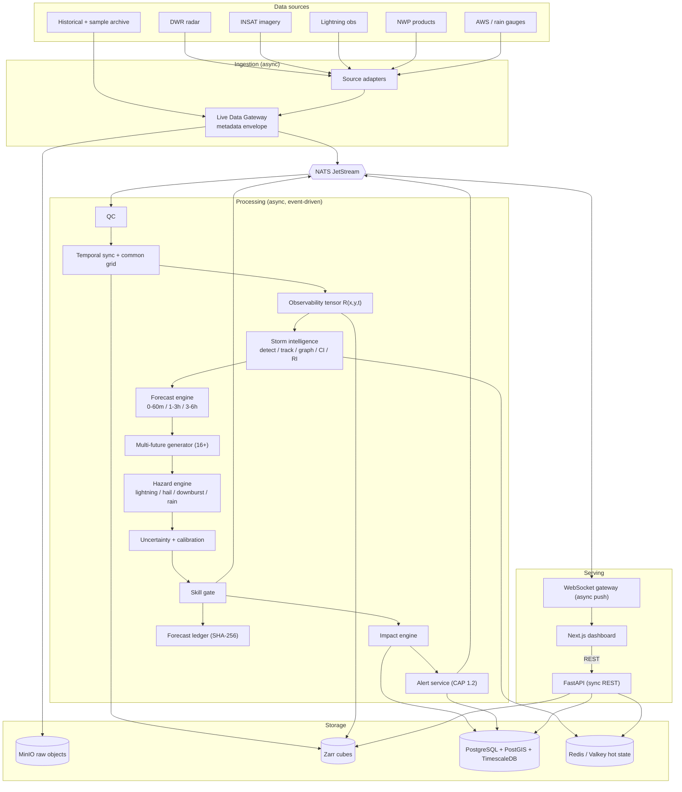

### 1.2 Component responsibilities

Component IDs are referenced in later sections. "Tech" is only what the source lists; role assignments for Redis/NATS/etc. are `[PROP]` because the source lists the technology without stating its role.

| ID | Component | Responsibility | Tech `[SRC]` | Mode |
|---|---|---|---|---|
| C1 | Source adapters | Poll/receive each source, convert to internal raw record, never interpret science | Python, Py-ART, wradlib, Satpy | Async |
| C2 | Live Data Gateway | Stamp metadata envelope, de-duplicate, write raw object, publish `obs.raw.*` | FastAPI, NATS JetStream, MinIO | Async |
| C3 | Event Store / data lake | Immutable, time-stamped store of raw + gridded data; basis of replay | MinIO, Zarr, xarray, Dask | Storage |
| C4 | QC service | Per-source quality control; emit cleaned data + QC flags | Py-ART, wradlib, Numba | Async |
| C5 | Grid service | Temporal sync, resampling, common grid | xarray, pyresample `[GAP: not in stack]`, rasterio, GDAL, Dask | Async |
| C6 | Observability service | Build `R(x,y,t)` and sensor-state table | xarray, PyTorch, Numba | Async |
| C7 | Storm intelligence service | Segmentation, objects, tracking, lifecycle, graph, CI, RI | PyTorch, PyG, Swin, OpenCV, pySTEPS | Async (GPU) |
| C8 | Forecast engine | Horizon-specific forecasting | Neural Operators, Temporal Perceiver, NWP encoder | Async (GPU) |
| C9 | Multi-future generator | 16+ sampled futures | Conditional Flow Matching | Async (GPU) |
| C10 | Hazard engine | Four independent hazard pipelines | Neural Hawkes, EVT/GPD, prob. heads | Async |
| C11 | Uncertainty service | Conformal intervals, calibration, CRPS inputs | Conformal, ACI, isotonic/beta | Async |
| C12 | Skill-gate service | Decide which product level may be shown | BSS, CSI, rolling validation | Async |
| C13 | Impact engine | Hazard × exposure | PostGIS, GeoPandas, OSMnx | Async + sync queries |
| C14 | Alert service | Alert decisions, CAP 1.2 messages | CAP 1.2, FastAPI | Async |
| C15 | Cycle orchestrator `[PROP]` | Decide when a forecast cycle starts/completes, track stage completion, version forecasts | — | Async |
| C16 | API gateway | REST for snapshots, history, control | FastAPI | **Sync** |
| C17 | Stream gateway | Push live state | WebSockets, NATS | Async |
| C18 | Dashboard | Map, storm panel, ETA, uncertainty, controls | Next.js, React, MapLibre, deck.gl, ECharts | Client |
| C19 | Replay engine | Time-controlled re-run from Event Store | Zarr, xarray, Dask | Async |
| C20 | Verification service | Score forecasts vs observations; benchmarks | CSI/POD/FAR/FSS/BSS/CRPS | Async/batch |
| C21 | Ledger service | Tamper-evident record per forecast | PostgreSQL, SHA-256, cryptography | Async |
| C22 | Monitoring | Latency, data quality, service health | Prometheus, Grafana | Async |
| C23 | MLOps (offline) | Train, calibrate, register, version models | MLflow, DVC, CUDA, Triton | Offline batch |
| C24 | Fault injector `[PROP]` | Inject simulated sensor failure for demos/tests | — | Sync trigger, async effect |
| C25 | Exposure data service `[PROP]` | Load/serve static exposure layers | PostGIS, OSMnx, WorldPop `[GAP: not in stack list]` | Batch + sync read |

### 1.3 Storage and event map `[PROP roles]`

| Store | Holds | Writers | Readers |
|---|---|---|---|
| MinIO (raw bucket) | Raw files exactly as received, immutable | C2 | C4, C19 |
| Zarr (gridded) | Common-grid cubes, observability tensor, forecast fields, multi-future samples | C5, C6, C8, C9 | C7, C8, C16 (tiles), C19, C20 |
| PostgreSQL + PostGIS | Exposure layers, alerts, forecast metadata, ledger, config | C13, C14, C21, C25 | C16, C20 |
| TimescaleDB | Storm-object state history, QC metrics, skill series, latency metrics | C7, C12, C22 | C12, C16, C20 |
| Redis / Valkey | Latest storm state, track buffers, latest forecast bundle, WS fan-out cache | C7, C15 | C16, C17 |
| NATS JetStream | Durable event log between stages | all producers | all consumers |
| MLflow / DVC | Model bundles, dataset versions, training lineage | C23 | C7–C12 |

Proposed NATS subjects `[PROP]`:

```
obs.raw.{radar|sat|ltg|nwp|aws}        # gateway -> QC
obs.qc.{source}                        # QC -> grid
grid.ready.{domain}                    # grid -> observability, orchestrator
obs.tensor.ready.{domain}              # observability -> storm intel
storm.state.{domain}                   # storm intel -> forecast
fc.stage.{stage}.{cycle_id}            # stage completion events to orchestrator
fc.publish.{domain}                    # gated, final forecast bundle -> API/WS/ledger
alert.{domain}                         # alert lifecycle
sys.sensor_state.{domain}              # observability transitions
sys.sim.{domain}                       # fault injection commands
```

### 1.4 Synchronous vs asynchronous summary

| Path | Mode | Why |
|---|---|---|
| Source → gateway → store → every processing stage | **Async**, event-driven via NATS | Sources arrive on independent clocks |
| Stage-to-stage hand-off inside a forecast cycle | **Async**, tracked by C15 with a completion barrier | Allows retry and GPU batching |
| Model inference calls (C7–C9) | Request/response *inside* a service, but invoked asynchronously by events | GPU latency isolated from ingestion |
| Dashboard → API (snapshot, history, replay control, simulate failure) | **Sync** REST | User expects an answer |
| Live updates to dashboard | **Async** push (WebSocket) | Server-initiated |
| Verification, benchmarking, training | **Async/batch**, offline | Needs delayed ground truth |

---

## 2. Data Acquisition

### 2.1 Common metadata envelope `[SRC fields + PROP completion]`

Every incoming record, regardless of source, is wrapped by C2 before anything else happens.

| Field | Origin | Notes |
|---|---|---|
| `record_id` | `[PROP]` | Content hash + source + event_time; the de-duplication key |
| `event_time` | `[SRC]` | When the observation was physically made (scan start / flash time / valid time) |
| `available_time` | `[SRC]` | When the data could first have been obtained by a real system |
| `ingestion_time` | `[SRC]` | When PRAMAAN-X wrote it |
| `source`, `product` | `[SRC]` source | e.g. `radar/<station_id>/volume` |
| `location` / `extent` | `[SRC]` | Point, station, or bounding box + CRS |
| `resolution` | `[SRC]` | Native spatial/temporal resolution |
| `latency` | `[SRC]` | `available_time − event_time` (derived) |
| `quality_flag` | `[SRC]` | Initial `UNCHECKED`; set by QC |
| `raw_uri`, `checksum` | `[PROP]` | Pointer into MinIO, integrity |
| `schema_version` | `[PROP]` | Contract evolution |
| `init_time`, `valid_time`, `lead_hour` | `[GAP]` | **Required for NWP** but not in the source envelope; without them NWP leakage cannot be prevented (see I-09) |

`available_time` policy:
- **Live:** `available_time = ingestion_time` minus measured transport lag if the source publishes an issue time; otherwise `= ingestion_time`.
- **Historical archive:** archives usually carry only `event_time`. `available_time` must be **reconstructed** from a per-source latency model `[PROP]`, stored with `available_time_method = reconstructed` so verification can report it. `[GAP]`

### 2.2 Per-source acquisition

Cadence and resolution values are `[ASSUME]`. The source document states none. They must be verified with data providers before any latency budget is committed.

| Source | Payload | Assumed cadence `[ASSUME]` | Key metadata | Primary unavailability handling |
|---|---|---|---|---|
| **DWR radar** | Volume scans: reflectivity, Doppler velocity (if available), derived VIL / echo-top | Minutes-scale volume scans (~10 min typical) | Station, beam geometry, elevation angles, scan mode, calibration | Mark radar `STALE` after N missed scans, then `UNAVAILABLE`; hand over to fallback fusion (Sec. 7) |
| **INSAT** | Multi-channel imagery (IR for cloud-top temperature cooling) | ~15–30 min (IR nominal ~4 km) | Channel, navigation, scan time | Reuse last frame with growing `age`; freshness feeds observability; cooling-rate features become `null` once age exceeds limit |
| **Lightning** | Flash events (time, lat/lon) | Near-real-time stream | Network id, detection-efficiency/coverage `[GAP: source network not named]` | Treat gaps as *missing*, not as "no lightning" — requires a coverage mask |
| **NWP** | Gridded environment fields: CAPE, CIN, shear, DCAPE, PWAT, moisture, freezing level, lapse rate | Model cycles (e.g. 6-hourly) with publication delay | `init_time`, `valid_time`, model id | Fall back to previous cycle with larger `lead_hour`; flag `nwp_age` |
| **AWS / rain gauges** | Point accumulations | ~15 min – 1 h | Station id, elevation, instrument | Spatial gaps allowed; mark station-level `missing` |
| **Historical + sample** | Archived radar/sat/ltg/NWP/rain for named events | n/a (batch) | Reconstructed `available_time`, event label | Pre-validated sample set so demos do not depend on live feeds |

### 2.3 Ingestion workflow

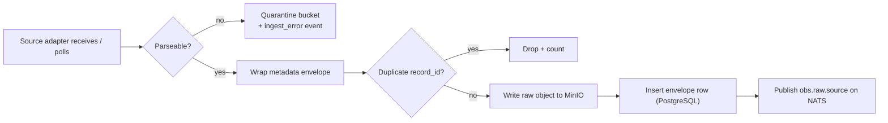

Contract:
- **Input:** source-native file/stream message.
- **Output:** immutable raw object, envelope row, `obs.raw.*` event.
- **Errors:** `UNPARSEABLE` → quarantine; `DUPLICATE` → drop; `STORAGE_WRITE_FAILED` → NATS message **not** published, adapter retries with backoff; `CLOCK_SKEW` (event_time in the future) → flag and quarantine.
- **Idempotency:** re-ingesting the same file produces the same `record_id` and is a no-op.

### 2.4 Source-unavailability handling (ingestion level)

Ingestion only **detects and reports**; it does not decide fallback.

1. C1 detects no data for `expected_interval × K` `[PROP: K per source]`.
2. C2 emits `sys.source_status` = `LATE` → `STALE` → `DOWN` (same labels the observability layer will consume).
3. The orchestrator (C15) proceeds on schedule without the late source; observability (C6) records the age. The forecast is **never** held indefinitely for a single source.
4. When the source returns, back-filled records keep their original `event_time` but a new `available_time`. Live cycles are **not** retroactively rewritten. A revision is issued only if a rule in Sec. 11.4 fires.

### 2.5 Live vs replay acquisition

| Aspect | Live | Replay |
|---|---|---|
| Data origin | Adapters | Event Store (C3) |
| Clock | Wall clock | Replay clock (Sec. 10) |
| Rule `[SRC]` | Use only data available at that moment | Use only records with `available_time ≤ replay_clock` |
| Model training | **No continuous training on live data** `[SRC]` | Historical data is used for training/validation/blind test |

---

## 3. Data Processing

### 3.1 Pipeline

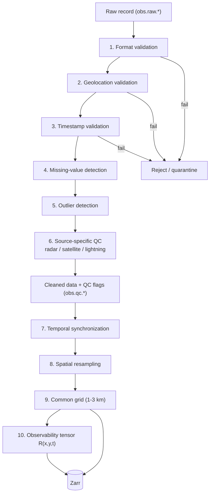

Order in the source: format → geolocation → missing-value → outlier → sensor-quality → timestamp. Section 3.1 moves timestamp validation earlier `[PROP]` because a record with an impossible `event_time` should be rejected before expensive spatial QC. This is a deliberate deviation; if STEPS.md mandates the original order it is a no-op swap.

### 3.2 Stage contracts

| # | Stage | Input | Output | Error conditions → action |
|---|---|---|---|---|
| 1 | Format validation | Raw object | Parsed arrays + units | Schema/unit mismatch → reject, quarantine |
| 2 | Geolocation validation | Parsed + site metadata | Georeferenced data | Coordinates outside domain/impossible → reject (lightning) or flag (radar navigation) |
| 3 | Timestamp validation | `event_time`, `available_time` | Validated times | Future-dated, non-monotonic, or implausible latency → flag `TIME_SUSPECT`, exclude from live cycle |
| 4 | Missing-data detection | Arrays | Missing mask | Missing fraction above threshold → `quality_flag = DEGRADED`; all missing → `UNAVAILABLE` |
| 5 | Outlier filtering | Arrays | Cleaned arrays + outlier mask | Physically impossible values removed; **removed values become missing, never interpolated silently** `[PROP]` |
| 6a | Radar QC `[SRC]` | Volume | Clutter-, attenuation-, AP-corrected fields + beam-blockage map | Excess clutter/blockage → lowers radar quality, does not discard scan |
| 6b | Satellite QC `[SRC]` | Imagery | Cloud mask checks, navigation check | Missing scan, navigation error, stale imagery → `STALE`/`DEGRADED` |
| 6c | Lightning QC `[SRC]` | Flash list | De-duplicated flashes | Duplicates removed; impossible coordinates dropped; temporal gaps recorded in coverage mask |
| 6d | NWP QC | NWP fields | Range-checked fields | `[GAP]` source lists no NWP QC |
| 6e | AWS / gauge QC | Station values | Range/consistency-checked values | `[GAP]` source lists no AWS QC, yet AWS is a live source |

### 3.3 Temporal synchronization `[PROP: algorithm; SRC: goal]`

Goal `[SRC]`: every grid pixel has aligned Radar, IR, Lightning, NWP, Terrain, Observability.

1. Fix the **cycle valid time** `T` (see C15, Sec. 5.5).
2. For each source pick the latest record with `available_time ≤ T` (live) or `≤ replay_clock` (replay).
3. Record each source's **age** `T − event_time` — this is an observability input, not a nuisance.
4. Lightning is **binned** over a window ending at `T` (flash counts / density), not nearest-neighbour matched.
5. NWP is time-interpolated between `valid_time`s of the newest available cycle; **never** from a cycle whose `available_time > T`.
6. Static terrain (Copernicus DEM) has no time axis.
7. Differences in age are carried forward, not hidden by interpolation. A 25-min-old satellite frame stays labelled 25 min old.

### 3.4 Spatial resampling and common grid

- Target `[SRC]`: one **1–3 km** common grid. `[GAP]` the source gives a range; implementations need **one** value, a CRS, and a domain extent. Radar is natively finer than this and INSAT IR is coarser `[ASSUME]`, so the choice implies down-sampling radar and up-sampling IR.
- Resampling rules `[PROP]`:
  - Radar: aggregate polar bins to grid cells with **max and mean** both retained (storm cores matter) plus a count of contributing bins (feeds quality).
  - Satellite: resample with nearest/bilinear; keep native-pixel footprint size as a channel so the model knows interpolation is happening.
  - Lightning: counts per cell per window.
  - NWP: bilinear (continuous fields) and terrain-aware where applicable.
- Output: `grid_{domain}_{T}.zarr` chunked by time; written once; read many times by C7–C9 and C19.
- Error conditions: `GRID_EXTENT_MISMATCH`, `CRS_UNKNOWN` → stage fails, cycle runs without that source (treated as `UNAVAILABLE`), alert to monitoring.

### 3.5 Observability tensor `R(x,y,t)` `[SRC]`

Per grid cell the source requires: radar age, radar range, beam height, beam blockage, radar quality, satellite age, lightning coverage, missing-data mask, sensor health. It "goes directly into the AI".

| Channel group | Derived from | Value type |
|---|---|---|
| Radar | Age, range to site, beam height at that range, blockage fraction, composite quality | Continuous 0–1 (quality), minutes (age), m (height) |
| Satellite | Frame age, navigation/cloud-mask quality | minutes, 0–1 |
| Lightning | Network coverage / detection-efficiency estimate, gap flag | 0–1 |
| NWP | `nwp_age`, `lead_hour` `[PROP]` | hours |
| Rain gauges | Distance to nearest valid gauge, gauge freshness `[PROP]` | km, minutes |
| Global | Missing-data mask per modality, per-sensor health state (Normal/Degraded/Unavailable) | categorical |

Rules:
- `R` is computed **every cycle**, because ages change even when no new data arrives.
- `R` is stored beside the data it describes (same Zarr group, same `T`) so replay reproduces it.
- Consumers: C7 (as model input), C8–C10 (as model input and uncertainty conditioner), C11 (as conformal stratum), C12 (as skill-gate input), C18 (as map overlay).
- Error: `R` missing for a cycle → cycle fails closed: **no forecast is published**; monitoring alert. A forecast without its observability context contradicts USP #3.

---

## 4. Storm Intelligence Pipeline

### 4.1 Flow

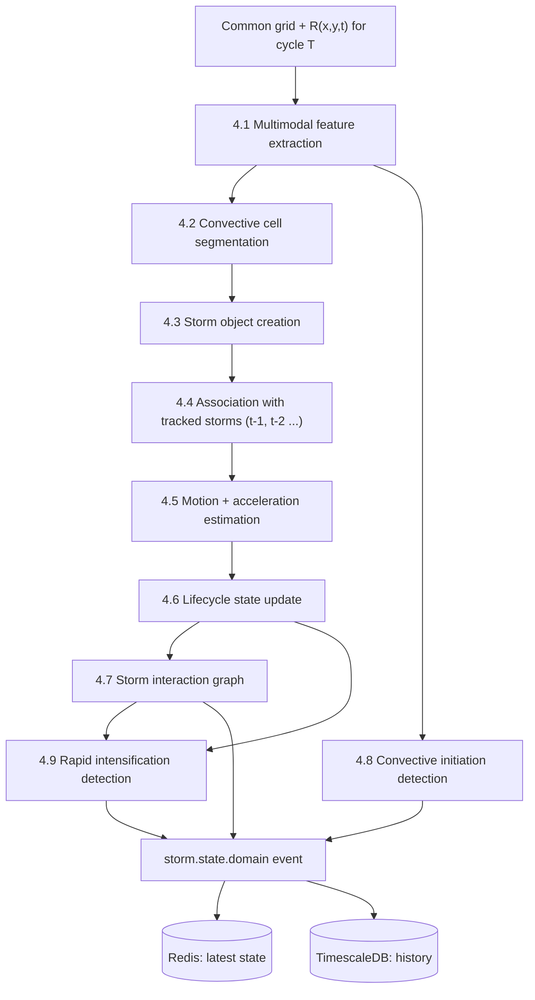

All stages run inside C7 as one GPU/CPU workload per cycle, triggered by `obs.tensor.ready`. They share the cycle's data in memory and publish **one** `storm.state` event at the end (not one per stage), so downstream consumers never see a half-updated state.

### 4.2 Stage-by-stage

| Stage | What it does | Inputs | Outputs | Error / degraded behaviour |
|---|---|---|---|---|
| **Multimodal feature extraction** `[SRC: "multimodal encoder"; tech: Swin Transformer + cross-attention]` | Encode radar, IR, lightning, NWP, terrain and `R` into a shared feature map | Grid channels + `R` | Feature tensor per cell | Missing modality → masked token (Sec. 7), never zero-filled |
| **Convective cell segmentation** | Label connected convective regions | Feature tensor | Cell mask / instance labels | No cells → empty list (valid result); model failure → fall back to threshold-based segmentation `[PROP, GAP: source defines no fallback or training labels]` |
| **Storm object creation** `[SRC]` | One object per connected cell with location, area, shape, reflectivity, VIL, echo-top, velocity, lightning rate, IR temp + cooling, CAPE, shear, DCAPE, growth rate, lifecycle, sensor reliability | Mask + grid + NWP | `StormObject[]` | Features that depend on an unavailable sensor are `null` + `reason_code`; `sensor_reliability` is always set |
| **Object association** `[SRC: "Optical Flow + Storm-object association"]` | Match each new object to existing tracks (continue / new / merge / split / end) | New objects, tracks, flow field | Track IDs | Ambiguous matches resolved by a stated rule `[GAP: algorithm unspecified]`; unresolved → new track flagged `LOW_ASSOC_CONF` |
| **Motion and acceleration** | Velocity, direction, acceleration per track; growth/decay; `dZ/dt`, `dVIL/dt`, `dLightning/dt`, IR cooling acceleration | Track history (≥3 scans for acceleration) | Kinematics on object | <3 scans → acceleration `null` (not 0); flow computed with OpenCV optical flow / Lucas–Kanade, pySTEPS available as baseline |
| **Lifecycle update** `[SRC]` | Initiating → Developing → Mature → Dissipating | Growth/decay, intensity, track age | `lifecycle_stage` + confidence | New track after a gap → `UNKNOWN`, not `Initiating` |
| **Interaction graph** | Nodes = storm objects; edges = distance, relative velocity, direction, overlap, convergence, intensity difference | Objects + kinematics | Graph + per-edge merge/split/intensification scores | Graph model unavailable → heuristic proximity edges only, flagged `GRAPH_DEGRADED` |
| **Convective initiation (CI)** | Probability that a new storm forms where no strong echo yet exists | IR cooling, cloud growth, lightning precursors, moisture convergence, CAPE/CIN, vertical velocity, shear, terrain | `P(CI<30)`, `P(CI<60)`, `P(CI<120)` per cell `[SRC]` | Satellite stale → CI confidence lowered and flagged; no satellite → CI **not issued** (`unsupported`, not 0) |
| **Rapid intensification (RI)** | Detect transition to severe growth | `dZ/dt`, `dVIL/dt`, `dLightning/dt`, IR cooling acceleration, echo-top growth, updraft proxies, graph context | RI flag + score per storm | Missing derivatives → RI `not_assessed` with reasons |

### 4.3 Storm object contract `[PROP schema; SRC field list]`

```json
{
  "storm_id": "S-000027",
  "cycle_id": "EASTIND-01/2026-10-04T10:20:00Z",
  "track_id": "T-000027",
  "geometry": {"centroid": [88.36, 22.57], "area_km2": 412.0, "polygon": "GeoJSON"},
  "kinematics": {"speed_kmh": 43.0, "dir_deg": 45.0, "accel_kmh_per_10min": null},
  "radar": {"max_dbz": 58.0, "vil": 41.2, "echo_top_km": 14.1},
  "lightning": {"rate_per_min": 49, "accel": 0.76},
  "ir": {"cloud_top_temp_k": 201.5, "cooling_rate_k_per_10min": -6.2},
  "env": {"cape": 2400, "shear": 18.0, "dcape": 1100},
  "growth_rate": 0.18,
  "lifecycle": {"stage": "DEVELOPING", "confidence": 0.74},
  "sensor_reliability": {"radar": 0.42, "satellite": 0.90, "lightning": 0.85},
  "null_reasons": {"kinematics.accel_kmh_per_10min": "INSUFFICIENT_HISTORY"},
  "flags": ["MERGE_RISK"]
}
```

Rule: any numeric field may be `null` only with a matching entry in `null_reasons`.
`[GAP]` The source says CAPE/shear/DCAPE are stored per storm, but NWP is coarser than a storm cell. The sampling rule (point at centroid? area mean? upstream inflow?) is unspecified.

### 4.4 Lifecycle state machine

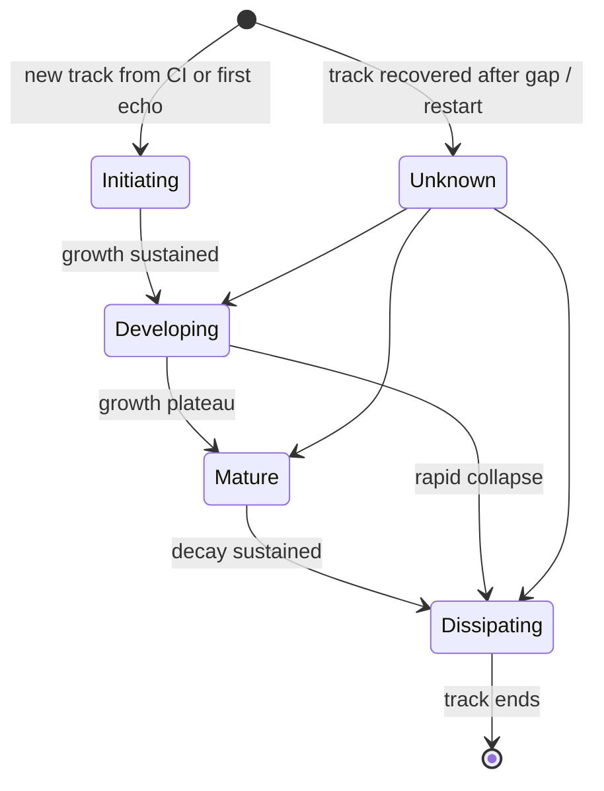

`Unknown` is `[PROP]`; the source has four stages and no representation for "we just don't know".

### 4.5 Storm-state persistence `[PROP]`

- **Hot state** (current object per track + last N scans): Redis/Valkey, rebuilt on restart from TimescaleDB.
- **History** (every object every cycle): TimescaleDB, append-only per cycle, keyed `(track_id, cycle_valid_time)`.
- **Idempotency:** re-running cycle `T` overwrites that cycle's rows atomically using `(domain_id, T, run_id)`; a `run_id` increments for revisions.

---

## 5. Forecasting Pipeline

### 5.1 Three horizon workflows `[SRC]`

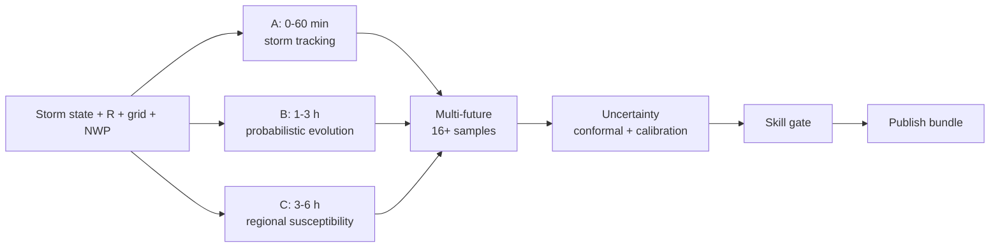

| | **A. 0–60 min** | **B. 1–3 h** | **C. 3–6 h** |
|---|---|---|---|
| Purpose | Precise storm trajectory | Probabilistic storm / hazard regions | Regional hazard susceptibility |
| Inputs `[SRC]` | Current storm objects, optical flow, radar, lightning dynamics, storm interactions | Storm state, growth/decay, interaction graph, CI probability, neural operator | Current convection, NWP environment, CAPE, moisture, shear, terrain |
| Method `[SRC]` | Lagrangian extrapolation + learned correction (Lagrangian Forecasting; pySTEPS and persistence baselines) | Neural operator + CI + graph | NWP encoder + convective susceptibility |
| Output `[SRC]` | High-resolution storm trajectory | Probability zones | Susceptibility regions |
| Highest product allowed | Storm track | Hazard probability zone | Regional outlook |
| Typical failure mode | Radar/flow loss → track widens, falls to B-style product | CI/graph unavailable → growth-only evolution | NWP stale → susceptibility flagged stale |

Per-horizon outputs are **different types of object**, not the same product at lower resolution. The API contract (Sec. 9) therefore carries a `product_level` field and the three horizons are separate arrays.

`[GAP]` The source gives no hand-off rule between horizons (does the 0–60 min trajectory seed the 1–3 h model? where do they blend at 60 min and 180 min?). Proposed: horizons share the same state input but are independent models; the UI shows each in its own lead-time band with no blending `[PROP]`.

### 5.2 Inference flow for one cycle

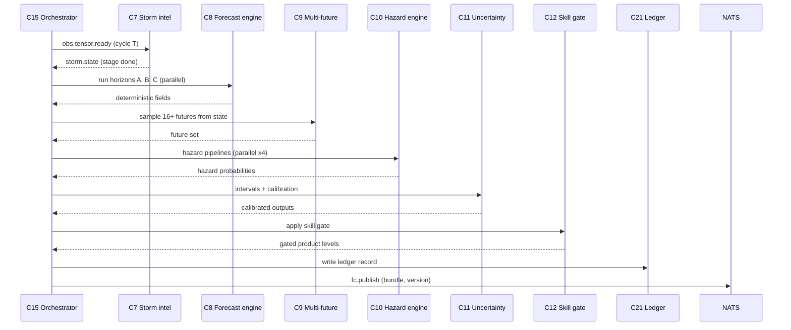

C15 owns the barrier: a cycle is **complete** when every mandatory stage has emitted `fc.stage.*`. Optional stages (e.g. a hazard that is `unsupported`) emit `skipped` with a reason, which counts as completed.

### 5.3 Multiple futures

- Source: **16+** futures (USP says "16+", workflow says "16") via Conditional Flow Matching, combined into a **probability map**, with scenario weights such as 42% / 27% / 18%.
- `[GAP]` Flow-matching samples are exchangeable draws, so they carry **equal** weight. Unequal "Future A 42%, B 27%…" requires an explicit step: cluster samples into scenarios and report scenario weight = fraction of samples. That step is `[PROP]` and is the only mathematically consistent reading.
- Per-future outputs: storm positions/intensities for each lead time; hazard fields; arrival time at each target location.
- Probability map = per-cell fraction of futures exceeding the hazard/event criterion.
- Ensemble size is a config value with a **latency/accuracy trade-off**; increase only if verification shows reliability gain `[PROP]`.

### 5.4 Uncertainty estimation `[SRC components; PROP composition]`

Source: combine 16 futures + sensor uncertainty + model spread + historical error + conformal prediction.

Proposed composition:

1. Ensemble spread gives the raw predictive distribution (ETA, position, hazard).
2. **Calibration** (isotonic / beta) maps raw hazard probabilities to reliable ones; fitted offline on validation data.
3. **Conformal quantile regression** wraps ETA to give an 80% interval.
4. **Adaptive Conformal Inference** adjusts the interval online from recent miss rate.
5. **Observability conditioning:** conformal calibration is stratified by sensor state (Normal/Degraded/Unavailable) so intervals widen automatically when `R` worsens `[PROP]`. This is the mechanism that makes "Radar ↓ → uncertainty ↑" real rather than cosmetic.
6. Confidence label (HIGH/MODERATE/LOW) is derived from interval width relative to horizon plus sensor state. `[GAP]` thresholds undefined.

Output example `[SRC]`: `ETA = 42 min, 80% interval 31–55 min; hazard probability 78%, confidence Moderate`.

Note on "no training on live data" `[SRC]`: ACI and rolling skill statistics **do** update from live outcomes. They are calibration state, not model weights. This distinction must be explicit in the PRD (I-14).

### 5.5 Forecast cycle and update triggers `[PROP]`

The source says "repeat whenever new observations arrive" but defines no cycle cadence. Proposed:

- **Primary trigger:** arrival of a new radar scan (the highest-rate precise source).
- **Deadline trigger:** if no radar arrives by `T_cycle + grace`, run on the schedule anyway using stale radar flagged accordingly.
- **Secondary triggers:** new satellite frame, lightning-rate change above threshold, sensor-state transition. These cause **revision** of the current cycle (Sec. 11.4), not a new cycle.
- **Coalescing:** if cycle `T` is still running when `T+1` arrives, the orchestrator skips to the newest state (no queue buildup) and records `cycle_skipped`.

### 5.6 Skill gating `[SRC concept; PROP mechanics]`

The source asks: *"Am I actually skilled enough at this lead time to show this prediction?"* and downgrades **precise track → probabilistic hazard zone → regional outlook**. It names BSS + CSI + rolling validation + calibration engine.

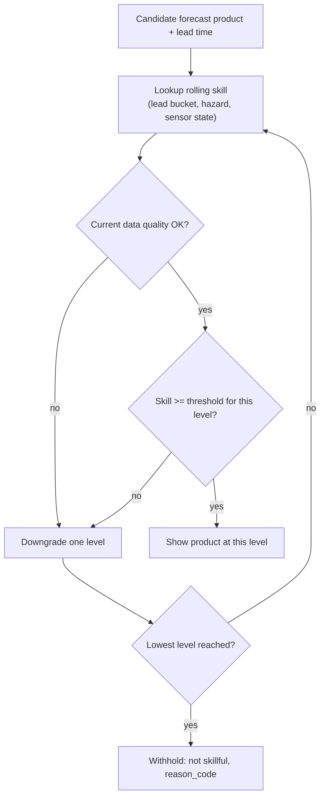

Rules `[PROP]`:
- Skill keyed by `(lead_bucket, hazard, sensor_state)`; a single global number would hide the Radar-down case.
- Thresholds are config, not hard-coded; they come from blind-event benchmark results (Sec. 10).
- **Hysteresis**: a downgrade is immediate; an upgrade requires skill above threshold for M consecutive evaluations. Prevents the product flickering.
- Withheld output is itself a result: UI shows "Not enough skill at this lead time" with the reason. It never shows an empty map that could be misread as "all clear".
- Rolling skill uses outcomes that arrive **late** (ground truth is not instantaneous). The gate therefore reads skill computed up to `now − verification_lag`. `[GAP]` lag undefined.

`[GAP]` Source's two vocabularies differ: Key Features says "Hazard probability / Regional outlook"; Workflow says "Probability zone / Regional outlook / Storm track available". They map 1:1 but should use one set of identifiers: `STORM_TRACK`, `HAZARD_ZONE`, `REGIONAL_OUTLOOK`, `WITHHELD`.

### 5.7 Forecast bundle (output of the forecasting pipeline) `[PROP]`

```json
{
  "forecast_id": "EASTIND-01/2026-10-04T10:20:00Z",
  "revision": 0,
  "model_bundle": "pramaan-x@<mlflow_run_id>",
  "data_snapshot": {"radar": "<record_id>", "sat": "<record_id>", "ltg_window": "...", "nwp": "<record_id>"},
  "sensor_state": {"radar": "NORMAL", "satellite": "NORMAL", "lightning": "NORMAL", "nwp": "NORMAL", "aws": "DEGRADED"},
  "horizons": {
    "0_60": {"product_level": "STORM_TRACK", "storms": ["..."], "eta": [{"target": "KOLKATA", "median_min": 42, "p10": 31, "p90": 55}]},
    "1_3h": {"product_level": "HAZARD_ZONE", "zones": ["..."]},
    "3_6h": {"product_level": "REGIONAL_OUTLOOK", "regions": ["..."]}
  },
  "futures": {"count": 16, "scenarios": [{"id": "A", "weight": 0.42}]},
  "hazards": {"lightning": {}, "hail": {}, "downburst": {}, "extreme_rain": {}},
  "confidence": "MODERATE",
  "skill_gate": {"applied": true, "downgrades": []},
  "reason_for_change": null,
  "ledger_hash": "<sha256>"
}
```

---

## 6. Hazard Intelligence

### 6.1 Independence and shared structure

Four pipelines, each with its **own** inputs, model head, calibration and skill record `[SRC USP #6]`. They share only the upstream storm state, futures and observability tensor.

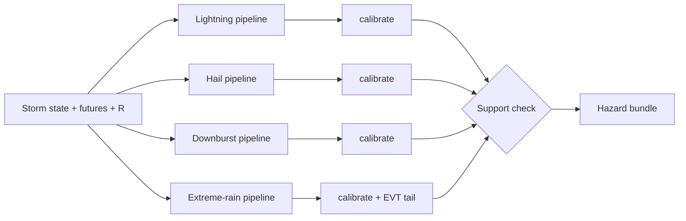

### 6.2 Pipeline specifications

| | ⚡ Lightning | 🧊 Hail | 💨 Downburst | 🌧️ Extreme rain |
|---|---|---|---|---|
| **Outputs `[SRC]`** | Flash density, flash rate, lightning jump, acceleration, clustering; burst probability (30 min) | P(hail-producing convection) e.g. "within 20 km" | P(downburst) e.g. "within next 30 min" | P(rain rate > threshold), e.g. P(>50 mm/h) |
| **Inputs `[SRC]`** | Flash history, storm lightning rate, IR cooling, graph context | Updraft proxy, vertical reflectivity, freezing level, −20 °C level, CAPE, shear, lightning jump, VIL/MESH where radar supports | Doppler divergence, radial-velocity gradients, echo-top collapse, core descent, DCAPE, dry sub-cloud layer | Accumulation, storm residence time, PWAT/moisture, orography, convective intensity |
| **Model `[SRC]`** | Neural Hawkes process | Probabilistic neural head on radar-derived features | Spatio-temporal transformer on Py-ART / wradlib features | Extreme Value Theory with Generalized Pareto tail on a probabilistic rainfall model |
| **Hard sensor dependency** | Lightning (or satellite proxy) | Radar strongly preferred; satellite/lightning/NWP as degraded path | **Doppler radar** | Radar rain rate and/or gauges; satellite/NWP as degraded path |
| **Verification truth (needs sourcing)** | Observed flashes `[available]` | `[GAP]` | `[GAP]` | AWS / gauge data `[available]` |

### 6.3 How probabilities are generated and validated

Generation (per hazard):
1. Compute hazard-specific features from each storm object and each sampled future.
2. Model head produces raw probability per storm/cell per lead window.
3. Aggregate across futures → per-cell probability and per-storm probability.
4. Calibrate (isotonic/beta) per hazard.
5. Attach conformal-style confidence label (Sec. 5.4) and `reason_code` list.
6. Pass through support check (6.4) and skill gate (5.6).

Validation:
- **Offline, blind events:** BSS, reliability diagrams, CSI/POD/FAR, FSS for spatial products, CRPS for continuous outputs (rain), burst-timing error for lightning.
- **Online, rolling:** the same metrics against delayed ground truth feed the skill gate.
- **Ground truth gap `[GAP]`:** lightning and rain have objective observations. **Hail and downburst do not appear to have any in the source.** Using radar-derived MESH/divergence as truth would be circular (the same signals are model inputs). Without observed reports (e.g. damage or storm reports, surface wind gusts at AWS), hail and downburst cannot be verified, and the claim "measured evidence" cannot be made for them. Resolution is required before these two are presented to judges as verified.

### 6.4 Unsupported-hazard handling `[PROP]` (source: none — listed as GAP I-12)

Each hazard emits a **support status** with every output:

| Status | Meaning | Example |
|---|---|---|
| `SUPPORTED` | All required inputs present and quality adequate | Downburst with fresh Doppler radar |
| `DEGRADED_PROXY` | Required input missing; a lower-skill proxy used; skill gate applied with the proxy's own track record | Hail with radar down, using IR cooling + lightning jump + NWP |
| `UNSUPPORTED` | No credible path | Downburst when Doppler is unavailable |
| `NOT_VALIDATED` | Pipeline runs but has no verification record for this regime | Hail/downburst until truth data exists |

Rules:
- `UNSUPPORTED` produces `probability = null`, `reason_code = MISSING_DOPPLER` (etc.), **never 0**. UI shows "Not assessed".
- `NOT_VALIDATED` outputs are shown with a visible label and are **excluded from alert triggering** by default.
- Alerts never rely on a hazard in `UNSUPPORTED` state. The alert may still be issued on a hazard that **is** supported.
- Support state transitions are logged like sensor transitions.

---

## 7. Observability and Sensor Failure

### 7.1 Sensor states `[SRC concept; PROP thresholds]`

The source says the system "knows how reliable each sensor is" (example: radar reliability 42%) but defines no states. Proposed three:

| State | Condition (config, **numbers are placeholders**) | System behaviour |
|---|---|---|
| **NORMAL** | Reliability ≥ θ_hi; data age within expected cadence | Full influence of the sensor in fusion; normal conformal stratum |
| **DEGRADED** | θ_lo ≤ reliability < θ_hi; or stale by 1–K scans; or partial blockage / partial coverage | Reduced influence (learned via masking/weighting); widened intervals; flagged in UI |
| **UNAVAILABLE** | Reliability < θ_lo; or stale > K scans; or hard failure | Modality masked entirely; fallback fusion; widest stratum; dependent products downgraded or withheld |

State is evaluated **per sensor and per cell** (radar may be fine near the site and blocked far away) plus an aggregated per-domain state shown in the UI.

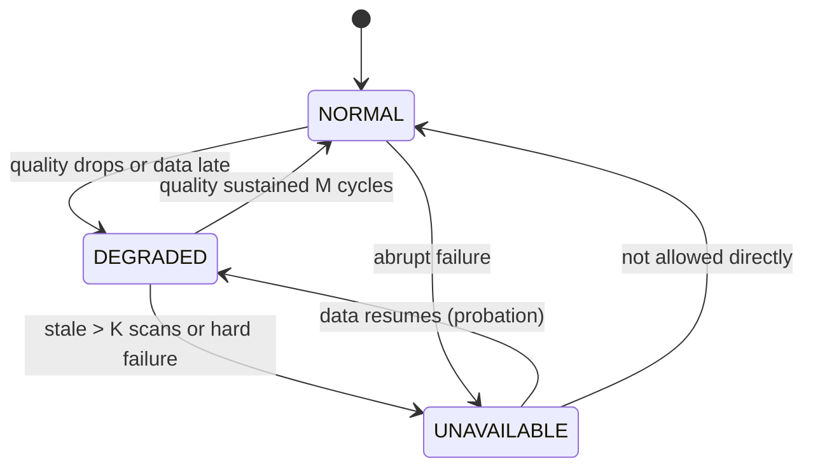

Recovery passes through `DEGRADED` as a probation state `[PROP]` to avoid whipsaw.

### 7.2 Fallback fusion and modality masking

Source flow: *Radar ❌ → Observability layer → Satellite + Lightning + NWP → Fallback forecast → Uncertainty ↑*, using **modality dropout + cross-attention + Virtual-DWR**.

| Mechanism | How it works | Dependency |
|---|---|---|
| **Modality masking** | Unavailable modality tokens are replaced by a learned "missing" token and its cross-attention weights are masked; `R` tells the model which tokens are masked | The model must have been **trained with modality dropout** `[SRC tech]`; this step is absent from the Training Workflow (I-11) |
| **Virtual-DWR** | A model estimating radar-like reflectivity from satellite + lightning + NWP, giving the downstream models a radar-shaped input | Mentioned only in Feature 6 `[GAP: not in Tech Stack, Workflow, or Training Workflow]` |
| **Reduced-influence weighting** | In DEGRADED state the radar contribution is down-weighted by reliability | Needs calibration of reliability → weight |
| **Product downgrade** | Skill gate selects a lower product level | Sec. 5.6 |

### 7.3 Confidence degradation and uncertainty expansion

Sequence applied each cycle:

1. `R` updated → sensor states updated.
2. Models run with masks → raw spread typically increases.
3. Conformal stratum for the current sensor state is applied → intervals widen further to match **empirical** error in that state (not an arbitrary inflation factor).
4. Confidence label recomputed.
5. Skill gate re-evaluated with the sensor-state-specific skill record.
6. Downstream impact and alerts see the widened result.

Source example: radar failure moves the interval from 31–51 min to 28–67 min and shifts ETA from 38 to 41 min. This is an *illustration*; actual values come from the conformal strata.

### 7.4 Simulated radar failure workflow

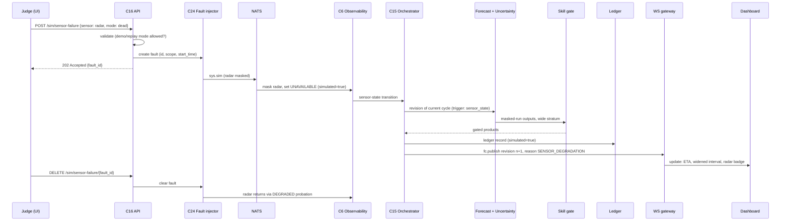

Rules `[PROP]`:
- Simulation acts at the **observability/masking layer**; it does not delete data from the store. Original data remains intact so the cycle can be re-run unmasked.
- Every artefact produced while a fault is active carries `simulated = true`: forecast bundle, ledger entry, UI banner.
- Simulated-fault forecasts are **excluded from skill-gate statistics and benchmark scores** unless explicitly selected for a "degradation test" report. Otherwise a demo would contaminate the skill record.
- Allowed only in replay/demo mode, or in live mode behind an explicit setting, so nobody can trigger it during real warning operations.
- UI shows previous vs current ETA/interval side by side and the reason ("Radar unavailable (simulated)").
- Failure modes of the simulation itself: fault already active → `409`; unknown sensor → `422`; fault injector down → `503`, UI shows the control as unavailable.

---

## 8. Geospatial Impact and Alerting

### 8.1 Flow

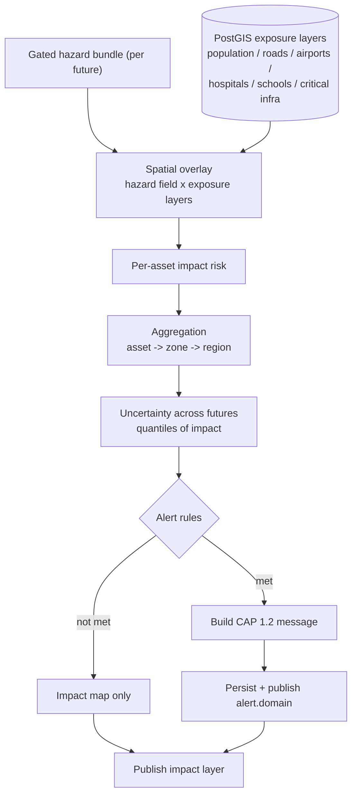

### 8.2 Exposure data (static, loaded offline)

| Layer | Source `[SRC]` | Geometry | Used for |
|---|---|---|---|
| Population | WorldPop | Raster → grid | Village / area risk |
| Roads | OSM via OSMnx | Lines | Road-corridor risk |
| Airports | OSM `[ASSUME]` | Points/polygons | Operational risk |
| Hospitals, schools | OSM `[ASSUME]` | Points | Facility risk |
| Critical infrastructure | `[GAP: no source named]` | — | Infrastructure risk |

Workflow: C25 loads and normalises layers into PostGIS with a `layer_version`; the impact engine always records which `layer_version` it used (so replay is reproducible). Missing layer for a domain → that impact category is `not_assessed`; others continue.

### 8.3 Impact computation

Source formula: **Hazard × Exposure → Impact Risk.** It gives no scale and no vulnerability concept.

Proposed `[PROP]`:

```
impact(asset, future_k) = P_hazard(asset, future_k) × exposure_weight(asset_class, asset_attrs) × vulnerability(asset_class, hazard)
```

- `exposure_weight`: population count or asset importance class (e.g. runway-length class, hospital bed count) normalised to [0,1].
- `vulnerability`: per-hazard sensitivity of the asset class (e.g. airports highly sensitive to lightning and downburst; roads to extreme rain). A small, documented table maintained by domain experts. **Not learned**.
- Compute per future (16+), then take quantiles → impact risk with uncertainty, rather than multiplying a single point probability.
- Impact class: LOW / MODERATE / HIGH / SEVERE from configurable cut-points on the expected-risk score. Source examples ("HIGH operational risk", "Airport exposure: HIGH") imply classes but don't define them `[GAP]`.

Aggregation:
- **Asset level:** score per asset.
- **Zone/district level:** exposure-weighted mean and **max** both reported (a single hospital at high risk must not be averaged away).
- **Corridor level (roads):** worst segment and length-fraction above threshold.
- **Region:** counts of assets/people per impact class.

### 8.4 Inputs, outputs, errors

- **Input:** gated hazard bundle (with support status), exposure layers, layer version.
- **Output:** impact layer (vector tiles/GeoJSON + raster tiles via TiTiler `[GAP: TiTiler reads COG; Zarr→COG export step not defined]`), per-asset table, summary per target location.
- **Errors:** hazard `UNSUPPORTED` → impact for that hazard = `not_assessed` (not zero); exposure layer stale → warning; spatial join failure → degrade to coarser aggregation level.
- **Sync / async:** impact is computed asynchronously inside the cycle. Ad-hoc queries (“impact for this polygon”) are synchronous API calls reading stored hazard fields `[PROP]`.

### 8.5 Alert generation `[SRC: CAP 1.2; PROP rules]`

Source final chain: *Storm detected → Hazard probability → ETA + uncertainty → Impact assessment → Risk zone → Alert*. It does not specify alert triggers, severity mapping, recipients, or lifecycle.

Proposed rule set (all thresholds config):

1. Alert candidate when `impact_class ≥ threshold` **or** hazard probability ≥ threshold for an area with non-zero exposure.
2. Candidate must satisfy **all** gates:
   - Hazard `SUPPORTED` and not `NOT_VALIDATED`.
   - Skill gate product level ≥ `HAZARD_ZONE` (never alert on `REGIONAL_OUTLOOK` or `WITHHELD`).
   - Confidence not `LOW`, or alert issued as lower-severity "Watch" with explicit uncertainty text.
3. **De-duplication key:** `(hazard, area_id, event_window)`.
4. **Lifecycle:** first alert → CAP `msgType=Alert`; material change (probability class change, ETA shift beyond interval, area change) → `Update` referencing the prior message; conditions cleared → `Cancel`.
5. **Hysteresis** on cancel (must be clear for M cycles) to prevent chatter.
6. Alert contains: hazard, area polygon, ETA median + interval, probability, confidence, impact class, `forecast_id`+`revision`, simulated flag, reason text.
7. Alert persists in PostgreSQL, publishes on `alert.{domain}`, and is written to the ledger referencing the forecast it came from.

`[GAP]` Delivery channels (SMS, CAP feed, email, sirens) are not specified. The documented scope ends at generating the CAP 1.2 message and displaying it.

---

## 9. Backend and Frontend Communication

### 9.1 Principles

- **Snapshot via REST, deltas via WebSocket.** The WebSocket never carries something REST cannot also return.
- Every message carries `forecast_id`, `revision`, `seq`, `server_time`.
- The client is a **projection** of server state: the dashboard never computes forecasts or applies gating.
- All timestamps UTC.

### 9.2 REST API surface `[PROP]`

| Method & path | Purpose | Sync response |
|---|---|---|
| `GET /api/v1/domains` | Available domains, targets, status | Domain list |
| `GET /api/v1/forecasts/latest?domain=` | Latest published bundle | Bundle (5.7) + `ETag` |
| `GET /api/v1/forecasts/{forecast_id}?revision=` | Specific version | Bundle |
| `GET /api/v1/forecasts/{forecast_id}/revisions` | Revision history with `reason_for_change` | List |
| `GET /api/v1/storms?domain=&cycle=` | Storm objects | StormObject[] |
| `GET /api/v1/storms/{track_id}/history` | Time series for one storm | Series |
| `GET /api/v1/hazards?...` | Hazard bundle with support status | Hazards |
| `GET /api/v1/impact?...` | Impact layer / per-asset | GeoJSON/table |
| `GET /api/v1/observability?domain=` | Sensor states, `R` summary | State |
| `GET /api/v1/alerts` , `GET /api/v1/alerts/{id}/cap` | Alerts, CAP XML | List / XML |
| `GET /api/v1/tiles/{layer}/{z}/{x}/{y}` | Raster/vector tiles | Tile |
| `POST /api/v1/replay/sessions` , `POST …/{id}/play|pause|seek|speed` | Replay control | Session state |
| `POST /api/v1/sim/sensor-failure` , `DELETE …/{id}` | Fault injection | `202` / `204` |
| `GET /api/v1/verification/{event_id}` | Scores, benchmark table | Metrics |
| `GET /api/v1/ledger/{forecast_id}` , `…/verify` | Ledger entry, hash verification | Record / result |
| `GET /api/v1/health` | Service + data health | Status |

### 9.3 Request/response lifecycle

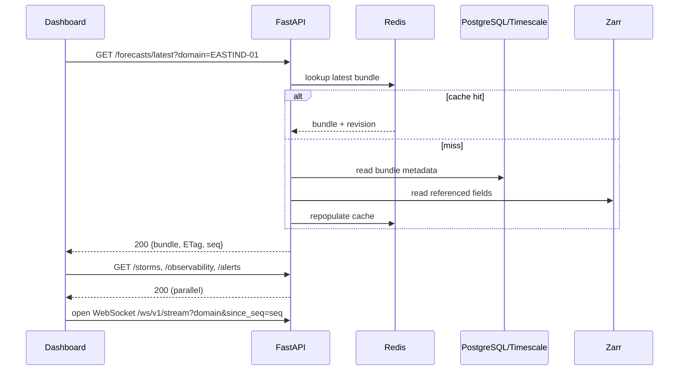

Error contract: JSON `{ "error": {"code": "...", "message": "...", "retryable": bool, "request_id": "..."} }`.

| HTTP | Meaning in this system |
|---|---|
| 200 | OK |
| 202 | Async job accepted (replay session, simulation) |
| 304 | Not modified (ETag) |
| 404 | Unknown forecast / storm / domain |
| 409 | State conflict (fault already active, replay running) |
| 422 | Invalid parameters |
| 429 | Rate limited |
| 503 | Dependency down; `retryable: true`, `Retry-After` header |

`[GAP]` Authentication/authorization is not mentioned. Impact and alert endpoints are operationally sensitive; at minimum read-only public vs privileged control routes (`sim`, `replay`) should be separated.

### 9.4 Data contracts

Versioned, schema-first (JSON Schema/OpenAPI generated from Pydantic models) `[PROP]`:

| Contract | Defined in | Notes |
|---|---|---|
| `MetadataEnvelope` | Sec. 2.1 | NWP fields missing (I-09) |
| `StormObject` | Sec. 4.3 | `null_reasons` mandatory |
| `ForecastBundle` | Sec. 5.7 | Carries `product_level`, `sensor_state`, `skill_gate` |
| `HazardResult` | Sec. 6 | `support_status`, `probability|null`, `reason_code` |
| `ImpactResult` | Sec. 8 | `layer_version`, quantiles |
| `Alert` / CAP 1.2 | Sec. 8.5 | |
| `WsMessage` | Sec. 9.5 | Common envelope |
| `LedgerRecord` | Sec. 10.5 | |

Compatibility: additive changes within a major version; the client declares `schema_version` and the server responds `426` if unsupported.

### 9.5 Real-time WebSocket protocol `[PROP]`

Endpoint: `/ws/v1/stream?domain=…&since_seq=…`

Envelope:

```json
{"type":"forecast.revision","seq":10452,"server_time":"2026-10-04T10:21:07Z",
 "forecast_id":"EASTIND-01/2026-10-04T10:20:00Z","revision":1,"payload":{...}}
```

| `type` | Payload | Dashboard effect |
|---|---|---|
| `forecast.published` | New cycle bundle (or pointer + diff) | Replace storm layer, ETAs, hazard zones |
| `forecast.revision` | Revised bundle + `reason_for_change` | Update + show "why changed" card |
| `storm.update` | Changed storm objects | Update storm panel/map |
| `sensor.state` | Sensor-state transition | Update badges, trigger banners |
| `alert.created` / `alert.updated` / `alert.cancelled` | Alert | Alert list + map |
| `replay.tick` | Replay clock, progress | Replay controls |
| `system.status` | Pipeline lag, degraded mode | Health indicator |
| `heartbeat` | Server time, `last_seq` | Liveness |

Fan-out: stream gateway consumes NATS `fc.publish`, `alert.*`, `sys.sensor_state` with a **durable consumer**, assigns monotonic `seq` per domain, and pushes. Large payloads are sent as pointers (`/forecasts/{id}`) + diffs.

### 9.6 Forecast versioning

- `forecast_id` = cycle identity. `revision` = integer, starts at 0, increments on each revision of that cycle.
- A published bundle is **immutable**. A revision is a new bundle with `supersedes = revision−1` and a `reason_for_change` enum:
  `NEW_DATA`, `SENSOR_DEGRADATION`, `SENSOR_RECOVERY`, `LIGHTNING_JUMP`, `STORM_MERGER`, `RAPID_IR_COOLING`, `RADAR_INTENSITY_INCREASE`, `NEW_CI`, `SKILL_GATE_CHANGE`, `MANUAL`.
  (The first six align with the source's "Why did the forecast change?" list.)
- Each bundle stores `model_bundle`, `data_snapshot`, `layer_version`, `config_hash` so it is reproducible.
- "Why did the forecast change?" payload `[SRC feature 15]`: previous vs new value, attributed drivers (feature attribution), storm-state history events. `[GAP]` attribution method and ranking are undefined beyond the label "feature attribution".

### 9.7 Dashboard state updates

Client state machine `[PROP]`:

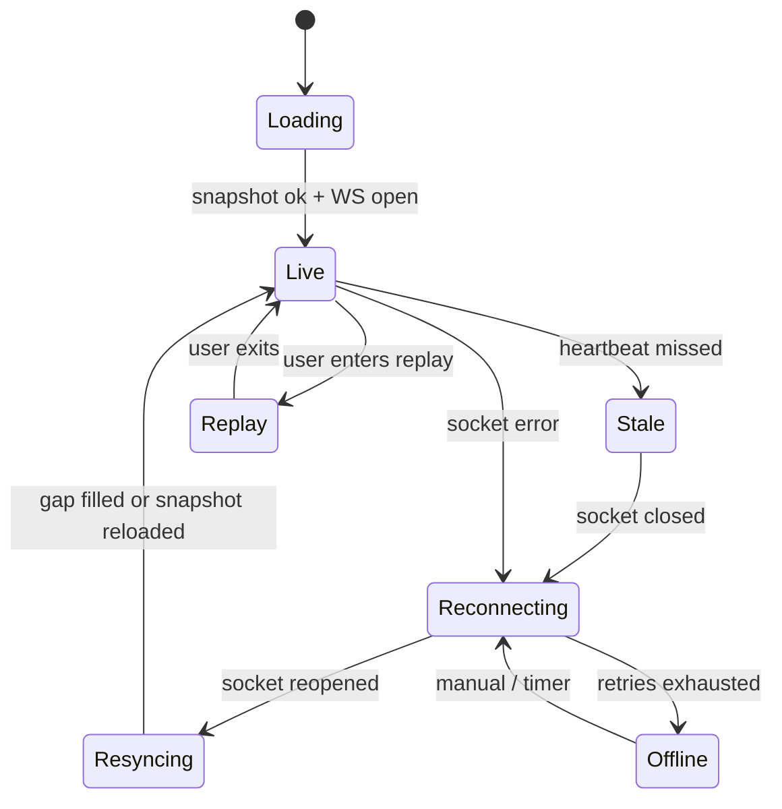

- Updates are applied in `seq` order; out-of-order or duplicate messages (same `seq`) are ignored.
- A message for an older `revision` than already shown is ignored.
- The UI always displays **data age** (time since `server_time` of newest applied message) and the **model-time vs wall-time** clock so "live" can never silently mean "stale".
- Mode banner: LIVE / REPLAY (with replay clock) / SIMULATED FAULT.

### 9.8 Error and reconnection handling

| Condition | Client behaviour | Server behaviour |
|---|---|---|
| Socket drop | Exponential backoff with jitter (e.g. 1 s → 30 s cap), keep last good state, show "reconnecting", age counter running | — |
| Reconnect | Send `since_seq = last_applied_seq` | Replay missed messages from JetStream if within retention; otherwise send `resync_required` |
| `resync_required` | Reload `GET /forecasts/latest` + dependent snapshots, then resume stream | — |
| Heartbeat missed (>2 intervals) | Mark Stale, grey out "live" badges | Keep emitting |
| Schema mismatch | Show "update required"; stop applying | `426` / error frame |
| REST 503/429 | Retry honoring `Retry-After`; do not hammer | Rate-limit |
| Server restart | Reconnect flow above | Durable consumer resumes at stored sequence |
| Pipeline lag high | `system.status` displays "forecast delayed" | Monitoring alert |

---

## 10. Historical Replay and Model Verification

### 10.1 Replay architecture

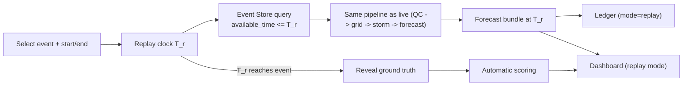

Source example: *14:00 data → 14:00 forecast → 14:10 new data → 14:10 forecast → actual storm → automatic scoring.*

### 10.2 Timestamp-controlled replay and leakage prevention

Rules (all `[SRC]` intent; mechanisms `[PROP]`):

1. **Single gate:** every Event Store read in replay is routed through a `TimeGatedReader(T_r)` that filters on `available_time ≤ T_r`. No pipeline component may read the store directly. This is a design constraint, not a convention.
2. **NWP:** use `init_time`/`available_time` of the cycle, **not** the `valid_time` axis. A 12 UTC valid-time field from a 06 UTC run is only usable once that run was available.
3. **Reconstructed availability:** archived data with reconstructed `available_time` is labelled; replay scoring reports whether any input used a reconstructed time.
4. **Ground truth isolation:** observations used for scoring (later radar, rain, reports) live in a separate namespace unreachable by the forecast path.
5. **Normalisation/statistics:** any scaling statistics, thresholds, calibration maps must come from training data only.
6. **Model isolation:** a replay of a **training** event is "in-sample" and labelled so. Only blind events are verification. If *Kalbaisakhi 2025* (named in the source) was used in training or tuning, its replay is a demonstration, not a blind test `[GAP I-17]`.
7. **Leak test:** an automated test replays a event while poisoning post-`T_r` records with sentinel values; any influence on output fails CI.
8. **Online state:** ACI/skill state is rebuilt from outcomes available at `T_r`, not live values.

### 10.3 Replay controls and state

`POST /replay/sessions {event_id, start, end, speed, model_bundle}` → `202`. The session runs as an async job feeding the same NATS subjects with a `session_id` namespace so live and replay streams cannot mix. WebSocket carries `replay.tick`. Replay and live can run **concurrently** because they are isolated by namespace and domain.

### 10.4 Benchmarking and event scoring

Baselines `[SRC]`: Persistence, Lagrangian persistence, pySTEPS, standard neural baseline, PRAMAAN-X. Metrics `[SRC]`: CSI, POD, FAR, FSS, BSS, CRPS, ETA error/coverage, warning lead time, inference latency.

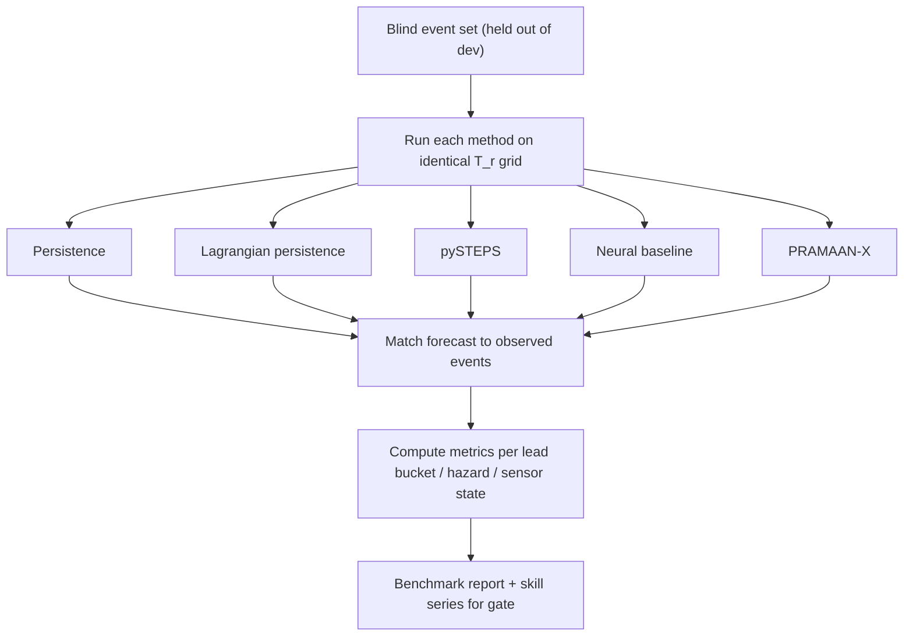

Needed but undefined in the source `[GAP I-16]`: event definition for CSI/POD/FAR (reflectivity threshold? hazard report?), spatial tolerance, FSS scales, minimum events per bucket, confidence intervals on skill (small event counts make improvements statistically uncertain; bootstrap by event), and how ETA coverage is scored (does the observed arrival fall in the 80% interval about 80% of the time?).

### 10.5 Forecast audit trail (ledger)

Source: PostgreSQL + SHA-256 + Python cryptography; each prediction tied to input timestamp, available data, model version, prediction, confidence, sensor state, evaluation result.

Workflow `[PROP mechanics]`:

1. After gating, C21 canonicalises the bundle (sorted keys, fixed float format).
2. `record_hash = SHA256(canonical_json || prev_hash)` **chained** per domain.
3. Insert into an append-only table (no UPDATE/DELETE privilege for the service role).
4. Periodically (e.g. daily) compute a Merkle/batch root, sign with a key (Python `cryptography`) and store/export it externally so history cannot be silently rewritten even by a DB admin.
5. `GET /ledger/{forecast_id}/verify` recomputes the chain and signature.

Two points that conflict with the source as written:
- Hash alone is not tamper-**evident** unless entries are chained or anchored. Source says "SHA-256" only (I-18).
- "Evaluation result" cannot live inside an immutable record because it is known hours later. Evaluation is therefore a **separate linked record** (`evaluation_record` referencing `record_hash`), hashed and chained as well (I-19).

---

## 11. Operational Workflows

### 11.1 Live monitoring

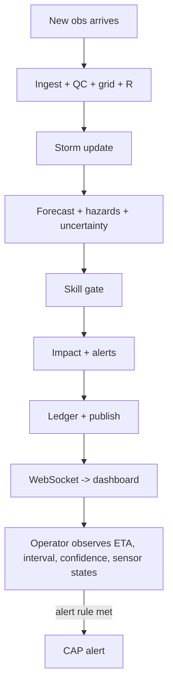

Operator view `[SRC dashboard]`: storm ID, motion, lightning trend, intensity trend, ETA to target, 80% ETA interval, confidence. Always visible `[PROP]`: sensor states, data age, mode banner.

### 11.2 Historical replay

Select event → create session → time-gated run → stepping/auto-play → ground-truth reveal → scoring → report (Sec. 10). Operator controls: play, pause, seek, speed, switch model bundle, compare against baselines.

### 11.3 Sensor failure simulation

Sec. 7.4. Pre-conditions: demo/replay mode. Success criteria: system continues publishing, uncertainty widens, product downgrades are visible, `simulated` flag everywhere, recovery path works.

### 11.4 Forecast revision

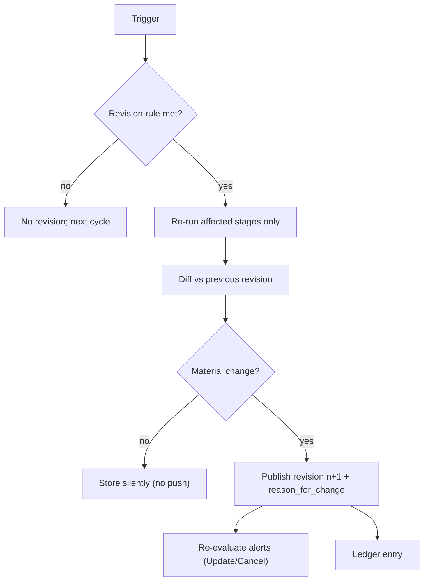

Triggers (`[SRC]` reasons in italics; rest `[PROP]`): *lightning jump*, *storm merger*, *rapid IR cooling*, *radar intensity increase*, *sensor degradation*, *new convective initiation*, late-arriving source data, skill-gate level change, manual operator re-run. "Material" is defined by configurable deltas in ETA, probability class, area, or alert status `[GAP]`.

### 11.4a Re-run scope
A revision re-runs only stages downstream of the changed input; storm intelligence is not re-run for a gate-only change.

### 11.5 Model evaluation (offline, continuous)

```mermaid
flowchart LR
  HD["Historical events"] --> QCg["QC + grid + storm objects"]
  QCg --> SPL["Train / Validation / Blind split by EVENT"]
  SPL --> TR["Train (modality dropout, labels)"]
  TR --> CAL["Calibration"]
  CAL --> CF["Conformal calibration (per sensor-state stratum)"]
  CF --> BM["Blind benchmark"]
  BM --> REG["Register in MLflow if gates passed"]
  REG --> DEP["Deploy as new model_bundle"]
```

Rules: split **by event** (not by timestamp within an event, which would leak); no live-data training `[SRC]`; a bundle is promoted only if blind benchmark beats baselines on declared metrics; promotion creates a new `model_bundle` id referenced by every subsequent forecast; DVC pins dataset versions. `[GAP]` training label definitions, split ratios and promotion criteria are not in the source.

### 11.6 Service recovery `[PROP]` (source has none; I-20)

| Failure | Detection | Recovery | User-visible effect |
|---|---|---|---|
| Source feed down | Source status events | Sec. 2.4 + observability states | Sensor badge, wider uncertainty |
| Adapter/gateway crash | Health check, lag | Restart; at-least-once from source, idempotent via `record_id` | Short delay |
| NATS down | Producers' publish errors | Buffer to disk/outbox, replay on recovery; consumers resume from durable offsets | "Forecast delayed" |
| QC/grid/storm worker crash | Missing `fc.stage` events by deadline | Redelivery; cycle retried; if past deadline, skip to newest cycle | Delay, then catch-up |
| GPU inference unavailable | Stage timeout | Run CPU/baseline fallback (persistence / Lagrangian) with product downgrade and flag | Lower-skill product, banner |
| Redis lost | Cache errors | Rebuild hot state from TimescaleDB (last N cycles); tracks restored with lifecycle `Unknown` where history is short | Brief gap in track continuity |
| PostgreSQL/Timescale down | API 503, write failures | Publish blocked (**fail closed** — no forecast without ledger) ; resume and back-fill | No new forecasts, clear status |
| Zarr/MinIO unreachable | Read failures | Retry; cycle fails; no stale substitution | Delay |
| WS gateway restart | Client disconnect | Clients reconnect with `since_seq` (Sec. 9.8) | Brief "reconnecting" |
| Ledger service down | Write failure | Queue; publish held until written or explicit operator override logged | Delay or flagged "unledgered" |
| Prolonged outage | Gap in cycles | Mark gap in timeline; live forecast resumes from fresh state; **no** back-computation of missed cycles into the live view | Gap shown |

---

## 12. One New Observation → Downstream Updates (trace)

Example: a new radar volume arrives at 10:20 UTC.

| Step | Component | Action | Mode | Output / event |
|---|---|---|---|---|
| 1 | C1 | Receives file | Async | Raw record |
| 2 | C2 | Envelope, dedupe, write MinIO + envelope row | Async | `obs.raw.radar` |
| 3 | C4 | Format/geo/time/missing/outlier/radar QC | Async | `obs.qc.radar` |
| 4 | C15 | Cycle trigger: start cycle `T` (new radar = primary trigger) | Async | Cycle open, `T` fixed |
| 5 | C5 | Select latest available record per source ≤ T, resample to grid | Async | Zarr cube, `grid.ready` |
| 6 | C6 | Update `R`: new radar age, quality; other sources age forward | Async | `obs.tensor.ready` |
| 7 | C7 | Segment, objects, associate, kinematics, lifecycle, graph, CI, RI | Async (GPU) | `storm.state` |
| 8 | C8 / C9 | Horizons A,B,C in parallel; 16+ futures | Async (GPU) | Fields + samples |
| 9 | C10 | Four hazard pipelines in parallel; support status | Async | Hazard results |
| 10 | C11 | Calibration, conformal intervals (stratum by sensor state) | Async | Intervals, confidence |
| 11 | C12 | Skill gate | Async | Product levels |
| 12 | C13 | Impact per future → quantiles | Async | Impact layer |
| 13 | C14 | Alert rules → CAP create/update/cancel | Async | `alert.*` |
| 14 | C21 | Ledger write | Async | `ledger_hash` |
| 15 | C15 | Barrier complete → versioned bundle, cache update | Async | `fc.publish` |
| 16 | C17 | Push to clients | Async | `forecast.published`, `storm.update`, `alert.*` |
| 17 | C18 | Apply by `seq`, redraw | Client | Updated UI |
| — | C16 | Any user action in parallel (e.g. open storm history) | **Sync** | REST |

Latency budget: **no targets are given in the source** beyond "inference latency" as a benchmark metric. Targets per stage should be set after measurement `[GAP]`. Monitoring (C22) records per-stage duration from `ingestion_time` to `fc.publish` so end-to-end latency is observable from day one.

Other triggers: a new satellite frame, lightning bin change or NWP cycle does **not** start a new cycle; it updates `R`/inputs and may cause a **revision** (Sec. 11.4). A sensor-state change is itself a revision trigger.

---

## 13. MVP vs Advanced Workflow Matrix

**All rows: `Impl = Unverified` (no code reviewed).** The tier is a proposal derived from the demonstrations the source names: live tracking dashboard, "Kill Radar" demo, named-event replay, benchmark vs baselines.

| Workflow | Source ref | Proposed tier | Rationale |
|---|---|---|---|
| Ingestion with metadata envelope (live/sample) | Workflow §1 | MVP-candidate | Foundation; envelope required for replay |
| Historical event store + sample event | Workflow §1B, §16 | MVP-candidate | Replay is a named demo |
| QC (radar, satellite, lightning) | Workflow §2 | MVP-candidate | Named steps; NWP/AWS QC is a gap |
| Common grid + observability tensor | Workflow §3–4 | MVP-candidate | Core of USP #3 and the Kill-Radar demo |
| Storm detection, objects, tracking | Workflow §5–6 | MVP-candidate | Core of dashboard |
| Interaction graph (merge/split) | Workflow §7 | MVP-candidate (heuristic) → Advanced (learned Graph Transformer) | Differentiator but heavy |
| Convective initiation | Workflow §8 | Advanced | Needs satellite/NWP/labels |
| Rapid intensification | Feature 4 | MVP-candidate (rule-based on derivatives) → Advanced (learned) | Example in dashboard |
| 0–60 min forecast | Workflow §9 | MVP-candidate | Live demo centrepiece |
| 1–3 h forecast | Workflow §9 | Advanced | Depends on neural operator + CI |
| 3–6 h susceptibility | Workflow §9 | Advanced | Depends on NWP encoder |
| Multi-future (16+) + ETA interval | Workflow §10, §12 | MVP-candidate | Named in dashboard example |
| Lightning hazard | Feature 9 | MVP-candidate | Objective truth available |
| Hail, downburst | Features 10–11 | Advanced (and `NOT_VALIDATED` until truth exists) | Verification gap |
| Extreme rain (EVT/GPD) | Feature 12 | Advanced | Needs gauge data/tail fit |
| Skill gating | Workflow §13 | MVP-candidate (table-driven from benchmark) | USP #7 |
| Sensor-failure simulation | Workflow §15 | MVP-candidate | Named demo |
| Fallback fusion (modality dropout, Virtual-DWR) | Feature 6 | MVP: mask + widen; Advanced: Virtual-DWR | Virtual-DWR undefined in stack |
| Impact engine (airports, roads, hospitals…) | Workflow §19 | MVP-candidate for 2–3 layers → Advanced for full set | Layer coverage |
| CAP 1.2 alerts | Feature 20 | MVP: message generation; Advanced: delivery | |
| Backend/WebSocket dashboard | Stack | MVP-candidate | Required for live demo |
| Replay + leakage control | Workflow §16 | MVP-candidate | Named demo and credibility |
| Benchmark vs baselines | Workflow §18 | MVP-candidate | "Measured evidence" claim |
| Tamper-evident ledger | Feature 19 | MVP-candidate (chained hash) → Advanced (external anchoring) | |
| "Why did the forecast change?" | Feature 15 | MVP-candidate (rule-based reasons) → Advanced (attribution) | |
| Service recovery | — | Advanced | Not in source |
| Alert delivery channels | — | Advanced | Not in source |

---

## 14. Inconsistency and Missing-Contract Register

Severity: **B** blocks implementation, **H** high, **M** medium, **L** low. "Where" refers to sections of the single source document.

| ID | Sev | Finding | Where | Proposed resolution |
|---|---|---|---|---|
| I-00 | B | `PRD.md`, `STEPS.md` and repository were not supplied. Cross-document checks and implemented-vs-planned status could not be performed | — | Supply files; re-run this register |
| I-01 | H | Workflow section "20. Final System" is an empty heading | Workflow §20 | Define final integrated system/scope or delete |
| I-02 | M | Numbering and counts differ across parts: USP 9, Features 20, Workflow 20 sections, no mapping table | all | Add a traceability matrix USP ↔ feature ↔ workflow step |
| I-03 | H | Technology appears in Features but not in Tech Stack: NetworkX, WorldPop, pyresample, CAP 1.2 library, Virtual-DWR model, Conformal Quantile Regression | F2, F16, F20, F6, F8 vs Stack | Add to stack or remove |
| I-04 | H | Roles of NATS JetStream, Redis/Valkey, TimescaleDB, Triton, TiTiler are not stated; no workflow step mentions the message bus | Stack vs Workflow | Adopt Sec. 1.3 roles or replace |
| I-05 | H | Cycle cadence and trigger rule undefined ("repeat whenever new observations arrive") | Workflow §14 | Adopt Sec. 5.5 |
| I-06 | M | Update frequencies, resolutions, and lightning data provider not named | Workflow §1 | Document actual source specs (Sec. 2.2 are assumptions) |
| I-07 | H | Common grid given as "1–3 km"; one grid, CRS and domain extent needed; implies resolution mismatch with radar (finer) and INSAT IR (coarser) | Workflow §3 | Fix single value and justify |
| I-08 | M | QC covers radar, satellite, lightning only; NWP and AWS/rain gauges are live sources with no QC step | Workflow §2 | Add QC definitions |
| I-09 | B | Metadata lacks `init_time`/`valid_time`/`lead_hour` for NWP → leakage cannot be prevented | Workflow §1A, §16 | Add to envelope; time-gate on run availability |
| I-10 | H | Historical archives typically lack `available_time`; no reconstruction policy | Workflow §1B, §16 | Per-source latency model + provenance flag |
| I-11 | H | Feature 6 requires modality dropout and Virtual-DWR; Training Workflow has no modality-dropout or availability-simulation step | F6 vs Workflow §17 | Add step; define Virtual-DWR scope or drop |
| I-12 | H | No handling defined for unsupported hazards (e.g. downburst without Doppler) | F11, Workflow §11 | Adopt support-status model (Sec. 6.4) |
| I-13 | H | Hail/downburst have no ground truth defined; radar-derived truth would be circular | F10–F11, §18 | Source observed reports / AWS gusts; mark `NOT_VALIDATED` meanwhile |
| I-14 | M | "No continuous training on live data" vs ACI/rolling skill that adapt online | Workflow §17 vs Stack | State that only calibration state adapts |
| I-15 | H | Unequal scenario probabilities (42/27/18/13) conflict with equally weighted flow-matching samples; "16" vs "16+" | F7, §10, USP #5 | Cluster samples into scenarios; fix ensemble size policy |
| I-16 | H | Scoring definitions absent: event thresholds, spatial tolerance, FSS scales, statistical uncertainty, ETA-coverage test | F18, §18 | Define evaluation protocol |
| I-17 | H | Replay named event ("Kalbaisakhi 2025") may be training data; blind status not stated | Workflow §16 vs F18 | State split; label in-sample replays |
| I-18 | M | "SHA-256" alone is not tamper-evident (no chaining/anchoring) | F19 | Hash chain + signed batch roots |
| I-19 | M | Ledger record includes "evaluation result" but record is immutable and result arrives later | F19 | Separate linked evaluation record |
| I-20 | H | No service-recovery, authentication, rate-limit, or retention policy | — | Adopt Sec. 9.3, 11.6; define retention |
| I-21 | H | API endpoints, data contracts, WS protocol, versioning not defined (the Backend/Frontend items) | Stack only | Adopt Sec. 9 or replace |
| I-22 | M | Skill-gate granularity and thresholds undefined; vocabulary differs between Feature 14 and Workflow §13; 6 h ETA vs gating | F14, §13 | Adopt keys and identifiers in Sec. 5.6 |
| I-23 | M | Skill uses rolling validation but ground truth arrives late; lag undefined | F14 | Define `verification_lag` |
| I-24 | M | Confidence labels (HIGH/MODERATE/LOW) and impact classes have no definition | §12, §14, §19 | Define thresholds from calibration data |
| I-25 | M | Hazard spatial/temporal neighbourhoods differ ("within 20 km", "next 30 min") with no definition of verification window | F10, F11 | Specify per hazard |
| I-26 | M | NWP-derived storm-object fields (CAPE, shear, DCAPE) have no spatial sampling rule; NWP resolution coarser than a cell | Workflow §5 | Define sampling (area mean/inflow) |
| I-27 | M | Association algorithm, segmentation labels, and segmentation fallback not defined | Workflow §5–6 | Specify (e.g. overlap + optimal assignment); define label provenance |
| I-28 | M | No hand-off/blending rule between the three horizons | Workflow §9 | Adopt Sec. 5.1 |
| I-29 | M | Alert triggers, severity mapping, lifecycle, recipients and delivery not defined | F20 | Adopt Sec. 8.5; decide channels |
| I-30 | M | Impact formula lacks vulnerability/scale; critical-infrastructure data source not named | F16, §19 | Adopt Sec. 8.3; name data |
| I-31 | L | TiTiler consumes COG/raster; pipeline writes Zarr; export step missing | Stack | Add Zarr→COG tiling step |
| I-32 | L | "ETA Kolkata" in dashboard implies a target-location registry that is not defined | Workflow §14 | Define targets per domain |
| I-33 | L | PostgreSQL, PostGIS, TimescaleDB listed separately; deployment topology unspecified | Stack | Decide single instance with extensions vs separate |
| I-34 | M | Simulated failure could contaminate skill statistics or verification | Workflow §15 | Adopt `simulated` flag + exclusion (Sec. 7.4) |
| I-35 | L | Workflow §3 lists "Terrain" as a grid channel but it appears in no QC or acquisition step (Copernicus DEM only in Stack) | Workflow §3 | Add as static ancillary source |

---

## 15. Open Questions to Close Before Build

1. Provide the real `PRD.md`/`STEPS.md` and, if it exists, code, so Section 13 can be turned into an implemented/not-implemented table.
2. Which radar(s), which Doppler capability, and which lightning network are in scope for the first domain?
3. Which event(s) are held out as blind, and is *Kalbaisakhi 2025* among them?
4. What ground truth is available for hail and downburst?
5. Target locations, domain extent, grid resolution and CRS.
6. Alert audience and delivery channel (or confirm the scope ends at CAP generation).
7. Latency target from radar arrival to dashboard update.
8. Authentication model for control endpoints (`sim`, `replay`).
